+++
# A Demo section created with the Blank widget.
# Any elements can be added in the body: https://sourcethemes.com/academic/docs/writing-markdown-latex/
# Add more sections by duplicating this file and customizing to your requirements.

widget = "blank"  # See https://sourcethemes.com/academic/docs/page-builder/
headless = true  # This file represents a page section.
active = true  # Activate this widget? true/false
weight = 20  # Order that this section will appear.

title = "Institutional Partnerships"
subtitle = " *FORRT is indebted to many organizations which lent their support to our organization. We list below our formal partners, which not only are sources of inspiration but share our mission to help promote systemic change towards integration open and reproducible science into higher education.*"

classtitle = "text-center"

[design]
  # Choose how many columns the section has. Valid values: 1 or 2.
  columns = "1"

[design.background]
  # Apply a background color, gradient, or image.
  #   Uncomment (by removing `#`) an option to apply it.
  #   Choose a light or dark text color by setting `text_color_light`.
  #   Any HTML color name or Hex value is valid.

  # Background color.
   color = "#fefdf6"
  
  # Background gradient.
  # gradient_start = "DeepSkyBlue"
  # gradient_end = "SkyBlue"
  
  # Background image.
  # image = "headers/bubbles-wide.webp"  # Name of image in `static/img/`.
  # image_darken = 0.6  # Darken the image? Range 0-1 where 0 is transparent and 1 is opaque.
  # image_size = "cover"  #  Options are `cover` (default), `contain`, or `actual` size.
  # image_position = "center"  # Options include `left`, `center` (default), or `right`.
  # image_parallax = true  # Use a fun parallax-like fixed background effect? true/false

  # Text color (true=light or false=dark).
  text_color_light = false

[design.spacing]
  # Customize the section spacing. Order is top, right, bottom, left.
  padding = ["60px", "0", "60px", "0"]

[advanced]
 # Custom CSS. 
 css_style = ""
 
 # CSS class.
 css_class = ""
+++

## **Partners**

 

 The [Society for the Improvement of Psychological Science (SIPS)](https://improvingpsych.org) brings together scholars working to improve methods and practices in psychological science. Anyone interested in improving psychological research is welcome to join, regardless of experience. SIPS is a service organization aiming to make psychological science higher quality and more cumulative.

 

---

 

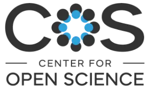 Founded in 2013, [COS](https://www.cos.io/) is a nonprofit organization with a mission to increase openness, integrity, and reproducibility of scientific research. COS pursues this mission by building communities around open science practices, supporting metascience research, and developing and maintaining free, open source software tools, including the [Open Science Framework (OSF)](https://osf.io/).

 

---

 

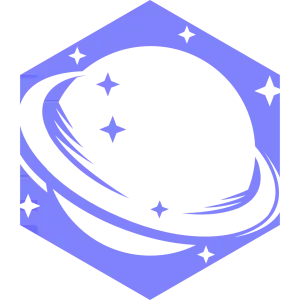 Many things about research can be improved, but too often we get stuck in preventing negative things from happening. [Liberate Science](https://libscie.org/) (est. 2019) is about growing positive alternatives to enable a better research environment. This is both for the research itself and the researcher, no matter the topic or where the researcher may be. Liberate Science's main project is [ResearchEquals](https://researchequals.com/?referrer=forrt), a modular publishing platform. This helps researchers document, communicate, and get credit for each step of the research process, not only the final report. [Join our Discord channel](https://discord.gg/SefsGJWWSw) if you'd like to talk with us!

 

---

 

 [The ReproducibiliTea (UKRN)](https://reproducibilitea.org/) is an ECR-led grassroots initiative that helps researchers create local Open Science journal clubs at their universities. Local journal clubs help build community for those interested in discussing diverse issues around open and reproducible research, improving research quality, research integrity, and more. Local members take ownership of how their journal club runs; whether they focus on reading and discussing papers (e.g. [using RTea's reading lists](https://rpt-rl.netlify.app/)), or holding workshops and tutorials, and even hosting guest speakers. Started in early 2018 at the University of Oxford, ReproducibiliTea has now spread to over 100 institutions in 25 different countries. ReproducibiliTea is completely volunteer run, and seeks to provide a unique and supportive community for members, who are predominantly Early Career Researchers.

 

---

 

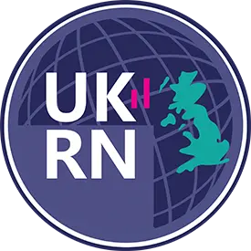 [The UK Reproducibility Network (UKRN)](https://www.ukrn.org/) is a national peer-led consortium that aims to ensure the UK retains its place as a centre for world-leading research. We do this by investigating the factors that contribute to robust research, promoting training activities, and disseminating best practice. UKRN also works collaboratively with various external stakeholders to ensure coordination of efforts across the sector. UKRN seeks to understand the factors that contribute to poor research reproducibility and replicability, and develop approaches to counter these, in order to improve the trustworthiness and quality of research. These issues affect all disciplines, so we aim for broad disciplinary representation.

 

---

 

 As a scholarly training and consulting organization, [Access 2 Perspectives](https://access2perspectives.org) is providing novel insights into the globally inclusive management and communication of Research based on Open Science principles and established scholarly standards to uphold research integrity and good scientific practices across all research disciplines. We equip researchers around the world with the skills and enthusiasm they need to pursue a joyful career. Furthermore, we support scholarly stakeholders in facilitating multilingualism, global research equity and knowledge sharing for societal impact.

 

---

 

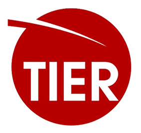 [Project TIER](https://www.projecttier.org) promotes the integration of principles of transparency and reproducibility in the quantitative methods training of undergraduate and graduate students. Project TIER is guided by the vision that students should be taught to use reproducible methods whenever they work with statistical data.  Reproducibility should be integrated into introductory courses in statistics or data analysis, reinforced at all levels of the quantitative methods curriculum, and ultimately adopted by students when they conduct research for theses, dissertations, or other independent projects. To pursue this vision, Project TIER's strategy is to focus on supporting instructors who wish to incorporate transparency and reproducibility in their teaching and research supervision. The primary activities include developing standards and curriculum for reproducible research, and then disseminating those resources to instructors via the TIER website, conferences and symposia, and faculty development workshops.

 

---

 

 [The German Reproducibility Network (GRN)](https://reproducibilitynetwork.de/) is a cross-disciplinary consortium that aims to increase trustworthiness and transparency of scientific research by investigating and encouraging the factors that contribute to robust research. We promote training activities and disseminate best practices, conduct and support meta-scientific research, and work with stakeholders to ensure coordination of efforts. GRN’s activities span multiple levels, including researchers, institutions and other stakeholders (e.g., funders, publishers, and Academic Societies).

 

---

 

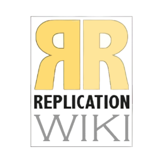 [The ReplicationWiki ](https://replication.uni-goettingen.de/wiki/index.php/Main_Page) serves as a database of empirical studies in the social sciences. It informs about the availability of replication material for them and categorizes them by keywords, methods used, sources, type and geographic origin of data used, and by software used. It lists replication studies and their types and results as well as corrections and retractions. More than 4,600 studies are already listed as well as over 700 replications. The database helps social scientists to see which results have already been tested independently and how replications are published. For instructors it helps to easily identify practical examples, e.g., that for which a method was used that they want to teach and for which data and code are available in a software they can use with their students. 

 

---

 

 [PaPOR TRaIL](https://open.ucc.ie/browse/all/cpd/courses/papor-trail-principles-and-practices-of-open-research-003cpd) is a free course on open research for undergraduate and postgraduate students. It is a self-paced online course that students can take independently and/or that can be embedded in exiting research curricula. Students can first complete an introductory module that providing a comprehensive understanding of the principles and practices of open research.  Following completion of this module, students can choose to complete any/all of six skill-based sections that demonstrate how to do the following open research practices. The six skills-based modules include: research integrity; pre-registration; research data management; reproducible practices; open reporting; open knowledge dissemination.

 

---

 

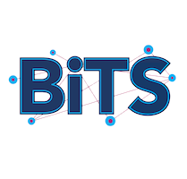 [The Stanford Big Team Science (BiTS) Lab](https://bigteamsciencelab.github.io/) was established in 2021 to facilitate conversations between members of large-scale collaborations (both at Stanford and beyond) and to advance the work done by these groups. Affiliate organizations are Affiliate organizations FORRT, Lookit, ManyBabies, ManyBirds, ManyDogs, ManyPrimates, Psychological Science Accelerator (PSA), and Strengthening Democracy Challenge. [Check out their events](https://bigteamsciencelab.github.io/events/) on Authorship in Big Team Science.

 

---

 

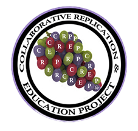 [The Collaborative Replications and Education Project (CREP)](http://www.crep-psych.org/) has as a mission to provide training, support, and professional growth opportunities for students and instructors completing replication projects, while also addressing the need for direct and direct+ replications of highly-cited studies in psychology (broadly). [Check out their OSF Repository to get started](https://osf.io/wfc6u/) or contact them at [CREP.Psych@gmail.com](mailto:CREP.Psych@gmail.com).

 

---

 

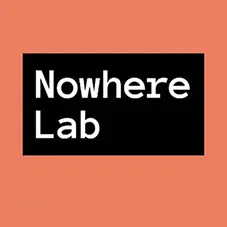 [The Nowhere Lab](http://nowherelab.com/) is an online community for people who would like the lab meeting experience but don’t currently have one. Nowhere Lab holds weekly meetings and has an active Slack. Nowhere Lab has members from across all populated continents and career stages: undergraduate students, master’s students, Ph.D. students, postdocs, faculty members, and people working outside academia.

 

---

 

 [ABRIR](http://www.abrirpsy.org) (Advancing Big-team Reproducible science through Increased Representation) was established as a response to the global need of increasing representation in how we conduct open and big-team science, and as a necessity to promote equity, diversity and inclusion in psychological science. It was ‘born’ during the PSACON2021, when five psychological researchers from different parts of the world (Asia, East Europe and Latin America) gathered and discussed the position of researchers from low-to-middle-income countries (LMICs). They concluded that researchers from LMIC face unique challenges when fulfilling participatory or leadership roles in big-team and open science networks. Likewise, large psychology consortia struggle to recruit participants and researcher leadership beyond WEIRD (Western, Educated, Industrialist, Rich & Democratic) populations.

 

---

 

 [Quala Lab](http://qualalab.org/) is a collaboratively-run working group that works to find ways to find connections between the open science movement and qualitative and mixed methods research. The group meets weekly to discuss ongoing projects, the philosophy of open science, and current events inside and outside of academia. 

 

---

 

 [OLS](https://openlifesci.org/)’s mission is to capacity build and diversify leadership in research worldwide. Long term, they want to see research that is accessible, inclusive, and equitable for everyone. Its 16-week “Open Seeds” mentoring and program is for people interested in applying open principles in their work and becoming Open Science ambassadors in their communities.

 

---

 

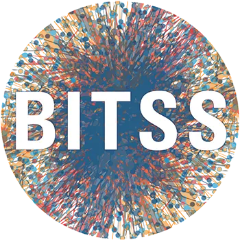 [The Berkeley Initiative for Transparency in the Social Sciences (BITSS)](http://bitss.org/) was established in 2012 as part of the Center for [Effective Global Action (CEGA)](http://cega.berkeley.edu/), a UC Berkeley-based hub for research on global development. BITSS works to improve the credibility of science by advancing transparency, reproducibility, rigor, and ethics in research. We collaborate with researchers, students, faculty, publishers, and funders across disciplines to: 1. Generate evidence on problems and solutions in science through meta-research led by BITSS investigators and our broader community. 2. Increase access to open science education, building capacity to recognize and conduct transparent and reproducible science through training, access to curricula, financial support, and a growing network of advocates and allies. 3. Strengthen the scientific ecosystem, enabling researchers and institutions to effectively and equitably change norms at scale through open science policy and protocol development.

 

---

 

 [Metadocencia](https://www.metadocencia.org/) is an organization that works towards making the production, communication, and application of scientific and technical knowledge globally equitable. It aims to advance innovation with a local perspective that responsibly builds scientific and technical capacities through the co-creation of networks, learning spaces, and accessible resources for Spanish-speaking communities.

 

---

 

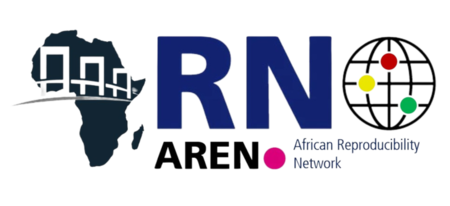 [The African Reproducibility Network (AREN)](https://africanrn.org/) is a community-led grassroots initiative which seeks to bridge the gaps in open science (OS) across Africa. AREN’s mission is to furnish African researchers with the necessary support and resources through training and workshops tailored to the local context, ensuring they are well-equipped to meet the growing global demand for openness and reproducibility in research. We also seek to establish local networks at universities and research institutes across Africa that will serve as advocay hubs for collaboration and cooperation, providing research communities with the necessary support for adopting and practising OS principles while also ensuring institutions are better prepared to implement OS policies.

 

---

 

 Together with universities, professional organisations and charities [The Collaborative Library](https://thecollaborativelibrary.com/) team are building a repository of lay summaries of peer reviewed articles and materials to help everyone understand research quality standards. The platform is grounded in the principles of open access to enhance access and accessibility of research- trying to break down barriers to understanding science and collaboration.

 

---

 

 [Incentivising Collaborative and Open Research (ICOR)](https://incentivizingopen.org/) Enables and incentivizes an open and collaborative research culture by strategizing, connecting and implementing projects that seek to change the status quo of competition throughout the research cycle. ICOR is also building a body of evidence and case studies on the impact of projects that facilitate collaborative open research, and to demonstrate how these practices, tools, metrics and incentives address the larger objective of finding innovative solutions to real-world problems.

 

---

 

 [The Junior Researcher Programme (JRP)](https://jrp.pscholars.org/) is a global initiative for students and early career researchers in psychology and behavioural sciences. We generate diverse research experiences and training, as well as opportunities for personal and professional development of young researchers.
The JRP supports an average of six research projects each year, providing a framework (e.g., summer school, meet-ups, and conferences), leadership, and scientific support. We adhere to the principles of Open Science and aim to build research competencies in line with these values in our students and scientific research. By offering support, training, and engagement opportunities to the community, we hope to make the hidden curriculum of academia more transparent and equip the next generation of scholars with both the how and why of Open Science.
To find out more please visit our [website](https://jrp.pscholars.org/) or email us at [jrp@pscholars.org](jrp@pscholars.org) with any questions about involvement for you or your students!

 

---

 

 We are an [international group of early career researchers (ECRs)](https://feministwonderlabcoll.github.io/feministwonderlab/index.html), working in the social and life sciences, who passionately believe in making academia a better place for underrepresented people. We ourselves are of diverse cultural, national, linguistic, gender, and neural ability as well as social backgrounds. The Collective meets online at least once a month to work on projects related to feminist perspectives on science, teaching, and academia. Our mission is to promote equity and justice for all people in the academy.

 
 

---

 

 [The Open Science Learning GATE](https://opensciencegate.com/) initiative supports the continual improvement of Open Science practices by sharing knowledge that aligns with the ever-evolving research field. Through connecting Open Science trainers, communities, catalogues and repositories, complementing existing initiatives and promoting Open Science education the GATE supports the advancement of innovation and progress through trustworthy research. Its broad data collection, in-depth analysis and indicative dissemination of the current state of the art in Open Science offers guidance for Open Science communities in education, infrastructure and policy making. GATE has its origins in NERQ 

More information at [www.openscienceGATE.com](https://opensciencegate.com/)

---

 

 

[The Brazilian Reproducibility Network (BrRN)](https://www.reprodutibilidade.org/en) is a multidisciplinary and multi-institutional initiative aimed at promoting transparent and reliable research practices within the Brazilian scientific community.

 

---

 

 [The LMU Open Science Center (OSC)](https://www.osc.uni-muenchen.de/index.html) has the mission to promote and foster open research practices at LMU Munich. It is led by Prof. Dr. Felix Schönbrodt. As a central knowledge hub, the OSC provides support for researchers on various aspects of open science, including research data management, FAIR data sharing, licensing, data privacy, and reproducible workflows. The OSC offers a range of services to researchers as well as students and research support staff, such as training programs, workshops, public talks, and the development of core curricula on open research practices. Additionally, the center is involved in original research on meta-science and reproducibility, contributing to the broader scientific community.

 

---

## FORRT membership in the UNESCO Global Open Science Partnership

Read more [here](logos/2025_04_09_FORRT_Flavio_Azevedo_.pdf)

 

---

## **Project-specific Partners**
---

**Project Summaries** [(link)](/summaries/)

 

 [The BordeauxTea](https://osf.io/jqxw6/) is a journal club organized in monthly sessions in which students and young researchers discuss various topics related to Open Science around a warm cup of tea. It is based in Bordeaux (France), and part of the Neurocampus Graduate Program PhD training (Université de Bordeaux). Moreover, the BordeauxTea stems from the ReproducibiliTea initiative—a worldwide Open Science initiative spread to more than 138 institutions in 26 countries.

 

---

**Replication Hub & Database** [(link)](/replication-hub/)

 

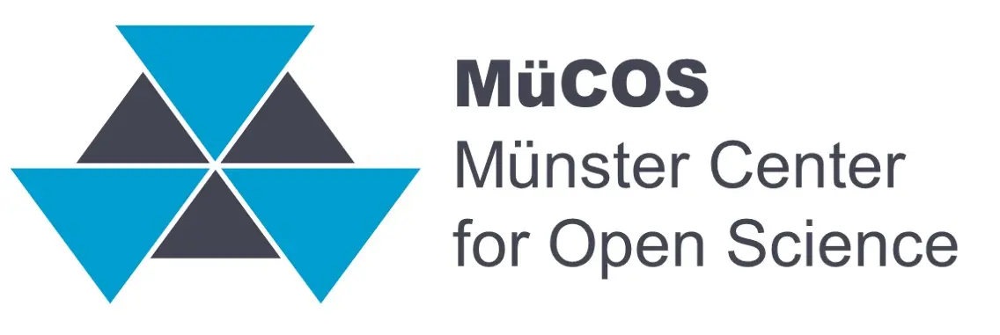 [The Münster Center for Open Science (MüCOS)](https://www.uni-muenster.de/MueCOS/en/forschung/index.html)  was established in 2024 to support researchers at the University of Münster in designing and conducting transparent and reliable research. It is the first center that was brought to life by the university management (in contrast to traditional grass-roots initiatives).
As part of its research activities, the MüCOS collaborating closely with FORRT to maintain and expand the Replication Database and the Replication Hub.

 

---

 

## **Cooperation & Collaborations**

 

 

__*Meta-psychology special issue*__

&nbsp;&nbsp;&nbsp;&nbsp; We have partnered with the journal [Meta-Psychology](https://open.lnu.se/index.php/metapsychology) and the [Psychological Science Accelerator](https://psysciacc.org/) to work on a recurring special issue. The call will request teaching materials, including pedagogical considerations, for the Educational NEXUS. This also sets the stage for our vision of academia in which the creation and maintenance of teaching resources are more valued - changing the publication’s structure to include these excellent and open resources.

__*Center for Open Science - OSKB & COSGN*__

&nbsp;&nbsp;&nbsp;&nbsp; We are partnering up with [OSKB](https://cos.io/oskb) ([Open Science Knowledge Base](https://cos.io/oskb)) to coordinate the alignment of our meta-data on educational materials so that we share our resources and community. To that end, FORRT will have a community in OSKB’s home ([OER Commons](https://www.oercommons.org/)) and enrich data and reduced redundant work. FORRT also joined COS network-of-networks or [Community of Open Scholarship Grassroots Networks](https://groups.google.com/a/cos.io/forum/#!topic/network-of-open-science-grassroots-networks/1OWtx9VDSwo) ([COSGN](https://groups.google.com/a/cos.io/forum/#!topic/network-of-open-science-grassroots-networks/1OWtx9VDSwo)). These partnerships aim to help build a community of existing educational initiatives, strengthening our missions, and streamline the advancement of open and reproducible educational practices.

