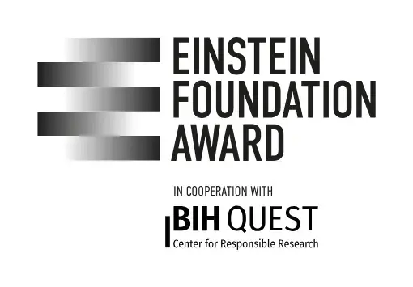
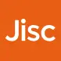
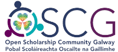
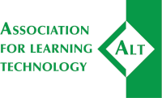

+++
# A Demo section created with the Blank widget.
# Any elements can be added in the body: https://sourcethemes.com/academic/docs/writing-markdown-latex/
# Add more sections by duplicating this file and customizing to your requirements.

widget = "blank"  # See https://sourcethemes.com/academic/docs/page-builder/
headless = true  # This file represents a page section.
active = true  # Activate this widget? true/false
weight = 10  # Order that this section will appear.

title = "Awards & Impact"
subtitle = ""

[design]
  # Choose how many columns the section has. Valid values: 1 or 2.
  columns = "1"

[design.background]
  # Apply a background color, gradient, or image.
  #   Uncomment (by removing `#`) an option to apply it.
  #   Choose a light or dark text color by setting `text_color_light`.
  #   Any HTML color name or Hex value is valid.

  # Background color.
  # color = "#fefdf6"
  # color = "#69b3a2" # greenish
  
  # Background gradient.
  # gradient_start = "DeepSkyBlue"
  # gradient_end = "SkyBlue"
  
  # Background image.
  # image = "headers/bubbles-wide.webp"  # Name of image in `static/img/`.
  # image_darken = 0.6  # Darken the image? Range 0-1 where 0 is transparent and 1 is opaque.
  # image_size = "cover"  #  Options are `cover` (default), `contain`, or `actual` size.
  # image_position = "center"  # Options include `left`, `center` (default), or `right`.
  # image_parallax = true  # Use a fun parallax-like fixed background effect? true/false

  # Text color (true=light or false=dark).
  text_color_light = false

  # Choose how many columns the section has. Valid values: '1' or '2'.
# columns = '2'

[design.spacing]
  # Customize the section spacing. Order is top, right, bottom, left.
  padding = ["60px", "0", "60px", "0"]

[advanced]
 # Custom CSS. 
 css_style = ""
 
 # CSS class.
 css_class = ""
+++

------------

Thanks to our amazing community, FORRT has become an ***award-winning*** grassroots interdisciplinary international organization integrating open and reproducible research training into higher education.

------------

## **Awards**

---

### FORWARD: A UNESCO Decade of Science Programme
 

**FORRT** is one of the few initiatives worldwide to be formally endorsed as a **Programme** of the [International Decade of Sciences for Sustainable Development (IDSSD, 2024–2033)](https://www.un-sciences-decade.org/en) , led by UNESCO and the United Nations (UN). This endorsement reflects the highest level of UN policy recognition and positions FORRT’s work in Education & Pedagogy (Curriculum Hub), Metascience & Research (Replication Hub) and Social Justice & DEIA as an **essential contribution to the UN’s strategy for achieving the Sustainable Development Goals (SDGs)**.

<a href="../educators-corner/023-forward-a-unesco-decade-of-science-programme/" class="btn btn-primary" style="font-size:0.7rem;">
  Click here for more details
</a>

---

 

 In 2023, FORRT was awarded the ***[Dorothy Bishop Prize](https://www.ukrn.org/2023/03/21/db-prize-winners-mar2023/)*** from the UK Reproducibility Network, for its work towards integrating open science principles into higher education and advancing research transparency, reproducibility, rigor, and ethics through pedagogical reform.

 

In 2023, FORRT was a *finalist* for the ***[Early Career Award](https://award.einsteinfoundation.de/award-winners-finalists/recipients-2023/early-career-researcher-award-2023-finalists)*** for Promoting Quality in Research from the Einstein Foundation for its [Replications](https://forrt.org/replication-hub/) initiative. 

 

 In 2023, FORRT received an ***[OSC Award](https://osc-international.com/osc-amsterdam/looking-back-oscawards/)*** in the Open Educational Resources / Open Education / Open Online Courses category from Open Science Community Amsterdam, receiving €200. This was for our paper, *[The role of pedagogical communities](https://doi.org/10.1186/s13104-022-05944-1)*. [Watch our successful pitch on YouTube](https://youtu.be/7wYW7xpqbUY).

 

 In 2023, FORRT received the ***[Mission Award](https://improvingpsych.org/mission/awards/)*** from the Society for the Improvement of Psychological Science for its overall initiatives.

 

 In 2023, FORRT was named a ***[Community Champion for UK education and research communities](https://www.jisc.ac.uk/news/all/jisc-announces-2023-community-champions)*** by JISC.

 

 In 2023, FORRT a ***[Commendation](https://improvingpsych.org/2023/08/22/sips-2023-awards-announced/
)*** from the Society for the Improvement of Psychological Science for its [Replications & Reversals](https://forrt.org/reversals/) project.

 

 In 2022, FORRT received an ***Open Scholarship Prize (1st Place)*** award from the Atlantic Technological University and the Open Science Community Galway for its several initiatives aiming to help researchers integrate Open Science into their educational pipeline, receiving €200/£189.

 

 In 2022, FORRT received a ***Grants-In-Aid to Reduce Barriers to Improving Psychological Science*** from the Society for the Improvement of Psychological Science for the FORRT's Neurodiversity initiative, receiving $1250.

 

 In 2022, FORRT received an ***Open Scholarship Conference award*** from the Association for Learning Technology for its initiatives, receiving €200/£189. This was linked to our presentation at the OER22 Conference.

 

 In 2022, FORRT received a ***[Commendation](https://improvingpsych.org/mission/awards/)*** from the Society for the Improvement of Psychological Science for its [Summaries of Open Science](https://forrt.org/summaries/) project.

 

 In 2021, FORRT has received a ***Commendation*** from the [HiddenREF](https://hidden-ref.org/hidden-ref-award-ceremony/) for its initiatives advancing training materials and resources on open and reproducible science. You can [watch a recording of the award ceremony on YouTube](https://youtu.be/btjRNG0NANg?t=1070).

 

 In 2021, FORRT has received an ***Open Scholarship Award (2nd Place)*** from the [Open Scholarship Community Galway](https://osc-galway.ie/competition/) for its overall initiatives. 

 

In 2021, FORRT has received a ***Kellogg School of Management Consultancy on “Leading & Managing Teams”***.

 

 In 2020, FORRT has received a ***Commendation*** from the [Society for the Improvement of Psychological Science](http://improvingpsych.org/mission/awards/) for its manuscript ["Introducing a Framework for Open and Reproducible Research Training (FORRT)"](https://osf.io/bnh7p/). 

 

---

## **Impact and Achievements**

Our work is sharing open scholarship with a wide audience. Our highlights include...

* **Four** of our projects are featured in UNESCO's [Open Science Capacity Building Index](https://www.unesco.org/en/open-science/list?hub=686).
* FORRT projects have been discussed in podcasts in **four** different languages: English, Polish, Finnish and Dutch.
* We've shared our expertise in **three** policy briefings to the UK House of Commons Science and Technology Committee, British Psychological Society, and Quality Assurance Agency for Higher Education (see our [Publications](https://forrt.org/publications/) page for more information).
* FORRT has broken **two** Google Docs by exceeding their 1.02 *million* character limit!
* Our work is cited in **two** Wikipedia pages.
* The FORRT Glossary has been featured on television **once**, [in a segment on Al Ekhbariya](https://twitter.com/Ali_AlHoorie/status/1497622163788115981).
* Our work has been [highlighted by NASA](https://web.archive.org/web/20220919002540/https://science.nasa.gov/open-science/transform-to-open-science/stories/dr-flavio-azevedo?s=09) **once**.
