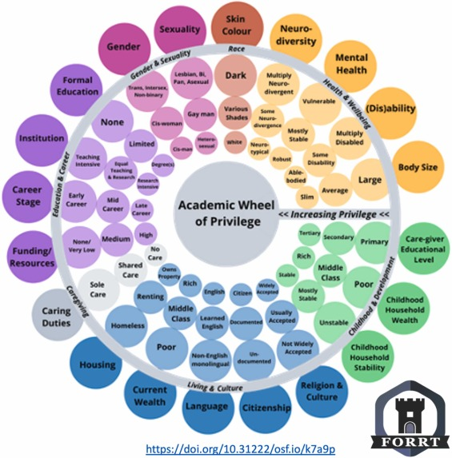

+++
# A Demo section created with the Blank widget.
# Any elements can be added in the body: https://sourcethemes.com/academic/docs/writing-markdown-latex/
# Add more sections by duplicating this file and customizing to your requirements.

widget = "blank"  # See https://sourcethemes.com/academic/docs/page-builder/
headless = true  # This file represents a page section.
active = true  # Activate this widget? true/false
weight = 10  # Order that this section will appear.

title = "The Academic Wheel of Privilege (AWoP)"
subtitle = "An equity-based tool for authorship order"

[design]
  # Choose how many columns the section has. Valid values: 1 or 2.
  columns = "1"

[design.background]
  # Apply a background color, gradient, or image.
  #   Uncomment (by removing `#`) an option to apply it.
  #   Choose a light or dark text color by setting `text_color_light`.
  #   Any HTML color name or Hex value is valid.

  # Background color.
  # color = "#fefdf6"
  # color = "#69b3a2" # greenish
  
  # Background gradient.
  # gradient_start = "DeepSkyBlue"
  # gradient_end = "SkyBlue"
  
  # Background image.
  # image = "headers/bubbles-wide.jpg"  # Name of image in `static/img/`.
  # image_darken = 0.6  # Darken the image? Range 0-1 where 0 is transparent and 1 is opaque.
  # image_size = "cover"  #  Options are `cover` (default), `contain`, or `actual` size.
  # image_position = "center"  # Options include `left`, `center` (default), or `right`.
  # image_parallax = true  # Use a fun parallax-like fixed background effect? true/false

  # Text color (true=light or false=dark).
  text_color_light = false

[design.spacing]
  # Customize the section spacing. Order is top, right, bottom, left.
  padding = ["60px", "0", "60px", "0"]

[advanced]
 # Custom CSS. 
 css_style = ""
 
 # CSS class.
 css_class = ""
+++

 

 

## Overview
---------------------

Authorship order in academia is not just a matter of protocol but a critical determinant of research impact and professional advancement. However, the decision-making process often overlooks justice and equity, leading to a skewed distribution of authorship that favors privileged individuals, thereby exacerbating credit disparities for marginalized researchers. In response, we introduce the Academic Wheel of Privilege (AWoP): a comprehensive toolkit anchored by a Shiny App and supplemented with educational materials designed to guide equitable authorship order decisions.

The AWoP transcends traditional frameworks by integrating accessibility, inclusivity, diversity, equity, and social justice. It is particularly beneficial in situations where contribution levels are difficult to assess or where systemic biases might influence decisions. Central to the AWoP's mission is its capacity to promote critical discussions on academic privilege, intersectionality, and power dynamics, nurturing a research culture characterized by accountability and a collaborative spirit in research. By adopting this tool, the academic community can move towards a research ethos that recognizes and values diverse backgrounds and experiences.

The Academic Wheel of Privilege aims to reform authorship practices and inspire a broader transformation towards fairness and inclusiveness in the academic landscape. We invite you to explore the AWoP toolkit and join us in promoting equity and justice in academia.

 

## Toolkit 
------- 

We provide a comprehensive suite of resources within the AWoP toolkit: 

 

**Manuscript**: [come back soon!]() 

**Shiny App**: [Access the AWoP Shiny App](https://forrt.shinyapps.io/awop) 

 * The Shiny App is a dynamic tool that allows users to generate customized weighted indicators of privilege across key socio-economic and cultural identity categories. It helps users actively identify and consider privilege in authorship decisions, facilitating equitable and transparent authorship order determination. 

**Supplemental Materials**:  
     
  * **Reflection Questions (S3)**: These questions are designed to guide both individual and collective introspection within authorship teams. They help users recognize and understand the dynamics of privilege and how these might influence authorship decisions. The questions can be used as a starting point for discussions about fairness and equity in academic contributions.
    * Example Question: "Do the people I collaborate with hold similar levels of privilege to me?"
 
  
  * **Case Study on First-Generation Academics (S4)**: This case study explores how specific aspects of academic privilege or its absence can shape individual academic trajectories. It provides a nuanced understanding of how socio-economic background influences opportunities and challenges in academia. 
    * Example Insight: "First-generation students often work more hours outside of academia to support their studies and have fewer interactions with faculty or mentors."
       

  * **Illustrated Examples of Academic Privilege/Disadvantage (S5)**: These visual representations depict the varied experiences of individuals within academic spaces. They serve as a relatable and engaging means to comprehend complex concepts of privilege and disadvantage. 
    * Example Scenario: "A scholar from a less privileged background might face significant barriers in networking and accessing funding compared to their more privileged counterparts." 
       

  * **Detailed Bibliography on Socio-Cultural Identities (S6)**: This extensive resource provides in-depth understanding and research on the diverse identity categories within academia. It supports users in exploring the intersectionality of different identities and their impact on academic careers. 
    * Example Topic: "The impact of race and gender on citation practices in academic publishing." 
       

  * **Syllabus for Learning on Equity, Justice, and Accessibility (S7)**: This curated syllabus is designed to support users at different stages of their journey towards equity and justice in academia. It includes structured learning paths and resources tailored to varying levels of familiarity and expertise. 
    * Example Module: "Understanding the principles of social justice and how they apply to academic authorship."

 

 

## AWoP in Use 
-----------

The AWoP is already being recognized and implemented in various settings, including: 

* [UK Research Integrity Office (UKRIO)](https://ukrio.org/ukrio-resources/equality-diversity-and-inclusion/academic-wheel-of-privilege/) 
* Other publications and web pages (add more links as they become available)

 

## AWoP Video
---------- 



 

## Additional Content Ideas (some are not great!) 
------------------ 

* **User Testimonials**: Collect and display testimonials from academics who have used AWoP. 
* **Case Studies**: Provide detailed case studies showing how AWoP has been implemented in different research settings. 
* **Frequently Asked Questions (FAQ)**: Address common questions and concerns about using AWoP. 
* **Community Forum**: Set up a space for users to discuss their experiences and share tips on implementing AWoP. 
* **Updates and News**: Regularly update the page with news about AWoP, such as new features, updates to the Shiny App, or upcoming workshops and webinars. 
* **Gform for feedback**: Place the link for the feedback form here.

## Contact Us
---------- 

For more information, please contact us: awop@forrt.org.

