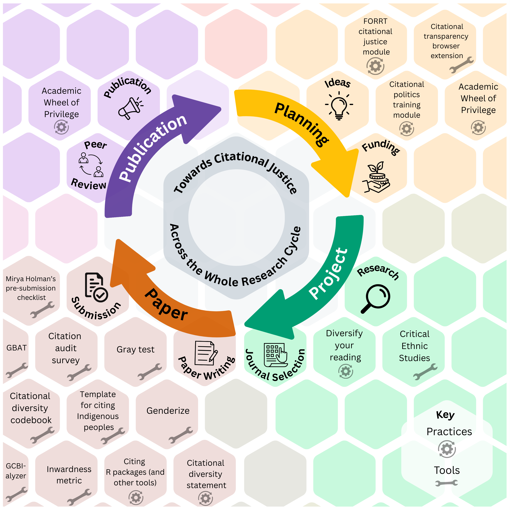

## Phase 1 - Planning

### Tools

- [Citation Transparency browser extension](https://chromewebstore.google.com/detail/citation-transparency/cepnbdbhabaljgecaddglhhcgajphbcf?hl=en&pli=1)

- [Citational politics training module - CLEAR (Civic Laboratory for Environmental Action Research)](https://civiclaboratory.nl/2023/08/08/citational-politics-training-module/)

- FORRT Citational justice training module (in development)  

### Practices

- [Academic Wheel of Privilege (AWoP) | FORRT - Framework for Open and Reproducible Research Training](https://forrt.org/awop/)

## Phase 2 - Project

### Tools

- [Citational Practices: Critical Ethnic Studies](http://www.criticalethnicstudiesjournal.org/citation-practices/) 

### Practices
- Diversity reading **see Table below**



## Phase 3 - Paper

### Tools

- [Mirya Holman's pre-submission checklist](https://docs.google.com/document/d/1JwwmOgRhd2p-Bl_RFEMnp04P0I2nNhOHW7JHdaLcyGs/edit?tab=t.0)

- [Gender Balance Assessment Tool (GBAT)](https://jlsumner.shinyapps.io/syllabustool/)

- Citation audit survey (Darda et al., 2023)

- [SIBL Citation Audit Template](https://docs.google.com/spreadsheets/d/1HHM6i1WDaAVzSJxgZG8UtNWP3aRcFprsdVpLZJEWxOQ/edit#gid=759055580)

- [Citational diversity codebook](http://github.com/dalejn/cleanBib)

- Gray test (Belcher, 2019)

- [Genderize](https://genderize.io/)

- Template for citing Indigenous peoples (MacLeod, 2021)

- [GCBI-alyzer](https://psych.wisc.edu/gcbialyzer/) 

- Inwardness metric (Baccini et al., 2019)

### Practices
- **Annotated reference list** (Lawson et al., 2025)  
- **Citational diversity statement** (Zurn et al., 2020)  
- **Citing R packages and computational tools**  

## Phase 4 - Publication

### Practices
- [Academic Wheel of Privilege (AWoP) | FORRT - Framework for Open and Reproducible Research Training](https://forrt.org/awop/)  
