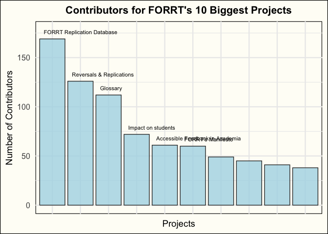

Currently, FORRT has 82 completed and ongoing projects with a total of
651 contributors across these projects.  
There is an average (mean) of 2.06 contributions per person across all
FORRT projects, and the average number of contributors per project is
16.00. Team CRediT is actively working on formalizing and updating
contributorship information.

