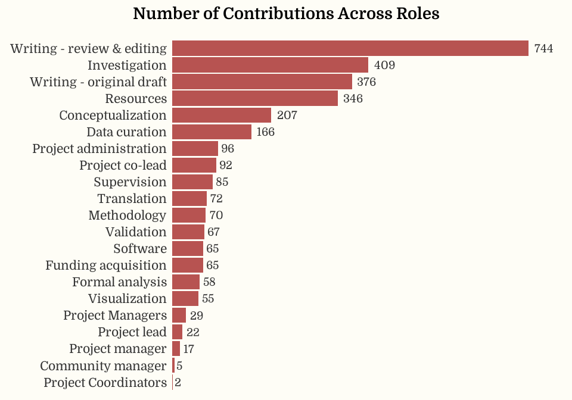

As of 14 September 2025, FORRT has a total of 91 completed or ongoing
projects and support teams, with a total of 587 contributors. There is
an average (mean) of 2.45 contributions per person across all FORRT
projects, and the average number of contributors per project is 15.54.
You can see the full list of FORRT contributors and their individual
contributions [here](https://forrt.org/contributors/).

