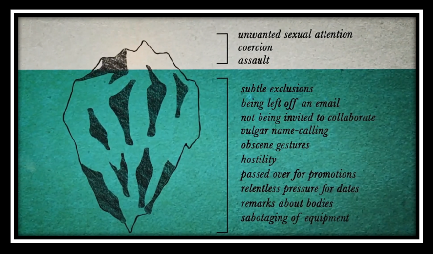

I want to tell y’all about one of my most meaningful teaching experiences. Pull up a chair.

I’ve been teaching experimental psychology since 2006. It’s the flagship research methods course for undergraduate psychology majors at my institution. We now enroll 120 students each semester and, with the amazing help of 5 TAs, we offer lectures twice per week and a 2.5-hour lab once per week.

As many of you know, the shit hit the fan when it comes to psychology research during my time teaching this class. I felt pretty dizzy for a while during and after 2011, the year that marks scales falling from my eyes. 

I didn’t really make many substantial changes to my course right away. I needed to feel like I was on firmer ground first. (I expressed that sentiment [in this tweet thread below.](https://twitter.com/HeatherUrry/status/968638314608721921?s=20)) 

But then, I came to realize that if I didn’t make changes to my teaching in addition to changes to my research, I was complicit. So, I got to work. Standing on the shoulders of the smart people who brought issues to light and modeled pathways to improvement, I shifted my content.

Building on traditional topics like internal, external, & construct validity, reliability, measurement, hypothesis testing, etc., I started teaching about transparency, openness, questionable research practices, and effect sizes.

We started to do IRB-approved, preregistered replication research some of which has seen or will see the light of day in published form ([like the example in this tweet).](https://twitter.com/HeatherUrry/status/1289013799828090880?s=20)

We also started discussing efforts like the ManyLabs studies, the Psychological Science Accelerator ([@PsySciAcc](http://twitter.com/@PsySciAcc)), & the Collaborative Replications and Education Project ([@CREP_psych](https://twitter.com/CREP_psych)).

This has all reinvigorated my love of teaching in general and this class specifically. I honestly feel like I’m fulfilling a real need. We need people in our society to have the tools to consume research responsibly, whether they go on to produce research themselves or not.

But then 2020 happened. After centuries of oppression of Black, Indigenous, People of Color (BIPOC) in the United States, and seeing the disproportionate impact that the coronavirus is having on BIPOC folks, it finally clicked. 

My students need more from me than validity and reliability and transparency and openness. They need to feel they belong. All of them. Every one of them needs to see themselves in psychological science if that’s how they want to spend their time.

So, this semester I introduced a single class session focused on the importance of representation in science. I borrowed ideas from Jessica Remedios ([see her terrific Twitter thread, which ends with her slides](https://twitter.com/jdremedios/status/1303700486277812226?s=20)).  

I had them read this work about [the diversity-innovation paradox by Hofstra and colleagues](https://www.pnas.org/content/117/17/9284).

I also invited them to watch the [Picture a Scientist film](https://www.pictureascientist.com/) and/or listen to the Everything Hertz podcast ([@hertzpodcast](https://twitter.com/hertzpodcast)) about Diversity in science [with Jess Wade](https://everythinghertz.com/114). 

I talked about psychology’s positivist tradition of believing there’s some sort of objective reality that we can discover if we cleave to principles like empiricism, transparency, & falsifiability and how that position is marred by biases (e.g., confirmation bias, availability).

It’s also marred by the fact that scientists are humans with standpoints that affect the questions they ask. And that power structures dominated by men and white people guide what we think is “normal” science. Such ideas aren’t commonly discussed in quantitative research circles.

I showed them clips from [Picture a Scientist](https://www.pictureascientist.com/) so they could appreciate what it’s like to be a woman in science, and the progress that’s been made to remediate gender bias (e.g., [the MIT report from 1999](http://web.mit.edu/fnl/women/women.html)).
 
 

We also talked about the idea that some seem to have been left out, women of color, in particular, but also disabled, LGBTQ, first generation, indigenous people, and all their intersections. 

We talked about the loss to science, especially when innovative ideas put forward by women, people of color, and women of color are devalued (Hofstra et al., 2020). 

I showed them powerful clips of one woman of color’s experience as a scientist, professor of chemistry, Raychelle Burks ([@DrRubidium](https://twitter.com/DrRubidium)). Dr. Burks captured so perfectly the importance of representation.

  

I talked about how these problems are not limited to male-dominated sciences but that these issues pervade psychological science too. 

I showed them data from APA demonstrating the move from roughly 78% undergrad psychology majors being female to less than 50% of full professors being female. Lots of factors at play, including gender bias.

I shared with them an email that a female colleague of color received recently that illustrated the gendered racism she faces in our field. It referenced the hardships faced by white men. (Sorry, what now?)

I talked about my own standpoint as an educated white woman, a full professor with lots of mentorship from family members and powerful colleagues through the years. I had a lot of help getting where I am in part because of intersecting identities tied to systems of power.

I expressed my hope that they’ll think about their own intersecting identities and if science is something they love and psychology specifically they should go for it and make room for everybody’s voices.

I’d never talked about these ideas in my class before this week. I have also never received so much positive feedback from students. They felt seen. I don’t think I’d ever made them feel seen before, not quite like that. I feel good about that.

I also feel sad. Students feel these things so hard, especially those we’ve marginalized in so many ways. I’ve been in undergrad classrooms for 15 years. I’ve worked with literally hundreds of students. So many missed opportunities. 

I can’t change that. But I can keep it up in future semesters. Urry is ON.

Meanwhile, [here are some of my slides minus film clips and the email](https://osf.io/597ut/). Maybe they’ll help you or someone you know address representation as a foundational idea of science at one of the earliest career stages. 

---
 

*Editor's note: The present text is an adapted version of widely shared [Twitter thread](https://twitter.com/HeatherUrry/status/1312104732308115457?s=20) which resonated with so many of us. We thought it is of general interest and deserved to be immortalized, and hence we approached Heather to adapt the thread to post it here. Importantly, in addition to writing extremely current and relevant threads, Heather has also inspired the creation of FORRT. Indeed, FORRT was initiated at the 2018 meeting of the [Society for the Improvement of Psychological Science (SIPS)](https://improvingpsych.org/) in Heather's [“Teaching replicable and reproducible science”](https://osf.io/x7d45/) hackathon with Kristen Lane.*  

