Psychological science is in the midst of a “credibility crisis” in which its practitioners re-examine their practices and re-define what constitutes study rigor. Replication studies have formed a critical role in motivating this sense of crisis – a sense of crisis that has led directly to the current movement to improve psychological science through a “credibility revolution”. 

Despite this important role, when I was invited to hold a virtual two-day, 10-hour workshop on replication studies for the students and faculty of the Department of Social and Organizational Psychology at ISCTE in Lisbon, I realized that I did not have any ready-made teaching materials on this important topic. This blog shares the guiding principles of the workshop and my finished materials so that you, the reader, can learn from my experiences.

My workshop materials, including a **syllabus**, **suggested readings**, and **exercises**, are freely available at [https://osf.io/m9bzh/](https://osf.io/m9bzh/)

**Workshop overview**

My workshop describes the _why_ and _how_ of replication studies: _why_ a researcher might want to conduct a replication study and _how_ a researcher should go about conducting a replication study. It also emphasizes some issues that are often neglected in discussions of replication studies, at least in my experience, including the importance of choosing good replication targets, the importance of resource constraints in doing good sample size planning, and the use of simulation studies in sample size planning.

The workshop proceeded in four modules, as shown in this workshop slide:

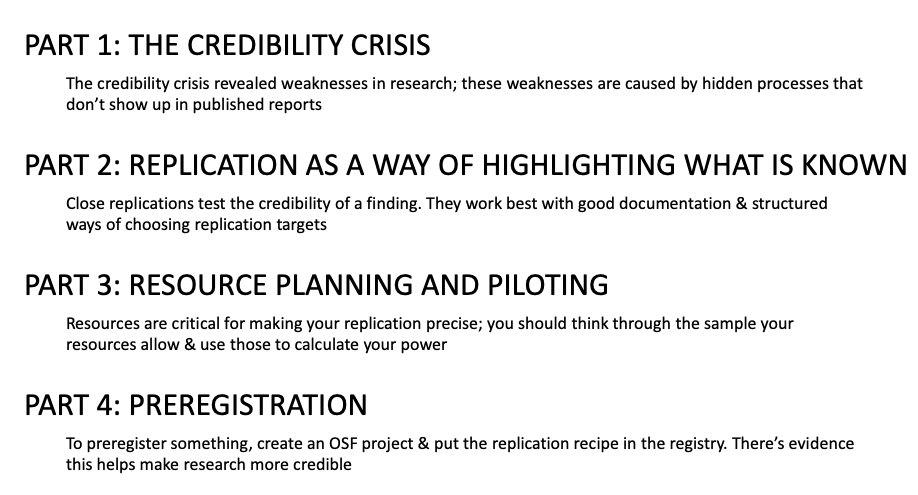

Each module is structured around one or two learning goals, or big-picture takeaway points that I wanted the students to understand at the end of the module. Each module also breaks up lecture sections with independent or guided exercises. The exercises are intended to both reinforce the content of the lecture and give the students hands-on experience with a broad swathe of the skills that go into replication research.

The remaining sections of the blog will describe the content of each module, how this content reinforces the module’s learning goals, and the exercises I used for each module.

**Module 1: The credibility crisis**

_Learning goals:_ _The credibility crisis revealed weaknesses in research; these weaknesses are caused by hidden processes that don’t show up in published reports_

This module is framed around a schematic version of how empirical psychological science works (adapted from [Munafo et al., 2017](https://www.nature.com/articles/s41562-016-0021)). 

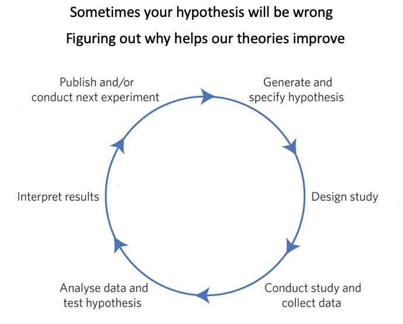

In the schematic, you generate a hypothesis from theory, design a study to test the hypothesis, collect data based on the study design, analyze the data to test the hypothesis, interpret the results, publish the data, and begin the cycle anew. By using this process to compare discrepancies between your hypothesis and the data, you can identify flaws in your theoretical assumptions, which allows you to revise the theories and improve them.

However, a variety of events made psychologists aware that something about this cycle wasn’t working. First was the observation that only about 8% of the results published in psychology journals are negative ([Fanelli, 2010](https://journals.plos.org/plosone/article?id=10.1371/journal.pone.0010068)) – yet these negative results are necessary to identify flaws in theoretical assumptions. Second was the publication of a paper by the well-respected social psychologist Daryl Bem, who, in 2011, published a somewhat unusual paper in the world’s top journal for social psychology, the _Journal of Personality and Social Psychology_ ([Bem, 2011](https://psycnet.apa.org/record/2011-01894-001)). This paper used methods that met or exceeded the standards of rigor that were typical for the time, but advanced a claim that was patently absurd: that college students (and, by extension, everyday people) could be influenced by future events. 

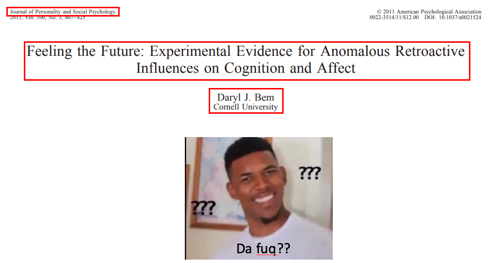

This paper suggested either that everything we knew about physics was wrong or (perhaps more likely) that the research methods in social psychology that we used to think were rigorous were somehow flawed.

I then describe how these observations spurred a _credibility crisis_ (not a “replication crisis”, as the crisis is broader than just a lack of replicability) in which researchers investigated whether and how research methods in social psychology are flawed. I use two exercises to illustrate some of the problems. 

In [the first](https://osf.io/58hdp/), the students use a [free shiny app](https://jeanmoneger.shinyapps.io/SizeMatters/) to simulate how the combination of the selective publication of positive results and low statistical precision create huge distortions in our understanding of the evidence supporting a particular psychological theory. This exercise demonstrates the concepts of statistical power, precision, and publication bias and demonstrates the general method of using simulation studies to understand what happens when some quantity (in the context of a simulation, a _parameter_) varies.

In [the second](https://osf.io/y3467/), the students use FiveThirtyEight’s [p-hacking app](https://projects.fivethirtyeight.com/p-hacking/) to illustrate what makes p-hacking possible. I randomly assigned students to either the Republican party or the Democratic party and to either make their assigned party look good or bad. This exercise illustrates how p-hacking can emerge from the combination of flexible definitions / measurement and a desire to obtain a certain result.

I close the module by describing how published research reports only constitute a subset of what goes into creating a certain research funding and how processes like p-hacking and publication bias, while hidden, can undermine a finding’s credibility. Thus, one way we can uncover the credibility of a finding is to make visible more aspects of the research process. The next module describes one way to achieve this greater level of visibility.

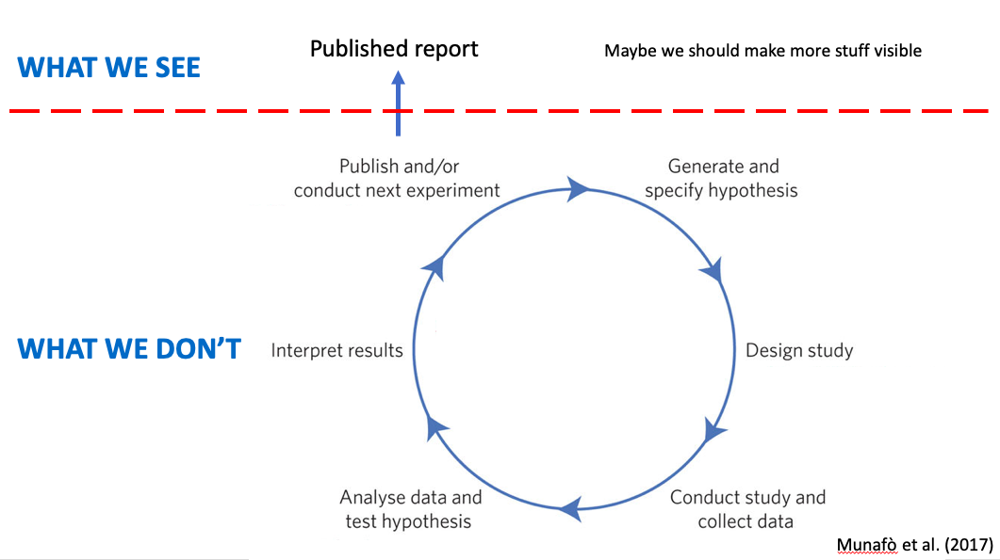

**Module 2: Replications as a way of highlighting what is known**

_Learning goals:_ _Close replications test the credibility of a finding. They work best with good documentation & structured ways of choosing replication targets_

This module starts with the question of how to determine whether a particular finding is “credible”. One way is to fix in place the _hypothesis_ and try to do the study again. When you do the next study, you can either vary certain aspects of the method or duplicate the past method as carefully as possible. Although I don’t yet introduce this terminology, these two sets of scenarios illustrate the ideas behind a _close replication_ and a _distant replication_.

I then ask the students to complete [an exercise](https://osf.io/n243q/) to think about the conclusions that are reasonable in close and distant replications. The goal of this exercise is to illustrate how close replications (where you keep the method similar) are particularly informative when they give you results that differ from a set of past results because they call into question the credibility of the original results. However, they are less informative when you get results that are similar to the original.

In contrast, distant replications (where you vary some aspect of the method) are particularly informative when you get results similar to the original results because they allow you to generalize across the methodological feature that you varied. However, they are less informative when you get results that differ from the original because, in addition to all the explanations that apply when you do a close replication, the features that you intentionally varied could also have produced the different results.

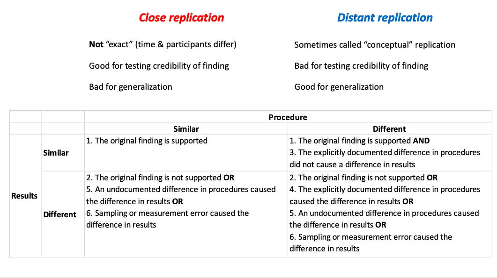

I also use this exercise to highlight the importance of minimizing sampling error and fully documenting procedures; both sampling error and undocumented differences in procedure (“hidden moderators”) provide possible explanations for why replication results differ from original results. This highlights a somewhat hidden side benefit of replications: they force you to very carefully document a particular procedure.

To illustrate how to document the procedure behind a replication study, I introduce the students to the “replication recipe” ([Brandt et al., 2014](https://www.sciencedirect.com/science/article/pii/S0022103113001819)). The replication recipe provides a structured set of questions to guide the process of creating a method section for a replication study. As [an exercise](https://osf.io/j3pna/), I ask students to fill out the first section of the replication recipe with an article that I assign (I pre-selected two articles that are short and have a relatively simple research design). After the exercise, we discuss the process of using the replication recipe and identify issues that came up – including the poor reporting standards of most (but not all) psychology articles.

In the last part of this module, we discuss a way to choose replication targets. I teach a somewhat informal version of a framework developed by [Isager and colleagues (2020)](https://osf.io/preprints/metaarxiv/2gurz/). As [an exercise](https://osf.io/zjwcg/), the students use the framework to rate the value, uncertainty, and cost of doing the replication study that I assigned them. 

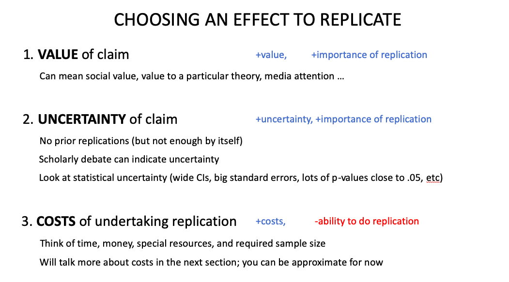

**Module 3: Resource planning and piloting**

_Learning goals: Resources are critical for making your replication precise; you should think through the sample your resources allow & use those to calculate your power_

This module subsumes most of the content that would normally be taught as “power analysis”. The reason I frame power analysis as “resource planning” is to emphasize the critical, and often unrecognized, role that resources (time, money, skills) play in the number of observations a replication study achieves. I teach two workflows for planning resources: a **resource-first workflow** based on identifying the practical constraints to one’s resources and determining the power those constraints allow to detect different effect sizes, and **smallest-effect-size-of-interest workflow** based on identifying a smallest effect size of interest and the number of observations (i.e., resources) required to achieve different levels of power to detect that effect.

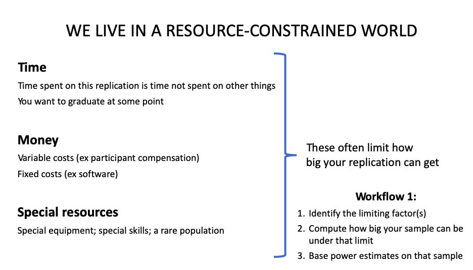

The module relies heavily on _[faux](https://debruine.github.io/faux/)_, an R package for simulating fake data that fits a specific set of constraints. I link the idea of simulation studies back to the first module and tell the students that I am giving them a powerful set of tools to conduct their own simulation studies. I do not assume that students know how to use R, but rather wrote two different scripts that make simulating [two-group](https://osf.io/x7upv/) and [four-group](https://osf.io/wdqem/) designs easy, even for a complete R novice. My goal is to give the students some tools to do basic tasks in R, as well as resources to learn more about simulations in R if they have the time and interest.

A hidden goal of this module is to demonstrate how under-resourced most past research really is. For example, when I illustrate the resource-first workflow, I assume that we have enough resources to achieve 80 observations per cell in a two-group design – a number of resources that meets or exceeds the sample sizes used during the 2000s in social psychology ([Fraley & Vazire, 2014](https://journals.plos.org/plosone/article?id=10.1371/journal.pone.0109019)). This design yields abysmal power to detect most reasonably-sized effects.

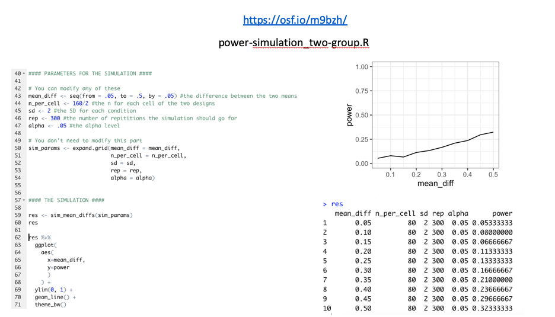

As another example, when I illustrate the smallest-effect-size-of-interest workflow, I assume that the target effect is part of an interaction. Interactions require about [16 times](https://statmodeling.stat.columbia.edu/2018/03/15/need-16-times-sample-size-estimate-interaction-estimate-main-effect/) the sample size to detect than main effects, a fact that is illustrated vividly in the simulation-based power curve from this part of the module.

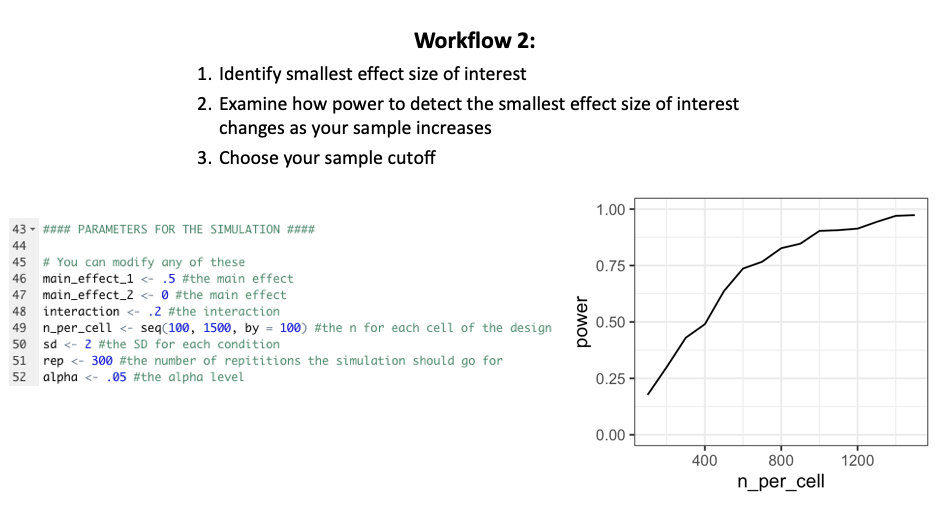

One last issue that comes out of the simulations is the number of assumptions that one must make in the process of doing a simulation study. This includes both statistical assumptions, such as the size of the standard deviation of the outcome measure, and non-statistical assumptions, such as the length of time it takes for a typical participate in the study (a fact that is necessary to accurately estimate the number of participants who can participate in a lab-based study, for example). I argue that pilot studies are useful for developing good values for these assumptions. Pilot studies are _not_ useful for directly estimating the value of the target effect size itself ([Albers & Lakens, 2018](https://www.sciencedirect.com/science/article/pii/S002210311630230X?casa_token=OETt_Sm5VFEAAAAA:-9rK8QScds9e0A1siznusvdtvl0-yC2WpBVWe7ztdGkZ8eVILbyqWMC5WmcsAxHWp6X7X7voPeA)); in any case it is better to power to a smallest effect size of interest than the expected effect size.

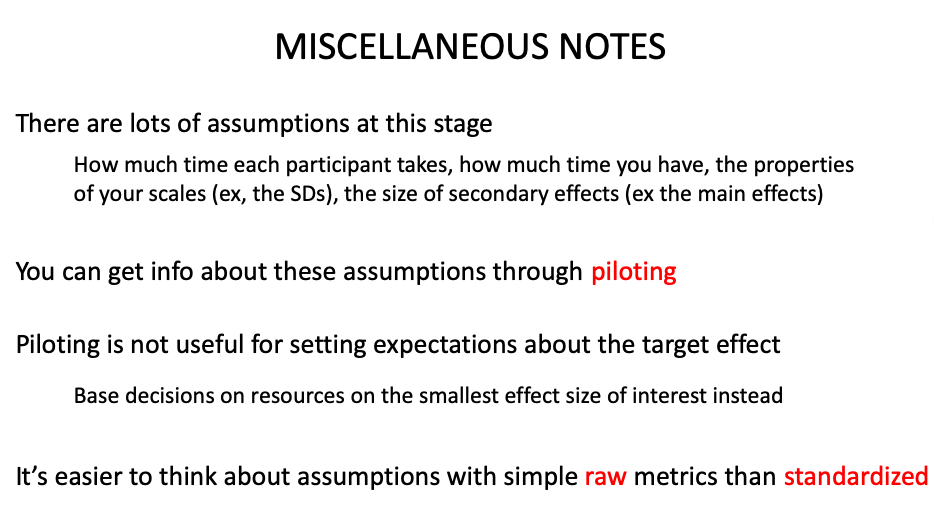

**Module 4: Preregistration**

_Learning goals: To preregister something, create an OSF project & put the replication recipe in the registry. There’s evidence this helps make research more credible_

The bulk of this module is focused around completing a pre-registration for the article assigned to the students in the previous modules. Because the workshop participants have already completed the first part of the replication recipe ([Brandt et al., 2014](https://www.sciencedirect.com/science/article/pii/S0022103113001819)) for this article, they are already familiar with the article’s purpose and materials. For the first part of this module, the students complete the remainder of the replication recipe (or at least, as much as they can) as part of [the last exercise](https://osf.io/w35fp/) of the workshop.

The replication recipe in hand, the students can complete a replication recipe-based preregistration on the Open Science Framework ([OSF](https://osf.io)). I walk the students through this process and introduce them to the basics of uploading materials on an OSF page. But the students already completed hard parts of preregistration as part of the previous exercises. 

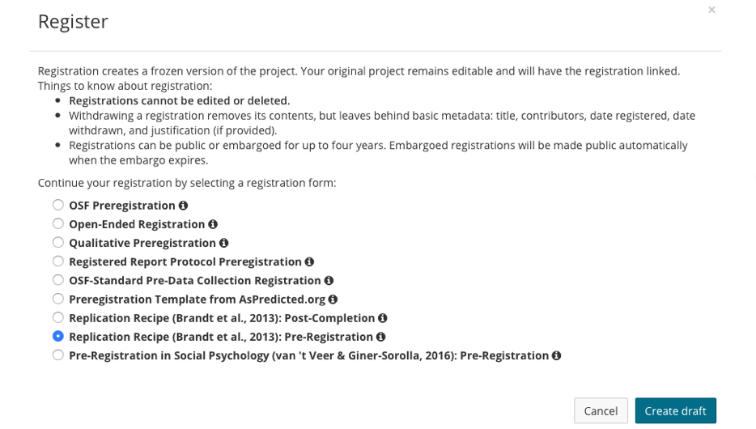

I spend the remainder of this module reviewing evidence of what a well-planned and well-executed preregistration can do for the credibility of research.

 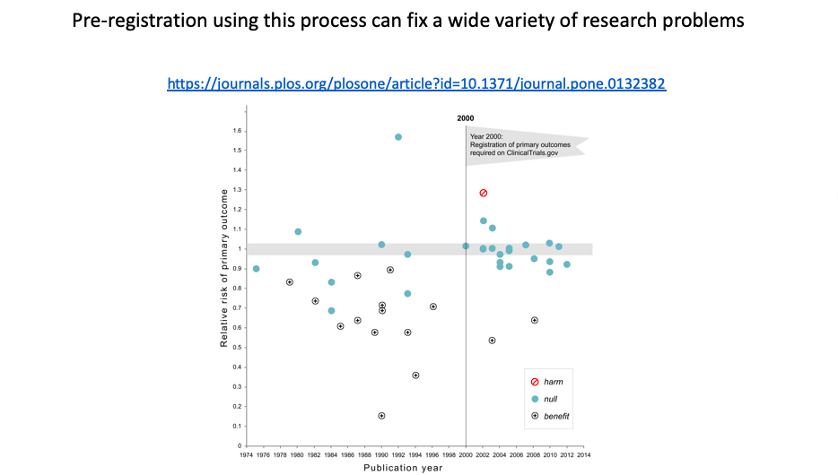

I also briefly cover Registered Reports, which circumvent publication bias through a staged review process. At stage 1, a proposal is reviewed prior to any data collection. At stage 2, the proposal is reviewed again, and as long as the researcher executes their accepted study protocol, published regardless of results. I give the students a [list of journals](https://www.cos.io/initiatives/registered-reports) that accepts registered reports if they’re interested in conducting a study with this publication format.

 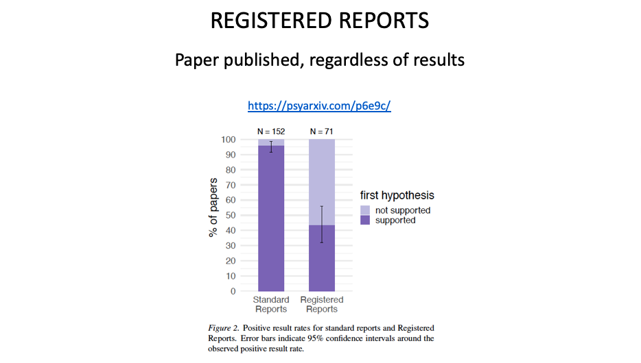

**Conclusion: Use my materials!**

Replications have played a critical, though I think sometimes misunderstood, role in spurring the credibility revolution: they are one way of investigating the credibility of a particular research finding. The primary way they do this, I think, is by serving as a tool to highlight previously unknown pieces of information, either during the process of documenting the procedure (so it can be successfully executed) or via the results themselves. This role deserves to be underscored in teaching materials. I also think replications can be a useful venue to highlight other parts of the research process, such as decisions about what to research and resource planning. The structure of my finished workshop reflects this general outlook.

If you find my materials useful, please use them! The materials are freely available in [this repository](https://osf.io/m9bzh/). Let’s use our teaching to pass the lessons of the credibility revolution on to the next generation of behavioral scientists.
