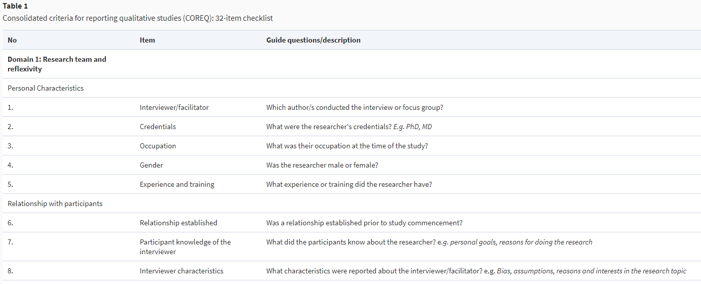
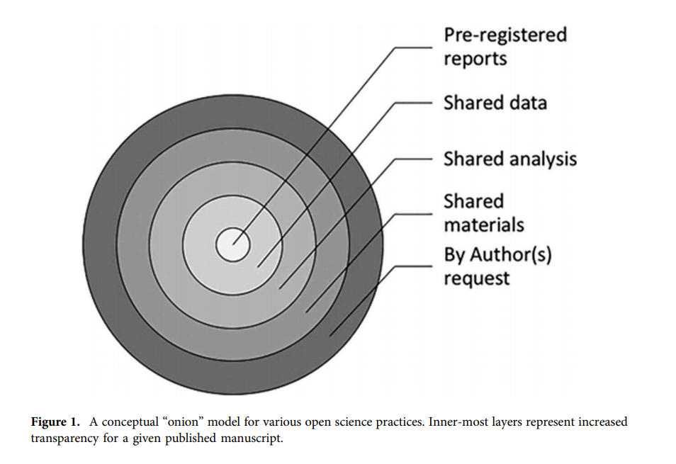

### Starting with Qualitative Open Science Practices

As a person who was trained primarily in research using quantitative methods but needed to do qualitative research to answer the next most pressing question, I was increasingly learning about qualitative research and how to conduct it properly. However, I had not seen much information about how to conduct qualitative research using open science practices. During my PhD, I had been introduced to open science practices as a way to improve educational research, but almost everything I saw did not seem to align with qualitative research. I asked colleagues what existed with regard to open qualitative research resources. Answer: no clue. 

### Call to action

We thus gathered people interested in qualitative open science research in education at the [Virtual Unconference on Open Scholarship Practices in Education Research](https://www.cos.io/education-reseach-2021-virtual-unconference#:~:text=February%208%2D9%2C%202021&text=The%20unconference%20included%20engaging%20plenary,detailed%20guidance%20for%20education%20researchers) sponsored by the [Center for Open Science](https://www.cos.io/). At the conference, we brought other educational researchers and open science fans together to debate what open science qualitative research might look like, put together a list of publicly available publications and tools, and figure out what to do with this information. By the end of a few of these hackathon sessions, we had a list of videos, websites, and publications to help the community understand how to do this work. The full list is located on the [Open Educational Resources website](https://www.oercommons.org/courseware/lesson/80058) but will be expanded upon here in this blog. This blog is intended to be a soft entry into this space of qualitative open science research, not a comprehensive journey; take the thoughts below as suggestions _if_ they align with your philosophy, project, and Institutional Review Board (IRB).

### Output

1. We started the resource list with articles that focus on the **basics of open science qualitative research**. These articles (and Twitter threads) dive into some of the reasons why open science work is important, such as opening the ‘Black box’ of research or helping replication in later studies. And others  also touch upon some of the murky issues of doing this work, like the fact that _quant _and _qual _researchers often have different ways of viewing the world and what truth is or can be. This is a good starting point so that you know that there will likely not be consensus on how to do this work well. However, if you read those and still want to try to incorporate open science into your qualitative projects, you can try this in any or all of the following areas: transparency/rigor, open materials, open access, and ethics. 

2. **Transparency & Rigor**. For transparency and rigor in qual research, this revolves around having enough information in your research so that other researchers A) know about the researcher(s) and their positionality and B) could do a similar study in the future, also known as replicating the study. For example, in the [COREQ guidelines](https://academic.oup.com/view-large/27217733), there is an entire domain dedicated to transparency regarding the researchers and their backgrounds (see picture below). Researchers must also describe the context, questions, use of theory, sampling method, interview techniques, and analysis in a way that someone could imagine themselves performing those tasks. One open science practice that qualitative researchers could use to some degree before even conducting the study is preregistration. Essentially it’s like the dissertation proposal where you lay out your plan in advance. Preregistration (and registered reports, the preregistration done with a specific journal with a publication agreement) helps to ensure that a researcher does not change their stated methods after the study is completed. Explaining every detail of the study might be difficult if you are under space constraints (as with publication length requirements), which brings us to #3: open materials.

  

3. **Open Materials.** Thanks to the internet, researchers have websites and repositories where they can upload the tools for others to access. In qualitative research, this might mean interview protocols, memos, coding notebooks, tools (such as Nvivo or R packages), or even the data itself. This provides a sort of audit trail so others can verify the results of the research. There is no all or nothing here; open materials, much like the rest of these open science practices, exist along a spectrum. Not only what researchers share is on a spectrum; researchers can also dictate who may access the open materials. Perhaps it’s the entire public, but it could just be people who want to verify findings (i.e., dissertation committees, participants, reviewers). Below you can see how [Bowman and Keene (2018)](https://www.tandfonline.com/doi/pdf/10.1080/08824096.2018.1513273) described open science practices as a layered onion with the innermost layer being the most transparent. However, no matter what or to whom materials are shared, researchers must include their plan within their consent procedures and IRB protocols to not violate any ethical boundaries. 

4. **Ethics.** Ethics must be considered with any research, but given the often close relationships with participants, potentially sensitive data revealed, and the fact that large amounts of data could reveal participants’ identity, ethics are huge when it comes to qualitative research. Resources both for abstract and practical purposes can be found in each section of the resources document (i.e., ethics specific to data management) and general ethical considerations are only within this section. 

5. **Open Access.** Finally, researchers can consider how to share their research study. Publishing within traditional academic journals can limit who can read their work, so journals have begun providing open access tiers where researchers can pay the publisher so that the article is available to the public. Alternatively, researchers can “publish” their work online in a preprint server before it is published in a traditional publication outlet. Pre-prints can help researchers get their work out and get community feedback, although certain publications will not accept articles that have been put in a preprint server or require authors to change the pre-print or the settings on it. Open access as an open science practice appears to be generally the same for both quantitative and qualitative work, so fewer resources are here as they can be found on most open science pages.

### Contact us 

Our team who created this (Rachel Renbarger, Sondra Stegenga, Thomas Lösch, Sebastian Karcher, & Crystal Steltenpohl) hopes that you’ll find this helpful for doing this work! We are continuing to explore this area further, so you can reach out to me at rachelrenbarger (at) gmail.com if you are interested in contributing to the conversation.  
