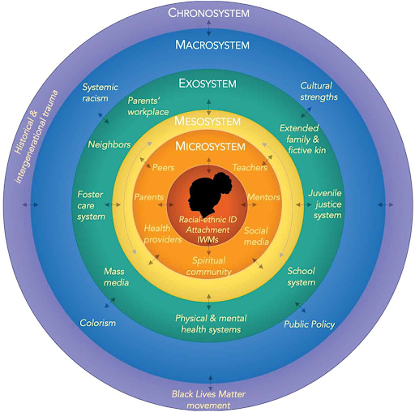

 

## What are the four grand challenges identified by APS members?

### 1. Globalization and diversity

Psychological science has been repeatedly described as WEIRD, meaning Western, Educated, Industrial, Rich, and Democratic. In particular, the persistent use of predominately White and North American college students to study human behaviour has raised concerns about the generalizability of our findings, as well as our legitimacy as a science (Arnett, 2008; Henrich, Heine, & Norenzayan, 2010; IJzerman et al., 2021; Thalmayer et al., 2021; Tindle, 2021). Others argue that we should get rid of the dichotomy altogether (Ghai, 2021). 

**Here’s what you can do to enhance globalization and diversity within psychological science:**

* Invite international speakers to participate in opportunities that historically privilege U.S. citizens (e.g., colloquium series, workshops, awards, fellowships)
* Explicitly cite the achievements and ideas of Black, Indigenous, and People of Color within undergraduate and postgraduate courses, particularly Black women (e.g., see existing resources such as the [BIPOC-authored Psychology Papers spreadsheet](https://docs.google.com/spreadsheets/d/1i7Eacoyv9VVg2lBbCV-KJZg4nSGvR_VZFOysOyOGG8g/edit#gid=666010790) for a detailed list of available scholarship; reference Smith, et al., 2021 for a description of the [Cite Black Women campaign](https://www.citeblackwomencollective.org/)) 
* Encourage people to engage with marginalized groups, including Disabled people; reference Educator’s Corner on [Navigating Open scholarship for neurodivergent researchers](https://forrt.org/educators-corner/010-neurodiversity/) 
* Acknowledge your positionality, meaning the social-historical-political aspects of a researcher that influence your orientations (see Bourke, 2014; Secules, et al., 2021) and include reflexive practice for all research pursuits, including quantitative research programmes (see Jamieson, Pownall, & Govaart, 2022) 
* Consider context and identity by reporting sample demographics (Sabik, et al., 2020), as well as incorporating informed frameworks (e.g., interpret results via critical race theory or open scholarship) 

### 2. Research integrity and applicability

Many of us have been warned about the replication crisis in psychology (also commonly referred to as the replicability or reproducibility crisis, as well as the credibility revolution). Not unique to psychology, the crisis highlights that the results of many peer-reviewed scientific studies are either difficult or impossible to replicate (Open Science Collaboration, 2015). However, the legitimacy of the concern with regards to replication remains hotly contested (Feest, 2019; Maxwell, et al., 2015). 

**Here’s what you can do to promote research integrity and applicability within psychological science:**

* Challenge bias against open science as valuable or legitimate; incentivize early career and contingent scientists to participate by reshaping institutional norms or program milestones (e.g., encouraging students to pre-register dissertation studies; Bahlai, et al., 2019)
* Shift mentality to encourage collaboration rather than competition (e.g., scientists working across departments or multiple working groups rather than in a singular lab at a particular campus)
* Raise awareness about the unique experiences of intersectionally invisible participants (e.g., people who share two or more marginalized identities such as Black women; Coles & Pasek, 2020; Purdie-Vaughns & Eibach, 2008) 
* Use existing resources, such as [the Open Science Framework](https://osf.io/) or [aspredicted.org](http://aspredicted.org) to collaborate, document, archive, share and register research projects, materials, code, and data; join the [Psychological Science Accelerator](https://psysciacc.org/) 

### 3. Collaboration across fields and disciplines

As psychologists, we rarely cross borders, whether real or imagined (e.g., departments, universities, countries)! Collaboration across disciplines and fields, however, is extremely beneficial to psychological scientists seeking to identify connections between psychological processes, history, and broader context (2020). Take, for instance, work from Henderson and colleagues on Confederate monuments; they find that the number of lynching victims in a county is a positive and significant predictor of Confederate memorialization in that county (2021). An intersectional lens can be applied to their findings to illustrate how race and social forces such as the Civil War contributed to anti-Black racism in the U.S., particularly during Reconstruction in the South. Through this example, we can also see how the present work invites participation from other fields like American politics, history, and Africana studies.  

**Here’s what you can do to collaborate across fields and disciplines within psychological science:**

* Participate in scholarly events outside of psychology, such as the [Minority Politics Online Seminar Series](https://minoritypolitics.netlify.app/) 
* Invite speakers from other disciplines to department- or University-led symposiums or conferences; provide remote options for attendance and accessibility grants to stimulate broader participation (e.g., the [University of Virginia Diversifying Scholarship Conference](https://uva.theopenscholar.com/diversifyingscholarship/))
* Initiate cross-discipline collaborations (e.g., [Gaither & Sims, 2022](https://www.mdpi.com/2076-0760/11/3/90))
* Leverage existing networks such as Academic Twitter to incorporate the views of people from relevant disciplines and achieve shared goals (e.g., a systematic co-creation of new knowledge on a specific topic) 

### 4. Strengthening theory

In science, a theory is a well-supported explanation of natural phenomena, confirmed repeatedly through observation and experimentation. Theory changes, however, if and when evidence accumulates that the theory cannot explain. Adaptive research in psychology must therefore follow the assumption that our knowledge will expand along with our understanding of human diversity (and vice versa). Doing so will allow room for concepts such as intersectionality and open science to be integrated within psychological science. Take, for instance, Bronfenbrenner’s ecological systems theory. Frustrated with the centrality of white boys, Stern and colleagues developed a new version centered on Black girls (2021). You can see the model here: 

**Here’s what you can do to strengthen theory within psychological science:**

* Expand theory regarding the mind and behavior to represent human diversity; the development of reliable theories is essential to scientific progress (*see* Eronen & Bringmann, 2021 for insights into developing good psychological theories) 
* Compile evidence to advance new theories if and when they are no longer applicable or outdated due to history or context (e.g., COVID-19); create theories that center marginalized people and the real-world scenarios they experience in day-to-day life, controlling for relevant covariates 

**Join me!**

It is possible that I am overoptimistic about the future of psychological science or naive to the systematic obstacles that must be overcome. Still, I would rather be naive than conform to a system that is stagnant to change. When we stand outside the Ivory Tower, aware that the system is corrupt but alone, helpless, and discouraged, we know that the master's tools will never dismantle the master's house (Lorde, 2018). We were meant to be kept out of the house. Ergo, the time has come to build a house of our own, a house founded on principles that reflect and affirm our identities as the marginalized, unconventional, and historically excluded. It is within our avant-garde that we will find our true power, and grapple with the many challenges requiring redress to create a stronger, more robust science. 

**Here’s what you can do:**

* Strengthen our existing community by [joining our Slack group](https://t.co/iFqoW5tIRh) 
* Seek collaborations to pursue broader work exploring intersectionality, open science, and related topics and crowdsource manuscripts 
* Identify funding opportunities to advance our goals: research transparency, reproducibility, rigor, and ethics (e.g., [Einstein Foundation Award for Promoting Quality in Research](https://www.einsteinfoundation.de/en/award/)) 
* Spearhead initiatives (e.g., write a post for the [Educators’ Corner](https://forrt.org/educators-corner/)) 
* Spread the word about FORRT (e.g., share this post with your colleagues, tag us on Twitter) 

**Contact information**: Annalisa Myer ([amyer@gradcenter.cuny.edu](mailto:amyer@gradcenter.cuny.edu)), Twitter [@MyerAnnalisa](https://twitter.com/MyerAnnalisa).
