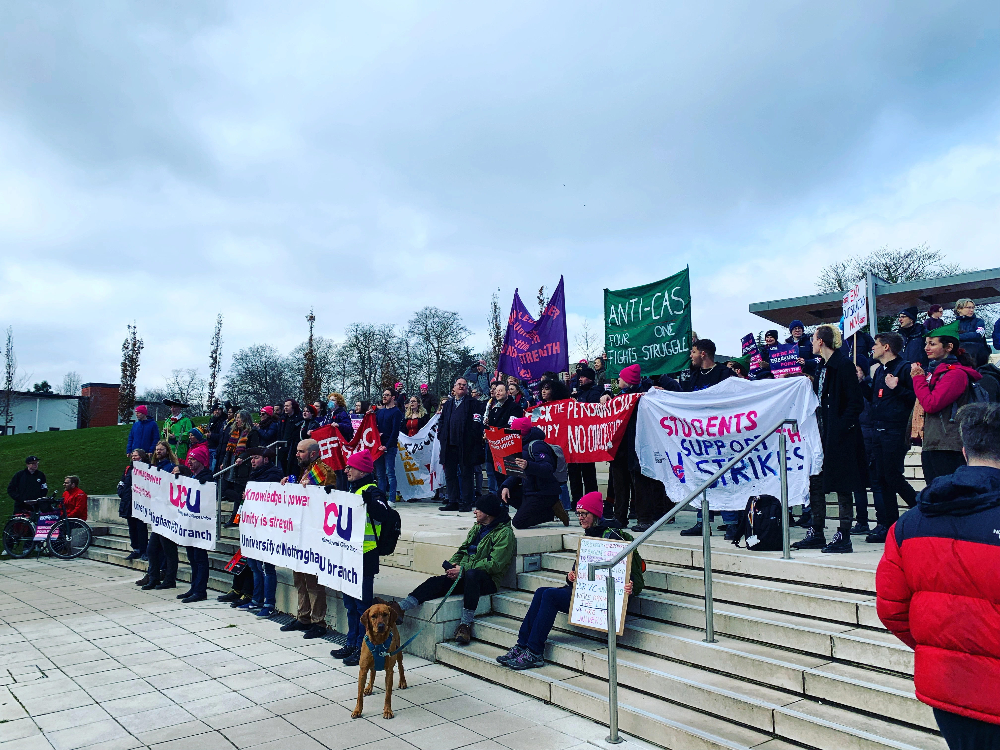

 

Given the scarcity of full-time, permanent academic jobs, more and more PhDs are looking abroad for employment. When I was on the job market in 2020–21, I applied to positions in 7 countries. I landed at the [University of Nottingham](https://www.nottingham.ac.uk/politics/people/anna.meier) in the UK—which, despite being ostensibly close to my home country of the US in terms of culture and primary language, proved to be [an entirely different world](http://annameier.net/the-big-us-uk-comparison-post/). This was apparent from the job application stage, yet at the time, there was no publicly available guidance on differences between the academic job markets in the US and UK.

Earlier this month, I set out to address this. I ran a webinar, “The Academic Job Market: US vs. UK,” aimed at demystifying both markets for applicants. Interest was so great that I added a second installment; in the end, over 200 people registered. You can watch a recording of the webinar below, which will remain freely accessible to all. The slides are also [available to download](http://annameier.net/wp-content/uploads/2023/04/USUKworkshop.pptx) from my website. I hope this can be a helpful resource to anyone looking to make sense of different market timelines, varying employment structures, and why you can’t address anyone below the rank of full professor in the UK as “Professor.” (This still trips me up constantly.)


 

## Structural Factors Shape Employment
What I’d like to expand on here, however, is something only briefly touched on in the webinar: the structural factors shaping employment in higher education in the US and UK. Whereas much of the academic job market comparison in the two countries is apples and oranges, paying attention to the sociopolitical forces changing higher education reveals much common ground.

Let me start with a timely example. In mid-April, faculty (teaching staff in UK parlance), postdoctoral fellows, graduate students, and counselors at Rutgers University joined together in unprecedented collective action. In the US, different categories of university staff are represented by different unions, and these are at best loosely networked nationally—there is no equivalent of the University and College Union (UCU), which represents all research and teaching staff, professional services staff, and PhD students at every university in the UK. Yet despite organizational hurdles, some [9,000 Rutgers workers](https://www.npr.org/2023/04/15/1170284149/rutgers-university-faculty-strike-ends-tentative-deal) went on strike together for living wages and an end to race and gender pay gaps. I can recall no similar university-wide coordinated action in the US in my lifetime.

There are echoes in this struggle of the dispute UCU has waged since before the pandemic. Wages for UK university staff [have fallen some 25%](https://www.theguardian.com/education/2022/aug/22/universities-surplus-ucu-union-staff-pay-strikes) in real terms since 2009; the [race and gender pay gaps](https://www.ucu.org.uk/media/975/The-diverse-academy---pay-and-employment-of-academic-and-professional-staff-in-UK-HE-by-gender-and-ethnicity-AUT-Oct-05/pdf/diverseacademy_oct05.pdf) remain unacceptable for universities who claim commitment to equality, diversity, and inclusion (EDI, the UK twist on the US’s DEI: diversity, equity and inclusion). Equally troubling are the echoes in both disputes’ resolutions. The deal at Rutgers, agreed to after a week of action, [has been criticized](https://twitter.com/jjjjjjjjohannah/status/1647625266854780928?s=20) for [marginalizing graduate workers’ voices](https://twitter.com/CliffConnolly/status/1647285805658898432?s=20), just as the current proposal under consideration by UCU provides [no concrete improvements for PhD students](https://docs.google.com/document/d/e/2PACX-1vRQJ-7uKjBazxCnxy-tjfXaFExSR779WTIszmXppAivDuoOkYezg7SKZ_jrOrmBT07Dt15n6lvBDSA0/pub) on casualized contracts. Solidarity at Rutgers, as in the UK, has been strongest among the most financially secure staff, with some of the least powerful university employees being left behind. Depending on the discipline, US PhDs will graduate into an academic job market where [around 70 percent of jobs](https://www.aaup.org/issues/contingency/background-facts) are temporary or contingent—a [similar landscape](https://www.ucu.org.uk/stampout) to that facing UK PhDs.

## Features, Not Bugs

Where do these analogous structural failings come from? The answer to this starts with deconstructing the idea that these are “failings,” rather than intentional components of a system that views degrees as commodities and people as cogs in machines. A system wherein the task of teaching is secondary to that of shoring up a university’s research reputation will not mind if teachers have to [live in their cars](https://www.nea.org/advocating-for-change/new-from-nea/homeless-professor-who-lives-her-car) or [move from city to city every semester](https://www.timeshighereducation.com/news/casualised-staff-dehumanised-uk-universities) in search of work. Likewise, a system where [glossy building façades](https://www.nytimes.com/2012/12/14/business/colleges-debt-falls-on-students-after-construction-binges.html) matter more than what happens inside of those buildings will not mind using historically excluded groups, particularly women of color, [as PR fodder](https://www.tandfonline.com/doi/full/10.1080/01419870701356015) while [exploiting their labor](https://psycnet.apa.org/record/2023-37109-001) until they burn out. 

Others have written [far more comprehensively](https://journals.sagepub.com/doi/full/10.1177/1478210317719792) about how these features of higher education (not bugs) [have become ever more present](https://www.boldtypebooks.com/titles/davarian-l-baldwin/in-the-shadow-of-the-ivory-tower/9781568588919/) in the past few decades. My point is simply that they are unavoidable, regardless of country of residence. Some might claim that coming to the UK will bring reduced research pressures compared to US research-intensive universities, which may be true in terms of the number of publications required but overlooks how the UK’s massive (and growing) [grant-grubbing apparatus](https://annameier.substack.com/p/grant-culture) saps staff time and discourages counterhegemonic work. Others might note that US academic salaries are generally higher than in the UK, which may be true even at poorer institutions but masks the [massive (and growing) disparities](https://www.nature.com/articles/d41586-021-01183-9) across and within US institutions. Regardless, the “it’s better over there” narrative sidesteps the reality of the academic job market for many: that, if they are able, they will go wherever hires them. 

## Trans-National Sharing

It's easy to despair. What’s necessary—and what I hope sharing information across the pond helps encourage, however minimally—is turning collective despair into solidarity. Faculty in the US and UK face different day-to-day pressures, different career benchmarks, and different alphabet soups of acronyms. (Ask me sometime why Master’s students are PGTs but doctoral students are PGRs.) But underneath the surface, our struggles rhyme. It behooves those of us on both sides of the Atlantic to learn about how academia works in the US and UK, as well as in other countries. Our sector is transnational, and transparent, accessible information about that sector is an important foundation from which to exchange expertise, build campaigns, and push for change.

 

### Author Biography

Anna A. Meier (she/her/hers) is Assistant Professor in the School of Politics and International Relations at the University of Nottingham. She is a committed advocate for graduate students, solidarity-building, and collective care in higher education. Email: anna.meier@nottingham.ac.uk; Twitter: [@AnnaMeierPS](https://twitter.com/AnnaMeierPS); website: [annameier.net](http://annameier.net/).
