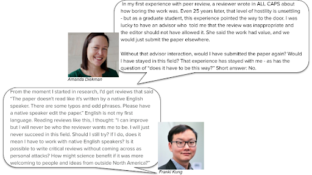
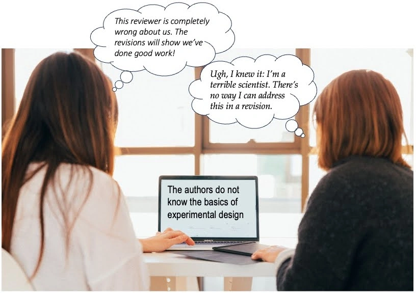

 

### Background of Reviewer Zero

Any writer who puts their work into the world knows it can be a humbling and harsh experience. Negative experiences with peer review, as depicted in the picture below, are all too common. Comments like those illustrated – and others that are unduly harsh, belittling, racist, sexist, or otherwise inappropriate – have been received by scholars at all career stages during peer review. These experiences provide a starting point to question normative practices in scientific peer review, and identify the hidden and blatant consequences for early career scholars, particularly those from underserved groups. Most importantly, we can ask what each of us might do to shift this culture.

[Reviewer Zero](https://www.reviewerzero.net/) is a collective founded in 2020 to take concrete, data-driven, anti-racist action to improve the culture of scientific peer review. We were formed with guidance from [SPARK Society](https://www.sparksociety.org/) — an organization that improves visibility and provides mentorship opportunities for cognitive scientists of color. Our broad aim is to change cultural norms in the peer review process, in order to improve the recruitment, retention, and advancement of minoritized scholars in psychology. Collectively, we are a group who has experienced hundreds of rejections and written hundreds of reviews. We’ve received decision letters accepting and rejecting our work, and we have written decision letters accepting or rejecting others’ work. 

Like readers of this blog, Reviewer Zero members know that science can be better than it is, and that shifting the status quo is not easy. The culture of science matters for who engages with it, and normative experiences within a culture can produce different consequences if individuals see themselves as safe or threatened within that culture. The experience of peer review as hostile or negative sets the stage for disparate impacts for minoritized individuals. For example, a survey of peer review experience [(Silbiger & Stubler, 2019)](https://www.zotero.org/google-docs/?wtZdP5) found that experiences of unprofessional peer review were quite common -  reported by 50% of scientists in the survey. However, individuals from minoritized groups reported a stronger negative impact of these unprofessional reviews, compounding the impact of other biases against such individuals (see Aly et al., 2023, for further discussion [preprint available](https://psyarxiv.com/435xz/)).

To understand peer review from the perspective of early career researchers who are underserved by the status quo, Reviewer Zero conducted a survey in 2020 of early career researchers in psychology / neuroscience. [Our results](https://osf.io/jqy4k) are not surprising: We found that cis-men of color reported less helpful feedback compared to White cis-men, and women/nonbinary respondents were more likely than cis-men to report that their peer review experience reduced their belonging in science. Qualitative results from a free-response question about the most memorable experiences with peer review were eye-opening, and heartbreaking. Respondents reported receiving harsh feedback, racist comments, and feeling so demotivated that they left those research topics behind. But there is also opportunity for change: This survey also showed that authors can feel motivated when the process is perceived as fair or when reviews note strengths of the work.

Harsh reviewer comments can have disparate impacts, demotivating early career researchers and driving them away from the field. 

Photo by [KOBU Agency](https://unsplash.com/@kobuagency?utm_source=unsplash&utm_medium=referral&utm_content=creditCopyText) on [Unsplash](https://unsplash.com/photos/7okkFhxrxNw?utm_source=unsplash&utm_medium=referral&utm_content=creditCopyText)

### How Reviewer Zero’s Mission Intersects with the Open Science Community

As efforts to improve scientific practice and policy toward more openness and transparency take shape, it is essential to consider who is designing these systems and what perspectives they reflect. To build systems that are truly open and accessible for a global psychological science, we must take proactive steps to include different perspectives, identities, and voices in creating and changing systems. Here, we walk through examples of two kinds of openness that can have implications for minoritized or underserved groups. The essential questions are who is being asked to be “open,” and at what cost?

One innovation in peer review is [open peer review](https://forrt.org/glossary/open-peer-review/), which includes disclosure of author and reviewer identities and reviews. Open peer review can include different levels of disclosure: For example, greater transparency without identification can occur if reviews are public but reviewers are not identified.  Although identified peer review can have some advantages in that reviewers are clearly accountable to what they write in a review, this system may not be equitably open to all. Individuals who occupy less powerful positions, whether due to their career stage or underrepresented group identities, may experience more backlash or more negative consequences in offering critique – or their perspectives may simply be dismissed in favor of reviews from people who hold more power or come from majority groups. Transparent peer review, where reviews are public but reviewer identities are not, might offer greater security to reviewers. From an author perspective, though, individuals who are contending with identity threat may be unwilling (for good reason) to have critiques of their work openly aired (for further discussion, Aly et al., 2023). The very ability to engage in different aspects of open peer review can vary across individuals with different levels of power in a system.

Would greater openness in peer review make hostile and unprofessional reviews less likely, or would greater openness in peer review exacerbate negative consequences for members of historically excluded groups? We don’t know the answer to these questions, but we need to ask them.

Given that hostile or unprofessional reviews can be common, individuals from historically excluded groups might steer away from participating in open review processes. Navigating peer review is challenging enough without doing so in public. One example comes from Dr. Colleen Murphy, who tweeted in response to [eLife’s move to drop accept/reject decisions](https://elifesciences.org/inside-elife/54d63486/elife-s-new-model-changing-the-way-you-share-your-research):

    

The inequities present in peer review need to be addressed before there is any possibility of open review serving a wide range of scholars. Without a deliberate effort to change the existing culture in a way that advances diversity, equity, and inclusion, other efforts might perpetuate or exacerbate these inequities. 

A different form of openness, transparency, and accountability in peer review comes from  institutions or organizations. It is not yet routine for journals, societies, or editors to collect or share aggregate-level data about the demographic or identity characteristics of editors, editorial board members, reviewers, or authors. Yet knowing this information could provide valuable insights about who is served by the current practices and how that might change with reforms. What are the demographic or identity characteristics of the editorial board and reviewers? Who is submitting papers, who is being invited to resubmit papers, who appeals editorial decisions, and what are the outcomes? Data about these aspects of scientific publishing are rarely collected, rarely examined by journal staff, and are even more rarely shared with the community. Without transparency and accountability in terms of representation, editor and reviewer choices tend to rely on individuals’ own social networks and perpetuate gender and race homophily. This reliance on social networks may be exacerbated by the growing difficulties with finding scholars to agree to provide peer reviews (Petrescu & Krishen, 2022). Editors may rely on close colleagues who are willing to do them a favor by providing a review, which can in turn further narrow the pool of reviewers and the types of feedback authors get. To counteract this tendency, journals can publicize calls for individuals to register as new reviewers, so that editors have accessible and current listings of scholars with expertise and availability. Generally speaking, clearer and more transparent data about who engages with peer review and how they do so can inform innovations to ease burdens on editors and provide more diverse slates of reviewers. 

### How Reviewer Zero and FORRT work together

Like FORRT, Reviewer Zero seeks to illuminate the black box of scientific and academic culture. Peer review is central to scientific careers, but peer review is often left to the “hidden curriculum” of processes that people learn as they go without explicit discussion or training. To bring some light to these unknown processes, Reviewer Zero hosts workshops (both online and at in-person conferences) for both early-career scholars and for editors and reviewers. In the sessions aimed at trainees and early career scholars, we introduce the basics of peer review, to consider the emotional and motivational aspects of navigating peer review, and to provide concrete tools and strategies for responding to editorial decisions. In workshops with editorial teams, we lead discussions about the current culture of peer review and its implications for perpetuating disparities in who contributes to and advances in science, and we discuss concrete steps toward a more constructive and inclusive peer review culture.

Reviewer Zero is developing [on-demand resources](https://osf.io/e7z5k/) based on these workshops, and these can complement FORRT resources offered in the adopting principled education section of the website. We particularly advocate for collaboration and conversation moving forward, for identification and promotion of strategies that can advance diversity, equity, and inclusion both in peer review systems and the goals of open science. At times, as noted above, these goals might appear to be in tension with each other - but that should be the start rather than the end of the conversation.

### Call to action 

Each of us plays a part in maintaining or changing the culture of scientific peer review.  We invite you to join us to stay updated on activities at [www.reviewerzero.net](http://www.reviewerzero.net) and to explore our developing [on-demand resources](https://osf.io/e7z5k/wiki/Resources/). 

There are steps you can take today to move toward a more constructive and equitable peer review system. As with any culture change, shifting a culture requires multiple actors to begin to think and act differently, and cultural change is more possible when actors at different levels of the system take part [(Hamedani & Markus, 2019)](https://www.zotero.org/google-docs/?fmR3wF). If you are someone with power in the system, with experience, and/or with a majority group identity, support minoritized and early career scholars to learn more about the unspoken aspects of peer review (Aly et al., 2024). If you have experience in scientific publication, speak about your rejections as well as your successes. When you deliver critique, remember there is a human on the other end of that communication, even if that person is not identified. If there is something promising or exciting about the work, note it explicitly. Recognize what power you have, and amplify the voices and perspectives of people whose voices are not yet central to the conversation. 

If you are someone who has been underserved by the current system, know that there are communities and allies who deeply value your contributions to science. Find friends and mentors who can interpret and contextualize reviews with you. If you encounter hostile or unprofessional reviews, know that you have options (including alerting the editor of the journal), and that unfortunately you are not alone.

We at Reviewer Zero see equitable practices and reducing group disparities as essential to cultivating excellent science - science that is fair, meaningful, robust, and rigorous. Any move to improve scientific practice can ultimately succeed only if it centers building systems and spaces that represent a diverse range of identities, uphold equitable practices and outcomes, and prioritize inclusivity. Peer review is central to the practice and progress of science, and bettering it to serve a wider range of scientists will improve the rigor, quality, and contribution of science.

 

### References

Aly, M., Colunga, E., Crockett, M. J., Goldrick, M., Gomez, P., Kung, F. Y. H., McKee, P. C., Pérez, M., Stilwell,
S. M., & Diekman, A. B. (2023). Changing the culture of peer review for a more inclusive and equitable psychological science.
Journal of Experimental Psychology: General, 152(12), 3546–3565.
https://doi.org/10.1037/xge0001461

Hamedani, M. Y. G., & Markus, H. R. (2019). Understanding Culture Clashes and Catalyzing Change: A Culture Cycle Approach. Frontiers in Psychology, 10. https://www.frontiersin.org/article/10.3389/fpsyg.2019.00700

Petrescu, M., & Krishen, A. S. (2022). The evolving crisis of the peer-review process. _Journal of Marketing Analytics, 10_(3), 185-186.

Silbiger, N. J., & Stubler, A. D. (2019). Unprofessional peer reviews disproportionately harm underrepresented groups in STEM. PeerJ, 7, e8247. https://doi.org/10.7717/peerj.8247

Aly, M., Ansari, S., Colunga, E., Crockett, M. J., Diekman, A. B., Goldrick, M., Gomez, P., Kung, F. Y. H., McKee, P. C., Pérez, M., & Stilwell, S. M. (2024). Mentorship practices that improve the culture of peer review. Nature Reviews Psychology, 3(1), Article 1. https://doi.org/10.1038/s44159-023-00261-1

 

### Author Biography

Reviewer Zero [Organizing Committee](https://www.reviewerzero.net/team). Contact information: admin@reviewerzero.net.

 

### Funding

This material is based upon work supported by the National Science Foundation under Grant No. 2224777. Any opinions, findings, and conclusions or recommendations expressed in this material are those of the author(s) and do not necessarily reflect the views of the National Science Foundation.
