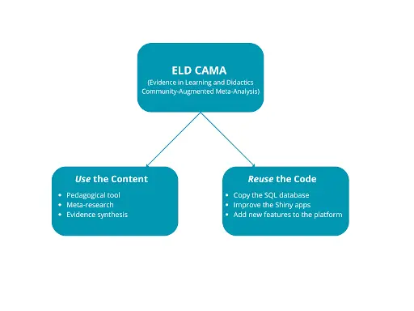

 

### Background of ELD CAMA

Systematic reviews are fundamental to empirical research and play a crucial role in effective policy-making. ***Indeed, their importance cannot be overstated***. However, the methodological rigor and transparency do not seem to follow the weight of the evidence systematic reviews represent in academia and practice ([Nordström et al., 2023](https://doi.org/10.1002/rev3.3443)). Unfortunately, the extensiveness of the systematic review process and the speed of the publication proliferation make any systematic review essentially outdated by the time it gets to dissemination. To combat this, a concept of living reviews and meta-analyses (i.e., ongoing systematic reviews that are continuously updated with new studies) have been proposed and developed in various ways (e.g., [Tsuji et al., 2014](https://doi.org/10.1177/1745691614552498); [Bosco et al., 2017](https://doi.org/10.1016/j.hrmr.2016.09.013)). 

Although living reviews have existed in various formats, they remain relatively unknown in educational sciences and are rarely used as practical tools. However, recent technological advancements now make it possible to implement such platforms at scale. ***The Evidence in Learning and Didactics Community-Augmented Meta-analysis  (ELD CAMA) platform*** redefines how educational research is synthesized and applied. Unlike conventional CAMA platforms that rely on pre-curated meta-analyses, ELD CAMA empowers users to upload individual studies, breaking dependency on existing reviews and enabling up-to-date synthesis. This marks a major shift in evidence synthesis: ELD CAMA democratizes access to meta-analytic tools, transforming static reviews into a collaborative, iterative process. By bridging the gap between primary research and large-scale evidence integration, the platform supports faster, more transparent, and more inclusive advancements in educational science.

For researchers, practitioners, and policymakers alike, ELD CAMA turns the ideal of "living reviews" into reality — ensuring decisions are grounded in the most current, comprehensive, and community-validated data available. The database, shiny application and interface is built upon open source packages which enables researchers in other fields to set up a CAMA platform without spending countless hours in development. Simply copy the available repositories and adjust the database and applications to suit the needs in your field. We put effort in making the repository documented and reusable, but we encourage questions for anything unclear, as our goal is for researchers to reuse the available code!

---

Box 1.

***Platform – and a template.***

The community-augmented approach therefore extends beyond the content development. Like existing [CAMAs](https://github.com/metahag/ELD-CAMA_source) that encourage ***forking*** and reusing established code, we aim to help meta-researchers with similar needs in developing their own database and platform with the template code we share. The beauty of it lies in the flexibility of the components. Users can take some components (e.g., only the SQL database) and build upon them to add new variables, improve the entire platform (e.g., add additional features or dynamic markdowns), or simply reuse it as is to build a platform in a different scientific filed (e.g., medicine). This flexibility facilitates incremental knowledge and collaboration, which is what ELD CAMA and FORRT both strive for. Repository: https://github.com/metahag/ELD-CAMA_source.

---

### How ELD CAMA and the FORRT reinforce each other

ELD CAMA fosters open science, research quality and integrity, and the main goal is to provide users with an open dataset of educational interventions in a FAIR (Findable, Accessible, Interoperable, and Reusable) way. FORRT is an excellent venue to reach like minded researchers who share the same interests and ideals. We hope to engage the educational science and meta-researchers to share the benefits and importance of updated, open, and high-quality systematic reviews.
ELD CAMA and FORRT share the same goals but focus on different target groups — both aim to build an infrastructure that supports open scholarship and a credible, reproducible evidence base, developed in collaboration with educators. FORRT’s commitment to sharing educational resources and pedagogical tools that make learning accessible to all — through both physical access to infrastructure and cognitive access to content — makes it an ideal platform for ELD CAMA to connect with like-minded researchers who share similar values and interests.
In contrast, ELD CAMA emphasizes high-quality evidence by implementing quality checks (e.g., risk of bias assessments) and promoting open collaboration (e.g., using the ORCID system for logging in), which align with FORRT’s core principles. Additionally, ELD CAMA supports [FORRT’s primary goal](https://forrt.org/about/us/) by offering a platform that educators can use to inform their teaching practices or serve as a pedagogical tool. 

For example, higher education teachers can use the platform for many various exercises – to teach meta-analysis, or explore the differences between frequentist and Bayesian statistical methods. Students can learn about the effects of heterogeneity in the population by comparing results from different subgroups. 
The benefit is not only in the platform’s content – with the open source code, educators can teach students how to code the database, or any of the shiny apps, which can make the platform valuable for data science, beyond its intended use.

### ELD CAMA Mission

Evidence in Learning and Didactics (ELD) is a research methods lab focused on improving evidence synthesis methods and transparency. We conduct and plan various systematic reviews within education research, and have encountered all of the annoying parts of the process, but we especially focused on improving the final part of the process - data extraction and synthesis. Extracting data is [tortuous and tedious](https://bsky.app/profile/dsquintana.bsky.social/post/3l334n6lntn2h), and there had to be some way to make this part more worthwhile. So we turned to the existing living review concepts and decided to create one for educational intervention research. 

Within the lab, we developed a Community-Augmented Meta-Analysis (CAMA) [platform](https://wanda.lnu.se/home) that enables researchers to contribute to living reviews by simply uploading studies they read or have conducted. When we say simply, we mean - go to the platform, login and start contributing data through an upload form that guides you on how to upload data. Good, right? Well, we hope so, and if you think there is an even better way, we’d love to hear it!

Not only can you contribute to the database, you can benefit from the database by using the available data to conduct your own meta-analyses, without having to go through the process of finding the studies and extracting the data for each one. Our [Shiny apps](https://wanda.lnu.se/apps) allow you to do frequentist or Bayesian meta-analysis on the data pulled directly from the database. 

### Quick start
1. Go to wanda.lnu.se and sign in with your ORCID.
2. Use the dashboard to explore educational intervention data and perform analyses.
3. Upload a study you’ve read or conducted — contribute to open educational science!

### Call to Action
If you found the presented concept interesting, then we need your help! As the name implies, these platforms aim to be community augmented. Our platform is in early stages, and needs to be populated with data. If you’d like to test our upload form and have a perfect study in mind to add, you can do it [here](https://wanda.lnu.se/home). Beyond that, we also look for feedback on the platform, any part - the shiny apps for the meta-analysis, database, user interface, code. Detailed information about the platform and links to repositories are available in the preprint (Box 2). If you decide to contribute, please email us, for contribution credit purposes.

---

Box 2.

**Featured Publication**

> "... our commitment to open science practices means that this next generation of CAMA platforms can further develop in new areas in the spirit of open, transparent, and community-driven research."

Kalmendal, A., Batinović, L., Claesson, F. & Carlsson, R. (2025, March 25). *Living Review Platform for Educational Interventions: The Evidence in Learning Community Augmented Meta-analysis*. https://doi.org/10.31234/osf.io/hjku5_v1

---

#### Contact information:
Lucija Batinović, lucija.batinovic@liu.se
