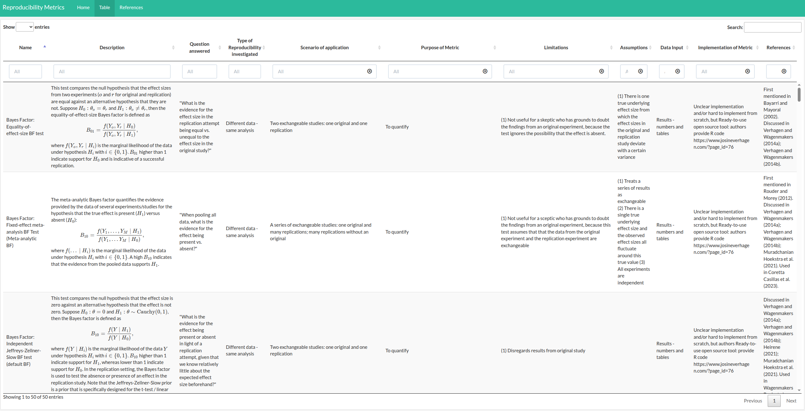

Across research fields, initiatives and calls have emerged to improve or ensure the **reproducibility** of research studies and findings. Ideally, research should be designed and reported in ways that allow an independent team of researchers to replicate a study and arrive at consistent results.

But how exactly can we **quantify reproducibility**? And how can we assess whether the findings of a replication align with the original?

Understanding how reproducibility is measured matters not just for the individual researcher aiming to improve their own work, but also for meta-researchers who study research processes and results, and institutions, funders and science policymakers who want to assess research quality in meaningful ways. This was the motivation behind a recent collaboration between members of the [**iRISE project**](https://irise-project.eu/) and the **FORRT** community. The results are now published in Royal Society Open Science [1].

### The iRISE project

The iRISE (improving Reproducibility In SciencE) project, funded through the Horizon Europe WIDERA call "*Increasing the Reproducibility of Scientific Results*" (WIDERA-2022-ERA-01-41), explores the causes of poor reproducibility and evaluates -- including primary research -- the effectiveness of interventions to increase reproducibility.

Even before the start of the project, we noticed that terms like reproducibility, replicability and replication are often used inconsistently across research fields and groups. What one group calls for example reproducibility, another might label replicability. To support clear communication and a shared understanding within the consortium, we developed the iRISE glossary [2] with working definitions of the most relevant terms.

A natural next step was to investigate how different aspects of reproducibility can be measured and quantified.

### A collaborative review of reproducibility metrics

To explore the question of **how reproducibility is and should be measured**, iRISE partners teamed up with members of the FORRT community to conduct a **scoping review**. Joris Frese, Helena Hartmann and Louise Townsin joined the team after a call for contributors was posted in the FORRT Slack channel. Our review's goal was to identify and categorise metrics used to quantify reproducibility in large-scale replication projects and metrics that were suggested or discussed in the methodological literature.

Following a preregistered protocol [3], the team identified **49 large-scale replication projects** and **97 methodological papers**. A total of **50 reproducibility metrics** were extracted from the included records. These ranged from statistical formulas and models (74%) to graphical representations (6%), algorithms (6%), frameworks (6%), and studies and questionnaires (8%). All metrics are summarised in Table 4 of our paper. An extended and interactive version of the table was also integrated in a small static website (<http://rachelhey.github.io/reproducibility_metrics/>) which allows for easy searches and filtering of the table.

### What we learned

We were surprised by the number and diversity of the identified reproducibility metrics, which reflects how complex it is to measure reproducibility. A few key takeaways stood out:

-   There is no single "best" reproducibility metric. Different metrics capture different aspects and serve different purposes.

-   Many large-scale replication projects did not clearly define what they mean by reproducibility, or how they planned to measure it.

-   The choice of a reproducibility metric(s) should depend on the study's goals and research questions. It should further inform the design of the study and researchers should transparently describe their choices.

We hope that our reproducibility metrics table will be a **practical tool** for future replication teams. It offers guidance on which metric fits which research question, and what data inputs are required. As a next step, we plan to systematically evaluate the real-world applicability of the identified metrics, with particular attention to their underlying assumptions and limitations. To support this analysis, we plan to use real-world data examples from the FORRT Replication Database.

### EDI considerations

We also explored how often dimensions related to equity, diversity and inclusion (EDI) were explicitly mentioned or addressed in the included literature. Unsurprisingly, only a few papers mentioned EDI dimensions, which highlights the need to make these considerations more explicit in future replication efforts. Within iRISE, EDI and research culture are not an afterthought; they are embedded by design into all our activities. If you are interested in other EDI efforts within iRISE, feel welcome to contact Stephanie Zellers at [stephanie.zellers\@helsinki.fi](mailto:stephanie.zellers@helsinki.fi).

Dr. Flávio Azevedo, FORRT's Director, sits on the iRISE Scientific and Ethical Advisory Board (SEAB) where he hopes to help iRISE's SEAB to monitor ethical issues that might require attention over the course of the project, but also monitor the progress of our work, assess its scientific quality, and provide feedback to consortium members.

### References

[1] Heyard R, Pawel S, Frese J, Voelkl B, Würbel H, McCann S, Held L, Wever KE, Hartmann H, Townsin L, Zellers S. (2025) A scoping review on metrics to quantify reproducibility: a multitude of questions leads to a multitude of metrics. R. Soc. Open Sci. 12: 242076 <https://doi.org/10.1098/rsos.242076>

[2] Voelkl B, Heyard R, Fanelli D, Wever K, Held L, Maniadis Z, McCann S, Zellers S, Würbel H. (2024) The iRISE reproducibility glossary. Open Science Framework. <https://doi.org/10.17605/OSF.IO/BR9SP>

[3] Heyard R, Pawel S, Wever K, Würbel H, Voelkl B, Held L. (2023) Reproducibility metrics - study protocol. Open Science Framework. <https://doi.org/10.17605/OSF.IO/7VC4Z>

------------------------------------------------------------------------

iRISE receives funding from the European Union's Horizon Europe research and innovation programme under grant agreement No. 101094853. The project also receives funding from UK Research and Innovation (UKRI) and the Swiss State Secretariat for Education, Research and Innovation (SERI): Direct Funding for Collaborative Projects as part of the transitional measures.
