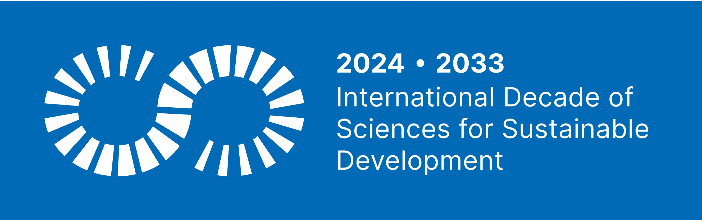

In a landmark moment for global scientific equity, **FORRT** is one of the few initiatives worldwide to be formally endorsed as a **Programme** of the [International Decade of Sciences for Sustainable Development (IDSSD, 2024–2033)](https://www.un-sciences-decade.org/en), led by UNESCO and the United Nations (UN). This endorsement reflects the highest level of UN policy recognition and positions FORRT’s work in Education & Pedagogy (Curriculum Hub), Metascience & Research (Replication Hub) and Social Justice & DEIA as an **essential contribution to the UN’s strategy for achieving the Sustainable Development Goals (SDGs)**. Specifically, FORRT for World Development (FORWARD), is recognized as critical infrastructure for advancing **Outcome 4 (widely and equitably practiced open science) and Outcome 1 (a globally science-literate society)** of the IDSSD. Through this work, FORRT facilitates the international research community to meet its core commitments to rigor, transparency, and global equity while delivering a roadmap for democratizing science worldwide.

One of the few programmes of the IDSSD to focus on how research is done, FORWARD provides a concrete, multi-year, and community-driven framework for delivering on the mandate of the UNESCO Science Decade while feeding into the work of the other Programmes and beyond. As an endorsed Programme, we are committed to **accountability and open knowledge sharing**, ensuring that all outputs are openly accessible and utilized by the global community. The resources developed over the next 8 years will serve as **policy tools for the Decade's Secretariat** and other high-level stakeholders to monitor and track progress on equity and quality in science. We are directly contributing to realizing the Decade's vision of an inclusive and effective global science culture by 2033, with the ability to contribute policy recommendations to the World Science Forum, the UN Science Summit, the Global Research Council, the European Commission, and more.

The FORRT community is already hard at work producing tools, guidelines, recommendations and materials to democratize science. We invite aligned organizations and strategic national and international partners to join us and invest in FORRT's mission, thereby directly supporting their national commitments to the UN Science Decade through our validated global roadmap.

