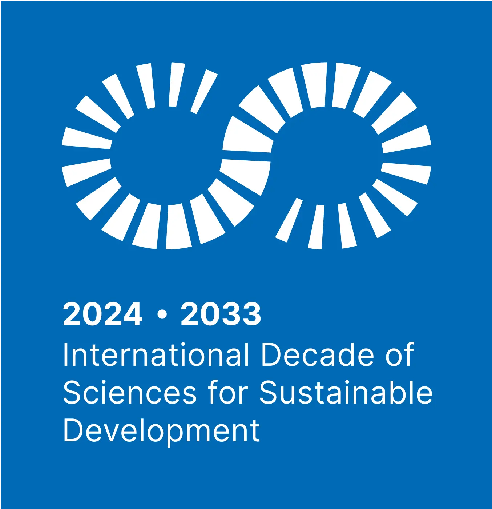

+++
# Combined Achievements & Awards section (two columns).
widget = "blank"  # See https://sourcethemes.com/academic/docs/page-builder/
headless = true  # This file represents a page section.
active = true  # Activate this widget? true/false
weight = 50  # Order that this section will appear.

title = "Achievements &amp; Awards"
[design]
  # Choose how many columns the section has. Valid values: 1 or 2.
  columns = "1"

[design.background]
  color = "#fefdf6"
  text_color_light = false

[design.spacing]
  # Customize the section spacing. Order is top, right, bottom, left.
  padding = ["40px", "0", "40px", "0"]
+++

---

### [FORWARD: A UNESCO Decade of Science Programme](../educators-corner/023-forward-a-unesco-decade-of-science-programme/)

 

**FORRT** is one of the few initiatives worldwide to be formally endorsed as a **Programme** of the [International Decade of Sciences for Sustainable Development (IDSSD, 2024–2033)](https://www.un-sciences-decade.org/en/endorsed-activities/forward-forrt-world-development-fostering-open-research-reproducibility-worldwide-accessible?hub=63) , led by UNESCO and the United Nations (UN). This endorsement reflects the highest level of UN policy recognition and positions FORRT’s work in Education & Pedagogy (Curriculum Hub), Metascience & Research (Replication Hub) and Social Justice & DEIA as an **essential contribution to the UN’s strategy for achieving the Sustainable Development Goals (SDGs)**.

<a href="https://www.un-sciences-decade.org/en/endorsed-activities/forward-forrt-world-development-fostering-open-research-reproducibility-worldwide-accessible?hub=63" style="font-size:0.7rem;">
  Read the Official Announcement of the endorsement of FORWARD by the UNESCO Science Decade
</a>

 



 

  

  <h3 class="ms-title">Milestones in 2025</h3>
  <ul class="ms-list">
    <li class="ms-row">
      <i class="fab fa-bluesky"></i><i class="fab fa-linkedin"></i>
      <strong>Over 2,000</strong> followers on Bluesky, and <strong>over 1,000</strong> followers on LinkedIn
    </li>
    <li class="ms-row">
      <i class="fas fa-puzzle-piece"></i>
      <strong>More than 50</strong> active or completed projects, with more on the way
    </li>
    <li class="ms-row">
      <i class="fab fa-slack"></i>
      <strong>Over 1,500</strong> of FORRT's members are on Slack
    </li>
    <li class="ms-row">
      <i class="fas fa-book"></i>
      <strong>10</strong> journal articles, <strong>5</strong> op-eds/other media, <strong>4</strong> preprints, <strong>&gt;600</strong> citations, <strong>3</strong> policy briefings, and <strong>14</strong> awards &amp; commendations (and counting)
    </li>
    <li class="ms-row">
      <i class="fas fa-envelope-open-text"></i>
      <strong>1,200+</strong> subscribers to the FORRT newsletter
    </li>
    <li class="ms-row">
      <i class="fas fa-users"></i>
      <strong>435 individuals</strong> have contributed to FORRT projects
    </li>
    <li class="ms-row">
      <i class="fas fa-handshake"></i>
      <strong>12</strong> formal institutional partnerships
    </li>
  </ul>

  

  

FORRT has won a series of awards and commendations for our work, including:

- The UK Reproducibility Network's Dorothy Bishop Prize
- Open Science Community Amsterdam's OSC Award in the Open Educational Resources / Open Education / Open Online Courses category
- An Open Scholarship Prize (1st Place) award from the Atlantic Technological University and the Open Science Community Galway

To find out more about these and more, read [FORRT's awards page](/awards).

  

