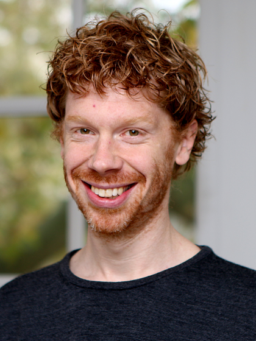
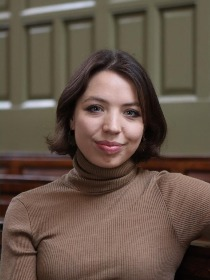
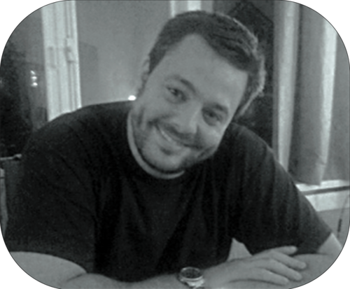
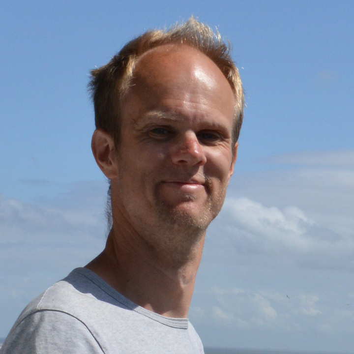
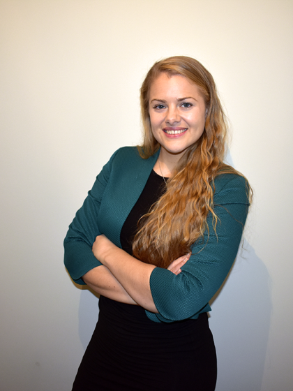
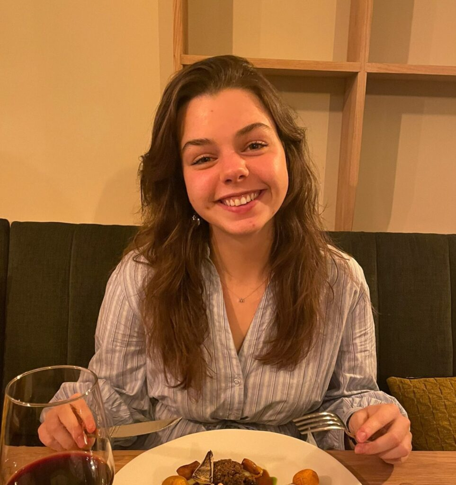
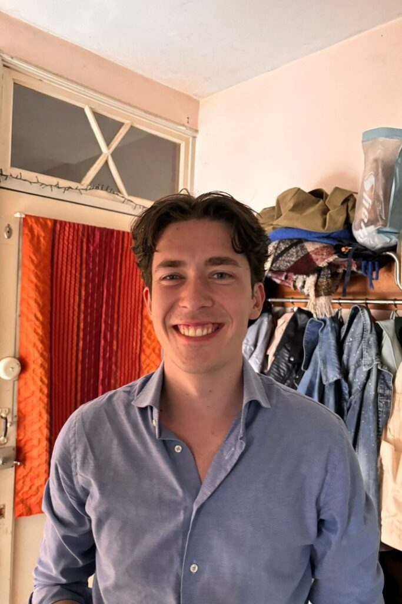
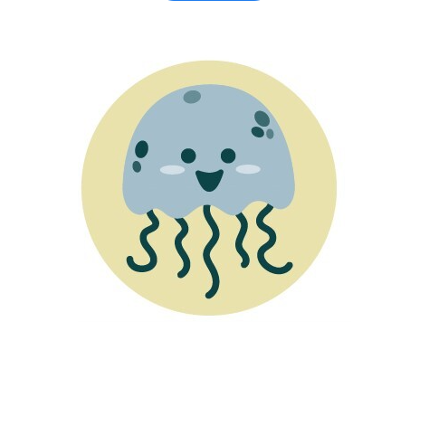

+++
widget = "blank"
headless = true
active = true
weight = 5

title = ""
subtitle = ""

[design]
  columns = "1"

[design.background]
  text_color_light = false

[design.spacing]
  padding = ["60px", "0", "60px", "0"]

[advanced]
 css_style = "font-size: 1.25rem;"
 css_class = ""
+++

# JUST-OS Chatbot

 

The **JUST-OS** (Judicious User-friendly Support Tool for Open Science) chatbot is an initiative by researchers at the University of Groningen and [FORRT](https://forrt.org/) that aims to develop an AI-based chatbot to help researchers navigate Open Science resources more easily.

Researchers generally support Open Science practices but often struggle navigating the vast landscape of available resources. JUST-OS aims to provide user-friendly, tailored, and efficient guidance to help researchers find relevant Open Science resources.

 

## Try the JUST-OS Chatbot



 

## The Team

<h4 style="margin: 10px 0 5px;">Rink Hoekstra</h4>

Associate Professor at Pedagogical and Educational Science department, University of Groningen; board member Open Science Community Groningen; co-project manager.

<h4 style="margin: 10px 0 5px;">Nina Schwarzbach</h4>

PhD candidate in psychotherapy and research methodology at University of Groningen; co-project manager.

<h4 style="margin: 10px 0 5px;">Flavio Azevedo</h4>

Assistant Professor of Interdisciplinary Social Science at Utrecht University (formerly Groningen); FORRT liaison.

<h4 style="margin: 10px 0 5px;">Michiel van der Ree</h4>

Consultant applied AI at Center for Information Technology, University of Groningen; programming lead.

<h4 style="margin: 10px 0 5px;">Vera Heininga</h4>

Assistant Professor studying psychology, psychiatry, sociology, and pedagogy; Open Science researcher.

<h4 style="margin: 10px 0 5px;">Madelief van der Velden</h4>

Research Master student with Pedagogy and Education background; student assistant.

<h4 style="margin: 10px 0 5px;">Robin Hoekstra</h4>

Bachelor student with Psychology and Law background; student assistant.

<h4 style="margin: 10px 0 5px;">Lukas Wallrich</h4>

Lecturer in Organisational Psychology at Birkbeck, University of London; FORRT Co-Director.

<h4 style="margin: 10px 0 5px;">JUST-OS</h4>

Jellyfish and chatbot for Open Science.

 
