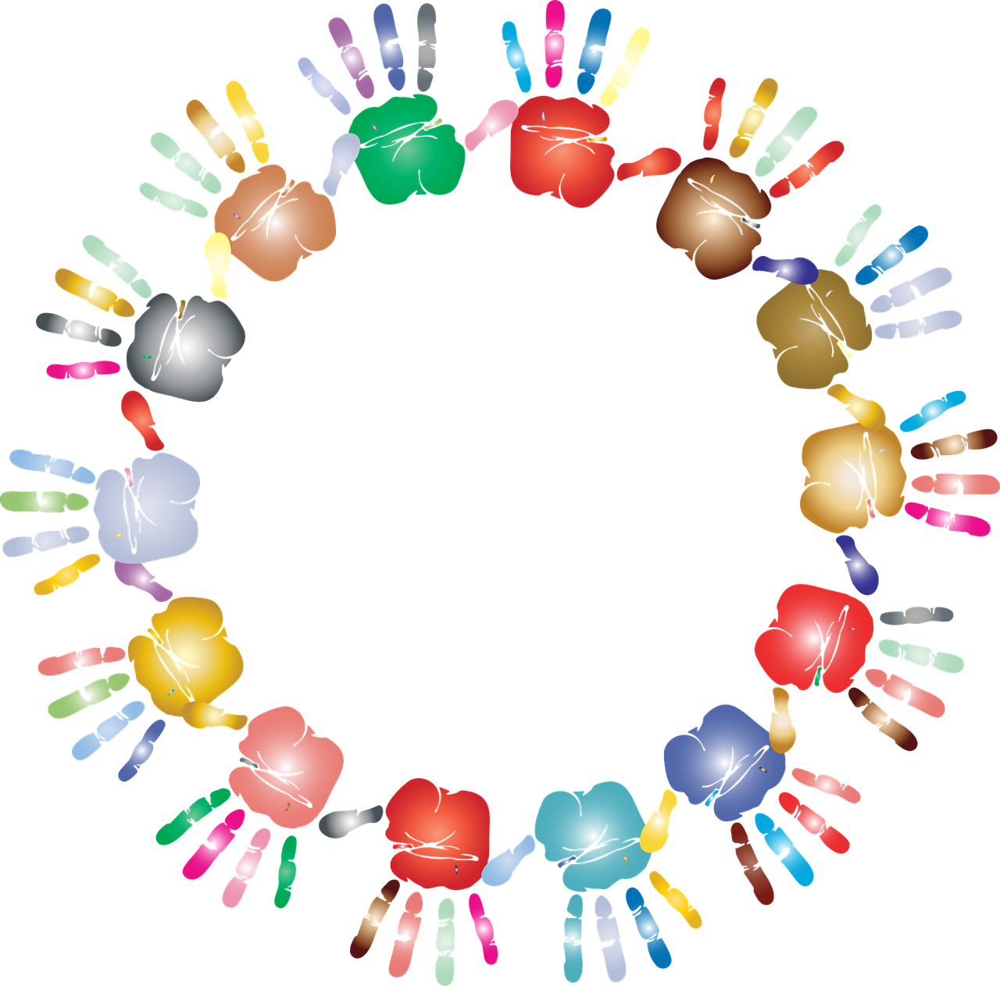

[LEAVE FEEDBACK AND LOOK AT THE LESSON PLAN HERE](https://docs.google.com/document/d/1UJYUTK_zbcoJTt6DjRQVrjvnfa6quCnqfYCEV2HtcDM/edit?usp=sharing)

**COMMUNITY PSYCHOLOGY: RESPECT FOR DIVERSITY**  

Diversity as one of the core values of Open Science

**Objectives:**

- understand cultural humility as an approach to diversity
- define and discuss dimensions of diversity
- understand privilege and intersectionality and reflect on own privilege using the wheel of privilege

[Click to see reading list and licenses](#reading-list)

Lesson incorporates content from chapter 8 “Introduction to Community Psychology: Becoming an Agent of Change” available online under the CCBY4.0 license.

**Before you start:** 

_What do you understand by diversity in science?_ 

_What controversies are presently discussed that relate to diversity and the field of psychology?_

Focus on diversity in psychology can be traced back to the 1930s and Vygotsky, the pioneer of Sociocultural Approach

**Activity 1 Respect for Diversity - Introduction**

Read the introduction to diversity below and see if you can answer the questions below it.

**Respect for diversity** has been established as a core value for Community Psychology, as indicated in Chapter 1 (Jason et al., 2019). Appreciating diversity in communities includes understanding dimensions of diversity and how to work within diverse community contexts, but also includes a consideration of how to work within systems of inequality. Community psychologists must be mindful of diverse perspectives and experiences when conducting research and designing interventions, as well as working to combat oppression and promote justice and equality. By working within a framework of cultural humility, this chapter attempts to provide a basic understanding of the dimensions of diversity that are most common in Community Psychology research and practice. Further, we explore how these dimensions contribute to complex identities and considerations for community practice.  

click to see the source

a) What do you know about Cultural Competence and Cultural Humility?

b) What dimensions of diversity can you think of?

c) There are some more terms and concepts related to the topic of diversity within communities. Can you explain and discuss these with another student or write down your ideas in points?

- privilege
- white privilege
- intersectionality

**Activity 2 Respect for Diversity: Jigsaw reading or poster**

Now choose the task you prefer to get a better understanding of the concepts presented above. Bothe tasks will ask you to refer to the source introduced in the previous chapter. Read the instructions, decide on the task and click the button underneath the instructions to see the text.

**JIGSAW READING (group activity)**

a) In groups, decide who is going to focus on the points below while skimming through the text in order to summarise it to the rest of the group. Once you decide how to divide the sections, spend 10-15 minutes reading through the relevant parts and preparing to summarise the concepts to your students.

**CREATING A MIND MAP OR A POSTER**

b) Skim through the chapter and create a mind map or a poster with dimensions of diversity and quick explanations. Then add information about cultural humility, privilege and intersectionality. Share the results of your work with another student.

*   Cultural Humility

*   Culture, Race and Gender

*   Age, social class and sexual orientation

*   Ability / Disability and Religion & Spirituality

*   Privilege and intersectionality

**Activity 4 The Academic Wheel of Privilege**

Reflect on how you see or identify yourself in relation to these dimensions. Which groups do you identify with? Have you heard the phrase "check your privilege"? Have you thought of intersectionality and privilege in relation to yourself? FORRT has developed a tool which allows everyone in academia to reflect on their privilege. Look at the video below, in which Bethan Iley, one of the members of FORRT explains the concept.

**Would you like to try the wheel?**

> For [#DisabilityPrideMonth](https://twitter.com/hashtag/DisabilityPrideMonth?src=hash&ref_src=twsrc%5Etfw) here’s our new preprint on [#Neurodiversity](https://twitter.com/hashtag/Neurodiversity?src=hash&ref_src=twsrc%5Etfw) and Open Scholarship! We look at [#ND](https://twitter.com/hashtag/ND?src=hash&ref_src=twsrc%5Etfw), intersectionality, [#SocialJustice](https://twitter.com/hashtag/SocialJustice?src=hash&ref_src=twsrc%5Etfw) & [#UniversalDesign](https://twitter.com/hashtag/UniversalDesign?src=hash&ref_src=twsrc%5Etfw). Sharing lived experiences & solutions for more equitable inclusion of ND people in academia!  
> 👉[https://t.co/FcQoppTbvD](https://t.co/FcQoppTbvD) [pic.twitter.com/vhF0vxy4xI](https://t.co/vhF0vxy4xI)
> 
> — FORRT @FORRT@mastodon.social (@FORRTproject) [July 14, 2022](https://twitter.com/FORRTproject/status/1547570498879442945?ref_src=twsrc%5Etfw)

**How to use the wheel:** Look at the dimensions of privilege on the outside of the circle and choose the option from the inner circle that describes your situation best. For every answer in the smallest circle (the closest to the middle of the wheel), give yourself 1 point, then 2 points for the option in a slightly bigger circle and finally 3 points of the option closest to the outside of the circle. Share your result with a friend or keep it to yourself. Do you think this tool is useful? Is it important to check our privilege? How can this make you more mindful of other’s experiences?

**Reading:**

(to be be done before or after the lesson)

Jason, Leonard A.; Glantsman, Olya; O'Brien, Jack F.; and Ramian, Kaitlyn N., "Introduction to Community Psychology: Becoming an Agent of Change" (2019). College of Science and Health Full Text Publications. 1. https://via.library.depaul.edu/cshtextbooks/1

Flavio Azevedo, Sara Middleton, Jenny Mai Phan, Steven Kapp, Amélie Gourdon-Kanhukamwe, Bethan Iley, Mahmoud Elsherif, & John J. Shaw. Navigating Academia as Neurodivergent Researchers: Promoting Neurodiversity Within Open Scholarship. APS Observer October 2022

Elsherif, M. M., Middleton, S. L., Phan, J. M., Azevedo, F., Iley, B. J., Grose-Hodge, M., … Dokovova, M. (2022, June 20). Bridging Neurodiversity and Open Scholarship: How Shared Values Can Guide Best Practices for Research Integrity, Social Justice, and Principled Education.
