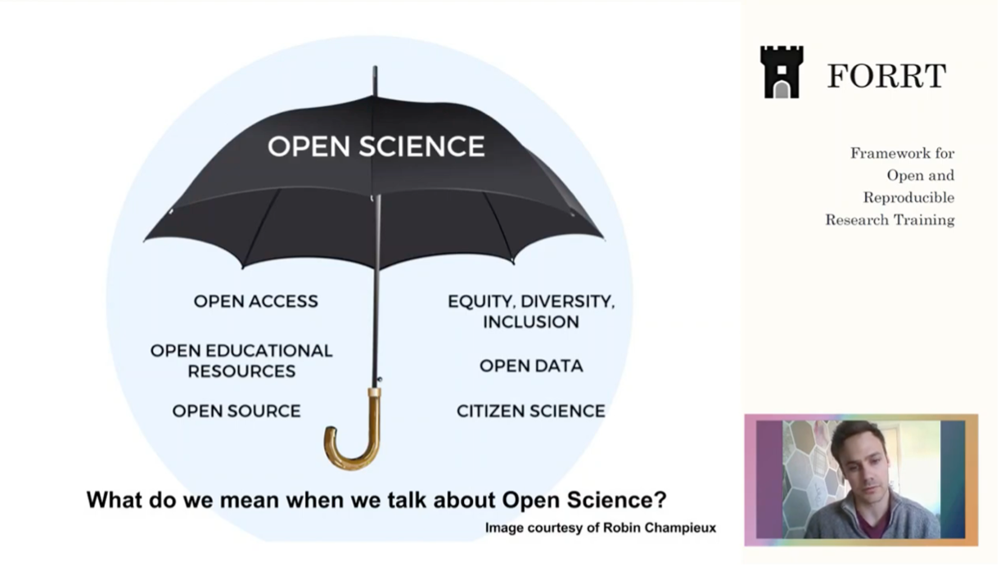

- Understand that research needs to acknowledge the implications of power dynamics
- Reflect on the importance of participatory research and cultural humility in relation to diversity in science
- Understand how Open Scholarship promotes diversity in research

## Activity 1

*You have discussed diversity in your previous class. Can you remember what the terms CULTURAL COMPETENCE and CULTURAL HUMILITY mean? Read the text below and explain the idea of PARTICIPATORY ACTION RESEARCH. How is it connected to cultural competence and humility?*

Adopting **cultural humility** is necessary for considering diversity in research. In research, it is important to consider how questions are asked or which samples are included in a study. In addition, the importance of topics of research to diverse communities must be considered, which may require developing research topics and questions with the populations that are being impacted. Participatory action research is a valuable tool for developing topics in an inclusive way and is a method frequently used by community psychologists to find solutions in the social environment (Kidd & Kral, 2005).

Research must also consider the power dynamics between the researcher and the community as well as the dynamics within the community. The use of culturally-anchored methodologies is important for exploring research questions in the appropriate context. **Marginalized groups are often compared to a majority group, but these comparisons may not always acknowledge the implications of power dynamics present in such comparisons.** When developing the methodology, it is important for the researcher to acknowledge one's own cultural assumptions, experiences, and positions of power. Recognition of these aspects of self will lead to a more careful framing of the research question within context. Finally, it is important to consider where to disseminate research findings to reach wide audiences.

*Source: Jason, Leonard A.; Glantsman, Olya; O'Brien, Jack F.; and Ramian, Kaitlyn N., "Introduction to Community Psychology: Becoming an Agent of Change" (2019). [https://via.library.depaul.edu/cshtextbooks/1](https://via.library.depaul.edu/cshtextbooks/1)*

## Activity 2

*How much do you know about Open Science and its values? Watch a presentation on Open Science by Sam Parsons (FORRT). How is Open science connected to diversity?*

 

Watch the presentation here

<iframe style="position: absolute; top: 0; left: 0; width: 100%; height: 100%;" src="https://www.youtube.com/embed/axiZhCkMiDc" title="YouTube video player" frameborder="0" allow="accelerometer; autoplay; clipboard-write; encrypted-media; gyroscope; picture-in-picture; web-share" allowfullscreen></iframe>

## Activity 3

*Take [this quiz](https://press.rebus.community/introductiontocommunitypsychology/chapter/chapter-8-quiz/) to check what you have learnt on diversity and research.*

### Extra reading:

- [How open science promotes diverse research](https://journals.sagepub.com/doi/full/10.1177/1475725719869164)
- [Respect for Diversity in Community Psychology](https://press.rebus.community/introductiontocommunitypsychology/chapter/respect-for-diversity/)
