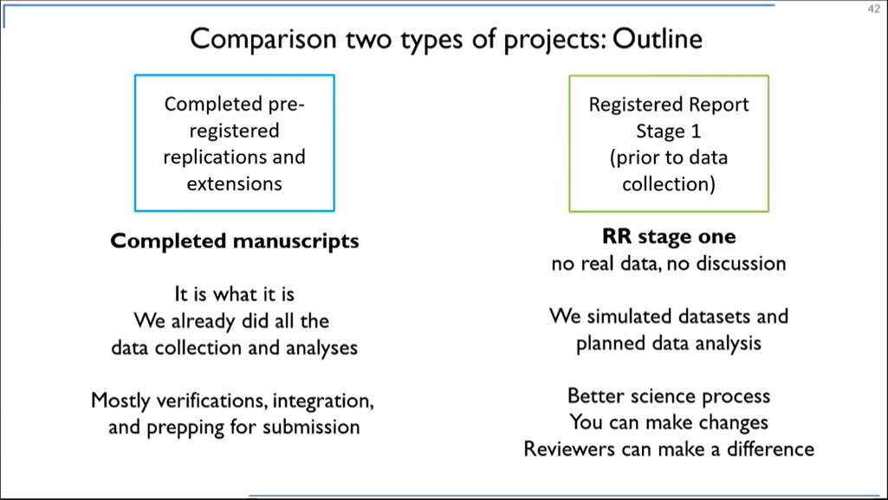

 

FORRT’s Pedagogies are back with no less than Gilad Feldman. Over the past years, Gilad has completely remodelled his research and teaching to incorporate several aspects of Open Science in a way that is certainly exemplary to many of us. In this FORRT’s Pedagogies, Gilad shares his materials and his insights about his own journey in Open Science. We hope that this can inspire and help many scholars wishing to incorporate more Open Science into their teaching and research. 

 

Gilad Feldman is Assistant Professor at the Department of Psychology at the University of Hong Kong (HKU). His research focuses on judgement and decision making and he strongly supports the Open Science movement at all levels - from his teaching philosophy, to the development of open teaching materials and resources, and the involvement of students in Open Science training and practice. One of Gilad’s most known projects is the student-led pre-registered replications and extensions, [which you can find here](https://mgto.org/core-team/). But be sure to check all his other amazing meta science resources such as his course syllabi and the “Check me, Replicate me” initiative (all links can be found below). 

FORRT’s Team Pedagogies took the opportunity to ask Gilad some questions on his journey through and with Open Science (shoutout to the FORRT and academic Twitter community for sending so many great questions). You can watch or listen to the interview in the video or read a summary of his main points below! We hope you enjoy and learn as much as we did! 

***Check out the full interview here***



 

1. **You have an incredible amount of Open Science resources ranging from courses and replications to incentives to other researchers to replicate or find mistakes in your own work. How did you embark on this Open Science journey?**

***Gilad***: In 2015, [the big Science paper](https://www.science.org/doi/full/10.1126/science.aac4716) came out, showing replication rates that in my opinion were alarming. I didn’t understand how bad things really were until this paper came out. I remember being a postdoc and thinking that something big was happening and that I couldn’t in good faith continue with the research I was doing without figuring this out. I then started to think about my principles and decided on my main goals: my research has to be trustworthy, reproducible, replicable. Over time, I also started thinking about equity and inclusion issues. I set my own principles, such as to share materials, data and code. Back in 2016, this was scary stuff! I started to supervise students according to Open Science principles, and the CORE team (Collaborative Open-science and meta REsearch) developed from this. 
 
 

2. **You have managed to put Open Science at the core of your teaching and research. Can you briefly mention the materials and activities you have developed in your own work to accelerate Open Science?**

***Gilad***: First of all, I have not developed this on my own. I’ve decided that every time I’m going to make a guide or a template, I’m going to make it collaborative. Everyone who contributes to the document puts their name down and if we submit to a journal, they’re co-authors - from students to professors! We have created a bunch of resources, such as research assessments, community resources (e.g., guides on how to do replications and extensions, how to calculate effect sizes, etc.) and collaborative open resources for statistical analysis, such as the [Jamovi guide](https://mgto.org/jamovijaspguide). Every time I see a need, I open a collaborative guide and share it with others (teaching assistants, students, external reviewers, the CORE team) and advertise it on Twitter. Guides have grown exponentially thanks to the community and now anybody can implement them. 

 

3. **Did you face any challenges or critical incidents when incorporating Open Science into your teaching or research? What can scholars expect when embarking on this Open Science journey?**

***Gilad***: Being completely open can be intimidating, and it takes some time to convince students that this model works. At the beginning the major issue was the lack of ready-made resources, but I feel that many of the initial challenges have been overcome. 

Psychologists study people, but we rarely point the research that we do to ourselves. I study judgment and decision-making and cognitive biases, and it is amazing how many of these biases we experience ourselves in the academic community and throughout the scientific process. There are lots of biases on how Open Science folks versus more status-quo researchers look at each other. I try to shield my team and students as much as possible from negative comments, but also want them to get a realistic view of the academic world, where there are lots of problems with ego, interests, cognitive biases and heuristics. I try to tell my students that in the end we all want the same thing: the science world is all of us working together. There are lots of challenges, we are humans, but we are learning as a community how to discuss these issues in the open. **Humility is key.** Taking a step back and listening can help overcome these biases and help us learn from each other. 

  

#### Fostering collaboration: from the teaching portfolio to course (re)design
*** 

  

4. **You have an amazing [teaching portfolio](https://mgto.org/giladteachingportfolio) where you detail all your teaching activities and present your teaching philosophy and goals. Could you tell us what you think are the key elements of your teaching philosophy?** 

***Gilad***: We really need to reorient what we do in education. I got a lot of inspiration from various projects, such as [CREP](https://osf.io/wfc6u/) and the [Psychology Science Accelerator](https://psysciacc.org/). I believe that students and early-career researchers are  key actors to address the replication crisis in science. We need to move away from the model of the professor standing in front of students with their powerpoint slides. I believe in alternative approaches such as **flipping the classroom**. I’m also a fan of **problem-based learning**: you give problems to students and they work together to figure it out. This works brilliantly in the undergraduate courses that I’m teaching in Hong-Kong. We need to teach students how to learn. We need to understand that science is messy.  These are the principles I set (see image below):

I decided to share everything I create: slides, lectures, videos... complete transparency! Everything students do is shared on [OSF](https://osf.io/cyvtb/), which may be scary initially, but increases the sense of accountability. And students understand the importance of doing this: even if there’s the possibility of error, you want to be transparent about the process, **so other people can help you do better** or find your mistake. In fact, there are lots of reasons why I started with replications and extensions: they are more practical, measurable, systematic, valuable for students in their learning journeys and overall more instructive. I believe that this helps students develop their **scientific thinking**, whatever career path they decide to take. 

 

5. **Collaboration is one of the pillars of your pedagogy, and in your syllabi you mention a [“team contract”](https://mgto.org/teamcontracttemplate) that is created together with the students. Could you explain what this team contract is? Why and how investing in/learning team communication can be connected with Open Science practices?**

***Gilad***: Team contract is something relatively new that really boosted collaborative work in my courses, mostly because it helps to align expectations. Students sometimes do not like to work together, and they’re used to multiple choice exams and a more structured model. But there is something very important about teamwork, also later when starting to work in a paid job. The most common complaint in my teaching evaluations at the beginning was: “we do not like to work in teams, we prefer to work individually, whenever we work in teams there are a lot of free-riders”. The team contract helps the team to solve issues students might face and it can be adjusted over the semester: basically, it’s about getting the team together to get to know each other and discuss their project following a [flexible template](https://mgto.org/teamcontracttemplate). For example, as part of the team contract, students  do a “pre-mortem”: they are asked to imagine an issue has happened, what they would do and how they could have prevented it from happening. At the end of the semester, we ask students to [**reflect on their learning journey**](https://mgto.org/teamworkreporttemplate) (what they did compared to what they planned). Then, students are required to grade themselves. Everyone was very humble and understood that it is not about me telling them “you have to learn this way”. It is about them setting their own goals, holding themselves accountable, overcoming challenges and reflecting on their journey. In fact, they all got precisely the grade they assigned themselves.

 

6. **Over time, how did you (re)design your courses to include Open Science principles?**

***Gilad***: At the University of Hong Kong, I am very privileged. I have a lot of freedom and flexibility. It is not a big deal to include Open Science principles into my own courses. **I just try things out.** Whenever I see a good idea, I try to embed it in my teaching. My students are very open-minded and let me do this and evolve together with me.

 

#### Mass Replications & Extensions: workflow, students’ feedback and co-authorship 
*** 

  

7. **You have conducted several replications within your courses. Could you walk us through how it works from beginning to end? For example could you share the administrative/organisational side of it? How many students are involved in each course/replication and how do you motivate students to participate in replications?**

***Gilad***: This is complex - I usually give 3 hour workshops on replications! In terms of numbers, some of the courses I teach are large, with 70 students per class. Recently, in the more advanced courses I got about 20 students. **We do two types of projects.** At the beginning, we completed **pre-registered replications and extensions.** Within one semester, students went from basic statistics skills to a completed manuscript that was ready to be submitted - with everything written up, from preregistration to data analysis and so on. In 2020, we moved to a model of Registered Reports Stage 1. We got a lot of rejection letters from journals telling us about all the issues in our replications, based on outcome bias and hindsight bias. This is something that **Registered Reports** tackle very well: I got students to write a Stage 1 Report with a simulated dataset (Qualtrics helps with this) and detailed methodology and analysis sections. The workflow is shown in the image below: 

For pre-registered replications, the schedule is very tight, and everything is done within a month and a half. Then, I usually don’t sleep for two or three weeks and give two or three teams the same dataset, so that they can peer review one another. Finally, they produce a final report and an early-career researcher takes the lead as first author. Everybody takes credit and everything is written down. We still have about 25 unfinished projects - so if anybody in the FORRT community is interested, they can come and work with us! 

A very similar model is applied to Stage 1 Registered Reports, but without the data collection, while the model for thesis students is a bit different. They have one year, and they do a registered report. We then submit everything to [Peer Community in Registered Reports](https://peerj.com/blog/post/115284884044/peerj-journals-support-peer-community-in-registered-reports/#:~:text=Peer%20Community%20In%20Registered%20Reports%20(PCI%20RR)%20is%20a%20community,design%2C%20rather%20than%20the%20results.). In terms of impact, students not only gain a publication but they have their chances of being hired (both in academia and industry) increased. This can make a difference for them, so they are very **enthusiastic and motivated.** They are serious about the work and they know the course itself is different from other courses - hands-on, **learning by doing...** Some students appreciate this, but not everybody. Students with other preferences can drop out and choose other courses offered at HKU.

 

8. **As one of your teaching goals, you have mentioned that “students experience the research process from beginning to end”. One of the most amazing things of the Mass Replications and Extensions is that students do make actual contributions to science. In your view, what is the role of students’ contributions to academic literature? Could you share with us the feedback that you got from students involved in replications?**

***Gilad***: Students can feel a lot of pressure, a lot of tension, during the process. Especially at the beginning. It’s so different from everything they have done before, so this can lead to some frustrations… I get some emails from students who have graduated and transitioned to industry, and reflecting back they are able to see these courses as a **meaningful** part of their journey (for good or bad). Some of them understand that science is messy, and others had never imagined they could have a contribution as undergraduates. It’s about empowering **students to take part in the process**. One thing I try to show them is how many mistakes professors make and that everybody is capable of contributing, helping us do better. Overall, many students find it meaningful, if not memorable - and they’ve learned important skills in the end. This is my aim and what I was hoping for. 

 

9. **You published several replications that started out as replications in classrooms. Were students interested in contributing to the research papers as co-authors after the end of the course? Can you explain how authorship is attributed and agreed upon?**

***Gilad***: This is an aspect that needs to be sorted out very early on, and we follow a very strict model. In my syllabus there’s a passage about “what it means to take part in this course”. **Everybody is a co-author by default**, but it’s possible to opt out if one makes it clear at the beginning (and reiterates it at each submission). Until now, and it’s been four years, nobody has opted out. In addition, we don’t want people to be forced by omission, and must ensure that the **implications of this model are clear to them.** The co-authorship model is explained to them early on, like a co-authorship contract: this is definitely very important to align expectations. I use a mandatory **quiz** on the course to collect their agreement and keep a written record (we also ask permission to submit articles in their name even after graduation). So, generally, every student is a co-author, with clear documentation of their contribution. We also have a **credit contributorship** where we keep track of what students, teaching assistants and early-career researchers bring in. Sometimes reviewers push back, so this document is useful to support and justify authorship attribution. Students did everything in their submissions. I guided them here and there but it’s really them who deserve the credit for the initial draft. It is open, transparent and collaborative work, with no room for misunderstandings. 

In my PhD, I just remember a lot of interactions between students and professors where professors put themselves as first authors and some students were not even mentioned. I don't understand how this is **a sustainable system**. It's not fair, it's not equitable, it’s not ethical. Undergraduate students, sometimes even high school students, can do science. There's nothing about me having a professor title that makes me more eligible for co-authorship than a student. I believe in as much inclusion as possible, and **it doesn't matter where you come from, what rank you are, how old you are. Everybody should be acknowledged and included.**

 

10. **You also encourage other researchers to check and replicate your own work (Check me, Replicate me). Do you also incorporate this in your courses, letting students check your own work? Can you explain how that works?**

***Gilad***: I started in 2019 to do assessments with students, because I understood that before we do replications students need to see how others do replications. I just wanted them to go and have a look at the top-notch replication work in our field. I realized that I really worry that in ten, twenty years somebody is going to find an error that I have made… and funding, millions of dollars, hundreds of hours are going to be wasted! This is partially why I open up everything: I want others to be able to check, for example, my code - which is something that, when you go through peer review, can be overlooked. So I turned this into a learning opportunity. In 2020, we checked our replication reports from 2019. In 2021, we checked our replication reports from 2020, and so on. I was hoping (praying!) that, on the one hand, students wouldn’t find mistakes. On the other hand, though, if there were mistakes I really wanted students to find them. [Last year I created a section of my website](https://mgto.org/check-me-replicate-me/) where I wrote “I will pay you 5 USD for a minor error, and 50 USD for a major error”. To my great surprise, students found mistakes and I paid them quite a bit of money (which they decided to donate to charity). Win-win. I’m promoting this “Check me, Replicate me” as a pledge that other people can also incorporate and I hope that we'll be able to do more of that in the future.

 

11.  **Do you have any general advice for new(ish) researchers wanting to be more open and transparent about their research and to educators wanting to implement Open Science in their teaching and mentoring?**

***Gilad***: The best way is to just get started. I was able to put my research aside for a year. If you can’t, try to incorporate some Open Science principles in your work. If you can’t free yourself, start doing this with a masters student, as part of a collaboration. Join a team that does this kind of stuff. **I suggest starting very, very simple, and building up.** We started with a very simple replication, a very simple main effect. It doesn’t have to be complicated, just be as transparent as possible. If you’re too scared, invite me, and I’ll show you how to do it. But in general, start small, or join a big team and see what you can learn. 

 
 

***All links to Gilad Feldman’s teaching resources***

* [Teaching Portfolio:](https://mgto.org/giladteachingportfolio) a document detailing achievements, teaching philosophy, goals and practices at HKU (2021)
* [Course Materials:](https://osf.io/cyvtb/) these include course summaries, syllabi, lecture slides, tutorials, teaching evaluations, and videos 
* Open Science Talks and Workshops (since 2020): recordings are available on [OSF | Open Science Talks and Workshops](https://osf.io/df9tj/) and Gilad's  [Youtube channel](https://www.youtube.com/c/GiladFeldmanScience/playlists) 
* A list of [collaborative and open resources:](https://mgto.org/resources/) guides and tutorials, examples of students’ work, templates, open projects for early-career researchers 
* Resources about [Open Science and the Science Reform](https://mgto.org/open-science/)
* [Collaborative Open-science and meta REsearch:](https://mgto.org/core-team) information on the project, mass replications and extensions, the team and how to get involved 
* [The .pdf version of this page, with Gilad's answers to the community's question](GF-interview.pdf)

 

***Suggested Citation***
________

Feldman, G. (2022). Developing principled pedagogies - An Open Science journey: Insights from incorporating open science into teaching and mentoring. *FORRT Pedagogies*. https://doi.org/10.17605/OSF.IO/QNCBF

 

**Team-Pedagogy Contributors**:
________

[Giorgia Andreolli](mailto:giorgia.andreolli@univr.it), Verona University, Italy

[Julia Wolska](mailto:juliawolska@gmx.de), Manchester Metropolitan University, UK

[Flavio Azevedo](mailto:fa441@cam.ac.uk), Cambridge University, UK.

[Leticia Micheli](mailto:l.rettore.micheli@fsw.leidenuniv.nl), Leiden University, the Netherlands.

