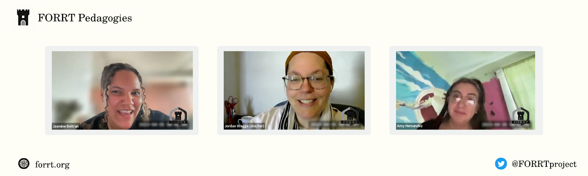

 

We are back with a very special Pedagogies, this time including also the perspectives of students on learning about Open Science (OS)! We have three amazing guests: Prof. Dr. Jordan Wagge and her two outstanding undergraduate students, Jasmine Beltran and Amy Hernandez. Over the past years, Jordan has led the way in developing CREP so that it can i) accomplish much needed replications, and ii) provide tools/structure for instructors who desire to train their students in OS. In this FORRT’s Pedagogies, Jordan and her students share their experiences with CREP and their thoughts about the trials and tribulations of involving students in the process of OS. We hope that this can inspire and help many scholars wishing to incorporate more OS into their teaching, mentoring and research. 

 

Jordan Wagge is a Professor of Psychology and Cognitive Science at the University of Avila (UA) and the Executive Director of CREP. Her research focuses on three areas including replication work, pedagogy, and critical work studies. She has a strong record supporting the OS movement at all levels - from her teaching philosophy, to the development of open teaching materials and resources, and the involvement of students in OS training and practice. But be sure to [learn more about Jordan from her website](https://jordanwagge.com/) (all links posted below). We are also joined by Jasmine Beltran and Amy Hernandez, Jordan’s students, who have experienced the implementation of CREP in their classrooms first hand. They discuss their perspective as a student, their challenges, and the benefits they gained through this process.

FORRT’s Team Pedagogies took the opportunity to ask Jordan, Jasmine, and Amy some questions on their journey with CREP (shoutout to the FORRT and academic Twitter community for sending so many great questions). You can watch or listen to the interview in the video or read a summary of their main points below! 

***Check out the full interview here***



 

1. **Could you tell us a little bit about yourself and how you got involved with Open Science and, more specifically, with CREP?**

**_Jordan_**: I got involved with OS pretty naturally. In graduate school, I taught Statistics and Research Methods. When I taught, I would highlight best practices and how science works. There were all these topics that I felt hypocritical teaching because I would also say “Psychologists don’t do this in practice”. It led me to ask, **why don’t we do these things in practice?** I naturally fit into the OS and transparency movement because it made sense. I got involved with CREP after it was founded. At a conference, I was seeking co-presenters on how to teach undergraduate students research methods most effectively. I wanted to know how others maximized the limited amount of time given all the learning outcomes associated with a methods course. [John Grahe](https://www.plu.edu/psychology/staff/jon-e-grahe/) responded. The angle he took is to make the course time to capitalize on a meaningful contribution to the field especially if students are already investing so much energy. At the same time, [Mark Brandt](https://www.socialsciencespace.com/author/markbrandt/) and [Hans Ijzerman](https://nias.knaw.nl/fellow/ijzerman-hans/) from Tilburg University were interested in replication efforts and began CREP. I reached out and joined from there.

**_Jasmine_**: We’ve had Dr. Wagge as an instructor for a year now. Our Statistics course is a 2-semester course. During the first semester, we focused on doing a literature review and collecting material. This semester we are currently collecting data. We were required to engage with CREP but it’s been a fun, educational experience.

**_Amy_**: I am in the class as well as in Dr. Wagge’s lab, so I’ve double dipped with the CREP experience.

 

2. **Could you give a brief description of what CREP does and an overview of the process from selecting studies to publication?**

**_Jasmine_**: I can talk about the CREP steps from a student perspective. It’s a Psychology project designed to tackle the replication crisis as well as provide a way for undergraduate students to gain that quality experience in the research process which I think is super important. I am completing a senior research thesis [final year undergraduate dissertation project for undergraduates who want to complete a PhD]. It’s important to gain this experience from CREP before just diving into research without knowing really anything. I would have had no idea how the research process looks like. With CREP, the main steps we took were the following: 

1. Studies are selected by the CREP Team. Across 9 disciplines, they select the most highly cited papers published in the previous 3 years. The studies undergo scrutiny by executive reviewers and are judged on how likely a student would have the ability to complete the replication in just 1 semester. The reviewers then do a final screening and reach out to the original authors of the selected studies to ensure the highest level of consistency with the original study.
2. Now, students enter the process. Students are first introduced to CREP by their instructor. They then create an Open Science Framework (OSF) page and assemble components.
3. Once the OSF page is drafted, it is submitted to a CREP executive reviewer to assess quality and provide feedback.
4. Students pursue Institutional Review Board (IRB) approval, revise and resubmit the OSF page if needed, pre-register the study and post that on OSF as well.
5. Data is collected, and once complete, students write up the results, discussion, submit materials, and sign a completion pledge.
6. Students are e-mailed completion certificates. Once enough data is collected by several labs, students are invited by the CREP Team to contribute to a meta-analysis manuscript, ideally in a 1st author position, which, as we know, is a pretty big deal for an undergraduate student.

**_Jordan_**: There’s a publication ([Wagge et al., 2019](https://www.frontiersin.org/articles/10.3389/fpsyg.2019.00247/full)) which has a flow chart of how the process works from both the instructor’s end as well as the students (see image below). We also have a step by step manual (linked below) that walks students through their exact responsibilities. Of the 19 studies originally selected, we collected data on approximately 15 of them. Three of those studies led to a publication and **one of them has a student first author**. I am also working on writing another paper right now and it has **30 authors that started in 2013**. There are several factors that impact the publication timeline. Some studies have few people choosing to collect data and other studies use software students may not have a background in, like Matlab. These lead to areas CREP is improving on. CREP publications need content experts to ensure high quality work. We started CREP with a sample size rule of thumb (2.5x the original); however, we want to move to conducting power analyses prior to data collection. We warn instructors that studies will eventually end after 1-2 years of being posted. That means that the publication timeline for a study will be at least 1.5 years until we receive a manuscript. Once a content expert has been obtained, they help mentor students writing it up. Independent sites who participate in CREP are able to publish their own collected data. We recommend they publish any extension hypotheses data; however, if they want to publish the data regarding the original hypothesis, they can. We simply note in the CREP manuscript that some of the data has been published already. We are constantly thinking of ways to make this process as efficient as possible.

![A flow chart outlining the CREP Process. Firstly, under the guidance of their faculty mentor, students contact the CREP Executive director to claim a study and be assigned a project code. Secondly, students create an OSF page forked form their replication study’s CREP page and begin collecting materials (includes scripts, surveys, and a video of in-person experimental procedures). At the third step, there are two branches: Student teams work on getting Institutional Review Board approval at their own institution (this may also be done prior to the semester by faculty members who have pre-selected replication studies); while a CREP executive reviewer, reviewer, and student administrator review the project, with a typical turnaround of 1.5 weeks. Next, the project is revised and resubmitted (if needed), with a typical turnaround of 1-2 days after resubmission. Following approval, the student team preregisters their page on the OSF and begins data collection. Following data collection, students write up results and discussion (full manuscripts might be required for courses, but are not required by CREP). Students post anonymised raw data with a codebook and preferably analysis code, sign a completion pledge, and notify the CREP Executive Reviewer for the project that they are ready for their final review. Next, the OSF page and materials are revised and resubmitted (if needed), including a completion pledge, with a typical turnaround of one week. Following final approval, students are emailed completion certificates. When enough data has been collected, students are invited by the CREP team to contribute to the meta-analysis manuscript (ideally in first-author position).](image2.webp)

*Flowchart of the CREP Process (Wagge et al., 2019)*

 

3. **The focus on students is what sets CREP apart from other large-scale replication projects. Are students also involved in the publication process? How is authorship discussed and decided?**

**_Jordan_**: We currently give independent site publications autonomy on student authorship. There have been no sites that have published their data, but we have thought of providing guidance through the OSF page’s bibliography. Currently OSF lists the graduate students first alphabetically, and I am last. Students can raise their position by contributing to more [CREdiT](https://credit.niso.org/) categories (e.g., collecting data, contributing to the manuscript). For example, if several students write up the results section, the best writer’s draft is used and they are considered to give additional contributions meriting higher authorship. Ideally, we contact every person who has contributed to data. One challenge we face is if instructors still work at their original institution and if students’ emails still work if they graduated. **When students are involved, they are also hesitant about their ability to provide meaningful feedback**. In a recent project, we developed a survey and we sent the manuscript in that survey, along with guiding questions for students to provide feedback. We had several students contribute that way and that earns them authorship. We may not use all the feedback students provide, but it is considered and makes our manuscript stronger. We will see how this process goes and get students’ feedback on whether they felt they were contributing to authorship in that way.

 

4. **There are many aspects of Open Science that can be taught to students. Could you tell us why CREP chose to focus on replications and what are the benefits of this approach?**

**_Jordan_**: The reason we focus on replications with students is because - without wanting to sound too negative - student projects done in research methods courses are often not heavily based on theories or quality methodology. There is definite value in having this traditional method. Students learn how to test questions and think about how to break down a question through an empirical lens. I joke with my students that topics often chosen are usually pre-workout, sleep, stress, attachment styles, and the Big 5. These topics are interesting, but the questions are often not grounded in theory nor are they the cutting edge questions of what the field is doing. That’s to be expected from someone’s first research project. My own 1st project I conducted was extremely sloppy. I knew that I didn’t have any idea what I was doing. **In other scientific fields, it is common for students to conduct replications of classic findings many, many times.** Imagine an introductory chemistry student is asked to create a compound in the lab: they are given a manual, told the exact steps, and get the desired outcome. Chemistry instructors never ask their students to form their own hypothesis from the get-go, never ask to imagine what would happen if you mix Chemical X with Chemical Z. Instead, **students are first trained by doing**. In psychology, a student who wants to study depression is now exposed to several depression inventories and asked to uncover the exact methodology of a study. What CREP offers are curated studies with materials and the opportunity of providing a meaningful contribution to our field by replicating  highly cited recent work. Instructors and students don’t have to worry about a lot of the decision making regarding the study. More time can be used in-class to discuss why we pursue the IRB, why this actual research study chose this method, and facing the challenges of being a replicator (e.g., ambiguous language for certain sections). **CREP comes from an apprenticeship model and provides scaffolding**.

**_Jasmine_**: When our class went over 5 or 6 studies we could do, it gave us **freedom** even if we didn’t get to do our own idea. We still had the choice of what to replicate and those days were my favorite. I appreciate the experience rather than being thrown in the deep-end and told ‘good luck!’.

 

5. **What would you say are the major learning goals for students in these replication projects? For the students, what did you personally take away from this experience?**

**_Amy_**: I was definitely scared of APA [American Psychological Association] style the first time, but I have improved my writing in APA since then. I am also less intimidated talking with faculty members and generally communicating with them.

**_Jasmine_**: I agree with the point about APA style as well as improving my ability to read scientific papers and their different sections. All students are contributing to every section of the research process, including the literature review. I believe the constant exposure to papers makes me feel **more confident in understanding scientific papers**, knowing I can write similarly... I think students need to build that confidence because nobody wants to sound stupid. By practicing in class, reading gets easier. Nobody is perfect at it, but practice helps get us there.

**_Jordan_**: I originally chose one study to replicate, but now I choose a pool of studies I am willing to lead and have students vote on which one they would like to do. All students in my class write their own papers and get exposure to all parts of the process. I see CREP **as a model to implement your own learning outcomes**, those of your department, and [APA’s listed 2.0 outcomes](https://www.apa.org/ed/precollege/about/undergraduate-major). We are currently **working on a resource putting together writing assignments that would align with different learning outcomes**. Instructors can then pick and choose assignments that suit the learning outcomes of their courses or departments.

 

6. **What are students’ initial reactions when they start with the replication projects? What are the major challenges they may face? For students, what was your experience when you started with CREP?**

**_Jasmine_**: When we first started, I was intimidated and thought my semester would be difficult. As we continued to move into the course, we spent a good amount of time on each step of the CREP process. This helped us maximize our learning. Currently, I am about to start my senior thesis and I am not nervous about that now. **The writing ability is definitely the biggest thing I took away from this process**.

**_Amy_**: I was intimidated, too. And overwhelmed, thinking about all the things I would not know how to do. The challenge others and myself faced is that we were scared to make mistakes. Many of us wanted to be perfect at it the first time so that fear of ‘screwing up’ held us back from going on. 

 

7. **Imagine I would now start a replication project with a group of students at my university. Could you tell us what you think would be the advantage of doing these student-replications together with CREP? What are the benefits for instructors and for students?**

**_Jordan_**: Having the structure, assignments, and pre-selected studies are important strengths of CREP. We do have lots of materials, for example tutorials on creating an OSF page. CREP also does have external reviewers who aim to get reviews back within 1-2 weeks. It is nice to have feedback from someone else on the project. We provide a huge advantage for replications in general. **CREP can be thought of as a professional network**. You meet collaborators and build relationships, and I’ve written letters of recommendations for Tenure and Promotion committees for those involved with CREP. And finally, you do have something that you can add for authorship. This is especially important for educators from small teaching schools, who might have difficulties maintaining their own lines of independent research besides the teaching duties. **With that being said, if you are interested in doing replications with students, do it your way. Look at CREP materials, download the step by step guide and adapt it to your needs.**

 

8. **What are the different ways in which instructors can incorporate the work with CREP into their teaching/mentoring (e.g., lab course, seminar, other)? Which types of incorporation work best in your opinion? Which challenges do instructors usually experience?**   8a. **For you students, how was the collaboration with CREP set up? What was your role in the replication and what did you like the most? Do all students have the exact same roles, or do some students have unique roles?**

**_Jordan_**: An instructor could implement replications with CREP in an Introductory to Psychology course up to a graduate level course. If the class is for earlier undergraduates, I recommend the instructor handling some of the ‘behind-the-scenes’ paperwork to make the process easier instead of having students be in charge of everything. Instructors could allow students to do their Master thesis on CREP replications; however, I personally ask my students to have extension hypotheses. I agree with work done by Daniel Quintana that student theses _should_ be replications ([Quintana, 2021](https://doi.org/10.1038/s41562-021-01192-8)). Instructors can do replications with CREP on a variety of topics and disciplines, although some fields like biopsychology, developmental, or certain populations (e.g., children) might be more challenging. Instructors often face timeline issues from their institution such as slow IRBs. I would recommend getting IRB approval before the semester starts. It is also important to get familiar with the projects before proposing them to students. For example, knowing which type of resources and materials the replications require and whether you, as the instructor, would have access to those in your institution. I also think it can be easier for first time instructors to implement CREP either in smaller classes or for 1-1 mentoring.

**_Jasmine_**: I mentioned that our Statistics and Methods class was shown several pre-selected studies to choose from. My favorite part was to go through each study in detail and discuss how many participants we would need to collect, what potential problems could arise, and so on. We were given ~100 voting points and each of the 20 students could allocate their points to the different studies. I also did an additional contribution to the project which involved recording myself doing the study procedures for the OSF. Amy also contributed with coding for an ongoing study.

 

9. **You recently got the National Science Foundation (NSF) grant to fund, evaluate, and enhance the activities of CREP. Congratulations! Can you share a little with us how you envision the future of CREP?**

**_Jordan_**: It’s really exciting that we got NSF funding to do research on CREP and learning outcomes. Right now, we have a couple of classes at different universities that are doing pre- and post-testing, and we're gonna keep doing that for the next couple of rounds. We are also implementing a **‘peer mentor’ system that pays students** who have undergone a project through CREP a 1-year stipend. These students would then have office hours and mentor other students around the world currently undergoing a replication with CREP. This is because students can feel more comfortable asking other students when learning about the research process. Chosen peer mentors will also be taken to a conference. For any students who have participated in CREP prior, we are also doing a Summer CREP conference to give an opportunity for students who participated in CREP research to present their results. Some of the money is going to **building infrastructure for a submission system. We also got a second grant that will be used to create instructor workshops** on how to implement CREP in their curriculum. This will be really helpful in sort of getting people to incorporate CREP, but also build out materials that other people can use. One of the sessions will be dedicated to mentoring students in replications with extension hypotheses (specifically ones grounded in Diversity, Equity and Inclusion hypotheses). Lastly, we are investing in **more teaching resources and material**. We hope to make CREP more accessible so that students get authentic, genuine research experience. We want students to have the opportunity to be real scholars. So we are thinking of more ways to engage students with professional development.

![A quote from Jordan Wagge, which says: “One of the most attractive things about CREP is that it is real research. It’s an authentic research experience that students get. They are contributing to the field. They are doing something that is real, genuine research. They engage with scholars. (…) We want all students to have an opportunity to do so. We want them to have an opportunity to contribute to research and to be scholars. And I think that’s sort of where the future is for our profession, but also, you know, for CREP: how can we engage students in a more meaningful professional development.](image3.webp)

 

10. **What is the best way to keep updated with the results of your conducted replications? Is there for example a sort of metadata containing all replications and the results?**

**_Jordan_**: That’s definitely on my wishlist items for the future. I’ve currently been posting results on Twitter ([@CREP_psych](https://twitter.com/CREP_psych)) to communicate these manuscripts. We are hoping to also improve the website in the future. This is also a good **call for volunteers**. If anybody wants to help set any of this stuff up, there are lots of places where people can help. Besides **help with the website and communication, we also always need reviewers, who are paid 10$ for the review**.

 

11. **Since CREP started, what have you learned so far about teaching Open Science that you could share with us? Any specific tips for instructors/educators who would like to incorporate OS into their teaching and mentoring?**

**_Jordan_**: The most surprising thing regarding replications is just how invested students were. I was really worried it would feel forced. I don’t have data to support this, but in my experience students seem as interested in these topics as in topics they choose on their own. 

Regarding tips, **I don’t believe I have to be the ‘perfect’ teacher**. I would say, don’t worry about doing everything. Do what you can and don’t be afraid to reach out and ask people what/how they are doing their class. We have a wonderful community. Being involved in things like SIPS [Society for the Improvement of Psychological Science], FORRT and Twitter really helps to see what other people are saying and doing. My biggest tip is to reach out whenever you have a question. If you are facing an issue about how to run your classroom, there is someone out there who has faced something similar and can help.

 

---

 

## CREP’s resources

* [CREP’s OSF page](https://osf.io/wfc6u/): The landing page for instructors who would like to start their journey with CREP. It includes CREP’s[ step-by-step directions](https://docs.google.com/document/d/1Wtv514fz-_xDgH7UdOQcxUWvB8RtdKU1SCm2G04YMEs/edit#heading=h.jyyw1x9ofb9x) and [example syllabi](https://osf.io/ey4h6/) that incorporate CREP
* [CREP’s Twitter page ](https://twitter.com/CREP_psych)
* [Jordan Wagge’s Website](https://jordanwagge.com/): more information about Jordan and her Replication & Open Science Lab (ROSE)
* Read more about Jordan’s thoughts on CREP from her interview given to Avila University: [Helping students become better scientists through authentic research](https://www.avila.edu/2022/05/18/helping-students-become-better-scientists-through-authentic-research/)
* See [Dr. Fieke Wagemans](https://www.canal-u.tv/chaines/univ-bordeaux/rkts-workshop/teaching-open-science-introducing-the-crep) from the University of Duisburg Essen lead a conference session introducing CREP: recorded on September 2018 at the University of Bordeaux
* [Youtube Playlist of CREP tutorials](https://www.youtube.com/playlist?list=PLECcejm-vUj-kOyCGXxN2TeAFTRFj1HU1): information on how to sign up for CREP, how to create a class OSF page, how to prepare and submit to CREP, and how to complete a CREP project
* [Google Slides presentation](https://docs.google.com/presentation/d/1s8BRZgHGhc1ncTy4rVIvr1KnmEm0qTrZzT7zyz_w12E/edit#slide=id.g1d4f756a301_0_0) on available studies for replication at CREP

 

## Suggested citation

Wagge, J., Beltran, J., & Hernandez, A. (2023). *Open Science education through student participation: Integrating replication training into the classroom.* FORRT Pedagogies. [https://doi.org/10.17605/OSF.IO/4JRFA](https://doi.org/10.17605/OSF.IO/4JRFA) 

 

---

 

**Team Pedagogies Contributors:**

Jacob Miranda, California State University - East Bay, U.S.

Julia Wolska, Manchester Metropolitan University, UK.

Giorgia Andreolli, Verona University, Italy.

Leticia Micheli, Leiden University, the Netherlands.

Alessio Merighi, Video Editor, [https://vimeo.com/user62908209](https://vimeo.com/user62908209)