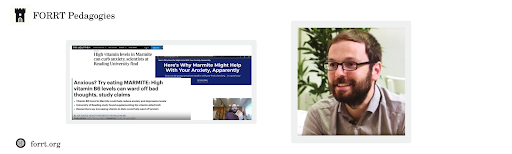

We are thrilled to present our new Pedagogies, which features Dr. Thomas Rhys Evans. Thomas is Associate Professor of Occupational Psychology (from September 2024 he’ll be Professor in Organizational Psychology and Open Scholarship) at the University of Greenwich and a very active member of FORRT! His research focuses, among other things, on using meta-psychology and Open Science practices to understand the quality of evidence in Psychology. In this FORRT’s Pedagogies, Thomas shares insights on the 12-week module on evidence-based practice he developed and taught for the first time in 2023. We discussed the philosophy behind the course, how it relates to Open Science, his students’ reactions, and so much more.  You can watch the interview in [the video](https://www.youtube.com/playlist?list=PLGy3sNZ2XOSCADrBzG93-1pV1-1L1Pp5C) or read a summary of their main points below.  Make sure to also check the 12-week module, which is fully available (including teaching materials, students’ reports etc) on the Open Science Framework (link below).  

 

1. ### How did you come up with the idea and identified the need for this course?

***Thomas:***  We all are involved in research and teaching because we want to do good and have a positive influence, but it can be really hard to know how you can help or what you can do. Especially when knowledge is so compartmentalized into different fields. The core thing for me was to try and break down what is shared across the ways in which different fields do research and the ways in which we teach people to think more about the broader skills that underlie, for example, open scholarship. It's this need for more critical thinking, to look at the evidence and say, “is that right? Are there other alternative interpretations?” **Critical thinking skills underpin so much of what we do, even in our general day-to-day life, not just our research life.** For example, I've become increasingly vocal about things like climate change and the need to start creating better bodies of evidence. And to do that, **we need to teach that better**. We need to teach people, support people, and give them the confidence to be able to question things and not just accept a paper written by somebody from a prestigious university. And so this course was based upon the idea that we can do better in providing students and the general public with those critical skills that can be used in day to day life as well as in research.



2. ### Can you tell us a bit more about the course set up and organization?

***Thomas***: I set up a new module for our occupational psychology MSc at the University of Greenwich, which lasts twelve weeks. It consists of a one-hour pre-recorded lecture and a two-hour face-to-face practical seminar each week. The module broadly fits four themes from start to finish, which are to **identify, evaluate, synthesize and apply evidence**. In terms of my teaching philosophy, I think it is really important that students can **label the skills** that they develop. Basically, the modules cover these four dimensions from start to finish: How do we identify and generate evidence? How do we push it through the process to make sure that people, policymakers, and practitioners use that evidence? 
[There was an interesting paper demonstrating that it can takes about ten years for research to actually evidence  influence.](https://repository.jisc.ac.uk/9321/1/data-enhancement-and-analysis-of-the-ref-2021-impact-case-studies.pdf) That’s a long time. So it's really important that we get the evidence right in the first case, developing high quality, robust, and rigorous evidence. And so that's where the kind of Open Science content tends to trickle in. 



3. ### How would you describe the teaching philosophy behind the course? 

***Thomas***: I try to always think about inclusivity in the broadest sense and I also think about it in terms of evidence. When people think about evidence-based practice in action, they often think about academic sources of evidence. But practitioners have loads of experience too. It is often not written down, but that does not make it any less legitimate. And so we are changing the way of thinking, becoming more inclusive in how we integrate all these different forms of evidence. When we think about inclusion, we also do what is known as the **class charter**, which is a co-agreed statement between everybody involved in the course. I get a lot of students from a lot of different backgrounds and with a lot of different experiences. **The idea is not to get everybody into the same conforming mindset**. In fact, it is the opposite: to get people to be **more open about different ideas and different notions, and to be inquisitive**.  Sometimes, students are encouraged to develop a mindset where you listen to the teacher and are asked to memorize what they say. That's definitely not the goal here. I think it is very important that we build up confidence for people to be independent critical thinkers. Another core component of my philosophy is practical skills, because it is really important that we know what to do with the information we have, to adapt to circumstances, and let that inform judgments and decision-making. So I see **practical skills as the most relevant components of my teaching**, as it is a way of bringing everything together. 



4. ### Research-wise, you are also quite involved in Open Science. Do you incorporate insights from Open Science research into your teaching? What Open Science principles did you integrate in this course?

***Thomas***: When we look at evidence, you can't separate it from the way in which it was created. So, what I do within this course is trying to weave in Open Science dimensions throughout. **We look at everything, starting with the standard things that you might expect ‒ like  pre-registration, replications, open data sharing**, and so on.  **But we also look at structural factors. That includes, for example, how research and researchers are evaluated**. As soon as you look at the incentive structure of research, it becomes clear that it is not always going to lead to the best quality evidence. We also think about the values and the way of thinking associated with open scholarship. Often, it’s about prioritizing transparency. It's about changing the focus from novelty to encouraging openness and reflection. For example, being open about both the limitations and the strengths of evidence. **It's not necessarily teaching Open Science, but it's about getting that mindset: what are the factors I should be thinking about and what's the style of thinking that I could adopt to get the answers I need?**



5. ### Which were the most important skills that you wanted your students to develop in this course? Could you give us an example of how you taught students these skills? 

***Thomas***:  Let me give you one of my favorite examples of this. During the first face to face session, **I gave my students evidence on how feedback (star ratings) on scented candles on Amazon changed over time, to encourage the application of critical thinking**. For me, that was a really fun way of getting people to think about different things. For example, why would the reviews of scented candles suddenly plummet? And then, obviously, you build into the facts ‒ okay, here are the years that it happened in, here are the time frames, and here is a little bit of the data. This didn't happen with unscented candles but it did happen with other fragrances. So what might that tell us? It turns out we were looking at the evidence behind COVID: reviews for scented candles were worse when people had COVID because they couldn’t smell the candles! I encouraged students to notice little details when evaluating evidence. **In this course I wanted my students to develop core academic skills, such as critical reading and critical writing**. These are fundamental skills to any research degree, but courses teaching these skills are usually so dry that students can’t see how they relate to practice. **I always try to achieve this in a practice-oriented way**.



6. ### In your course, you teach students how to gather and evaluate evidence-based knowledge. Do you integrate different research epistemologies? If so, how?

***Thomas***: Within this course, I do encourage people to think in different ways. **I don’t ask my students to look at things from one perspective, but rather encourage them to use multiple points of view**. A good example of what I've done is a book about the evidence behind specific HR practices (Evans, 2022). And the whole purpose of this book was to become the core reading of the module, because it encourages us to think in different ways and to adopt different epistemological viewpoints. This book **deconstructs the evidence behind the so-called “best training.”** I’ll give you an example. One of the students on the first version of this course was a trained massage therapist. They did their assignment looking at the evidence for the role of in-seat massages for workplace stress. The role of their professional experience in integrating academic evidence became a huge part of what they spoke about in their assignments. How does their experience match with what certain types of academic sources say? And again, there were lots of interesting differences between what quantitative research and qualitative research were saying. And then they had this interesting third point, which was their professional experience of this. This course is designed to facilitate those sorts of links in critical thinking.



7. ### For their assessment, students had to produce an evidence-based synthesis, evaluation and practical dissemination. Can you tell us a bit more about it? 

***Thomas***: I wanted students to apply what they learned by looking into a workplace practice they were interested in and evaluate the evidence behind it. The goal of the assessment is for students to find sources of knowledge, such as academic sources and experts, identify the most important evidence we have about their chosen topic, and to bring all of that information together to form a message. **The assessment has three main components**, starting with a 

- **curated literature review**. The purpose is to demonstrate that you can prioritize the most important sources of knowledge, bringing the evidence together to say something. I encourage students to consider not just academic sources, but also practice, expert opinions, and other evidence-based resources. 

- Second, students evaluate the **quality of evidence** they have, using one of the quality evaluation or risk of bias tools they were introduced to during the course. For this task, students evaluate a piece of evidence that they find to be particularly important and then create a narrative to communicate their evaluation. For example, in the literature review, they might have highlighted a body of evidence or source of evidence that was extremely popular or well cited. But then in the quality evaluation they find that actually there's a quite substantial risk of bias in a certain direction, and we reflect on how these concerns may impact our conclusions. 

- The third component is **practical dissemination**: a way for students to share with the public what they’ve found in the first two assignment sections. I encourage students to get creative with how they share this information, whether it be a poster, a blog, or a series of videos. Several students have allowed me to share their assignments as examples, which can be found [here](https://osf.io/typ4z/).



8. ### How did students respond to the course? Did you notice any changes in their attitudes towards science? Could you share your thoughts on how well the students grappled with the material and assignment in this course?

***Thomas***: I feel like I threw a range of topics at students, and they were always ready to engage with the material and participate in activities. As the course went on, **the biggest change I noticed was the questions students asked. They became more willing to question different practices, and their questions were often in line with Open Science practices**. For instance, they began to question why someone did not share their data or why a study wasn’t pre-registered. **One take away from this course is that the quality of a justification is important for evaluating a choice, particularly when there is not a single right answer**. For their assignment, there was no one right way to accomplish the goal because there was a lot of flexibility. This encouraged students to use critical thinking skills, which ultimately made for a good project. I like to share students’ assignments as examples because you can really see the range of ways students accomplished the task. In terms of criticisms, students felt that there was a lot of reading, which is true. However, I try to highlight the skills students get out of situations like these, such as prioritizing tasks, and to ask them to do something with the readings beyond summarizing them. Overall, I think emphasizing the skills students will gain, and making sure the activities focus on skills that will support them in their future employment, can help students get more out of the class.
 


9. ### Sometimes we think that incorporating Open Science into teaching means teaching a course on Open Science, but it’s not always possible to do that. What is your advice for teachers who have pre-defined courses/content but want to introduce more Open Science principles into their teaching?

***Thomas***: My advice is to not necessarily tackle everything at once, but to start small, and **try embedding that critical way of thinking, encouraging students to start asking the right questions**. For instance, sometimes this might mean breaking down the source of evidence to ask: “what can we take from this evidence if we acknowledge the role of that specific practice/bias/decision?”, “why did they use this sample or sampling strategy?”, “what would be the potential implications if they did this differently?” You are not teaching them what pre-registration is or why it's useful to share data, but helping them gain that same way of thinking, that importance of critically reflecting on evidence. Open Science can also be incorporated in the way we grade students, again prioritizing the skills they developed in synthesizing evidence and thinking critically about it. In my course, the literature review has a criterion for criticality: have they demonstrated critical thoughts about the evidence gathered? Have they picked a diverse range of sources of evidence? 
If you’re starting a course from scratch, or even picking up a pre-existing module, it's easy to embed little ideas and notions that get students thinking in that critical way. And this can be a really powerful mechanism to teach Open Science principles, especially because some people are openly averse to Open Science ways of thinking and specific practices. So, this  just gives you that little first step of a positive kind of development in that direction.



10. ### Do you have a favorite part of the course? Do you think your students have a favorite too? 

***Thomas***: I definitely have a favorite piece. It's week one, lecture one, and my first encouragement to students to have a little bit of that flavor of critical thinking. I start off with a broad question: **“Wouldn't it be good if we could improve our mental health based upon what we ate for breakfast?”** [And I talk about a news article that said having Marmite on toast improves your mental health](https://osf.io/preprints/psyarxiv/w296f). It's such a beautifully simplistic thing that could have such a positive impact. So everybody wants it to be right. My fun with this first session was to clinically take the fun out of it and deconstruct the [evidence](https://www.youtube.com/watch?v=P9W77YVPGus&list=PLUYzqsKLrqYCsQJZQmwZeAEQgFd3rj4zk&index=3). We start by pondering what sort of evidence we would need to trust that claim: epidemiological,  experimental, observational, etc… Turns out the study was an experimental trial with different types of multivitamin tablets, and it had nothing to do with Marmite whatsoever, but Marmite has a high amount of the certain type of vitamin they investigated. Then I really stretched this as far as I could by working out with them how much we would have to eat of a certain product to get the vitamin amount that they evaluated. Turns out that if you actually ate that much Marmite, you would more quickly die of sodium poisoning than you would of anything else because of the salt. So really, it wasn't a very clever claim to make. Then we explore further and find out they also tested different vitamins, the study was underpowered, it didn’t declare the vitamin tablets given to the researchers for free as a conflict of interest, and that the distortion from tablets to marmite came somewhere between the university press release and the journalists. For me, this was a very fun exercise, because it is something we all hope would be real, but when we look at the evidence, it actually tells us a very different picture.



### Resources

- Check Thomas’ 12-week module class: https://osf.io/typ4z/ 
- Evans, T. R. (2022). The evidence behind HR: An open evaluation of contemporary HR practices. Routledge.
- [Data enhancement and analysis of the REF 2021 Impact Case Studies (jisc.ac.uk)](https://repository.jisc.ac.uk/9321/1/data-enhancement-and-analysis-of-the-ref-2021-impact-case-studies.pdf)
- YouTube video about evidence-based practice: [Evidence Based Practice: A Toasty Introduction - YouTube](https://www.youtube.com/watch?v=P9W77YVPGus&list=PLUYzqsKLrqYCsQJZQmwZeAEQgFd3rj4zk&index=3)
- OSF link to “The ongoing and upcoming challenges for the role of news in science communication”: [PsyArXiv Preprints | The Ongoing and Upcoming Challenges for the Role of News in Science Communication (osf.io)](https://osf.io/preprints/psyarxiv/w296f)

### Suggested citation: 

- Evans, T.R., Wolska, J., Andreolli, G., Woodward, A.M., Merighi, A., & Micheli, L. (2024). FORRT Pedagogies. From mental-health breakfast interventions to evidence-based practice: Teaching students how to critically engage with science. (https://doi.org/10.17605/OSF.IO/SB5VE)

### Team Pedagogies Contributors:

Julia Wolska, Manchester Metropolitan University, UK
 
Giorgia Andreolli, Verona University, Italy
 
Leticia Micheli, Leiden University, the Netherlands
 
Amanda Mae Woodward, University of Minnesota, United States
 
Alessio Merighi, Video Editor, alessiomerighi.com
 
