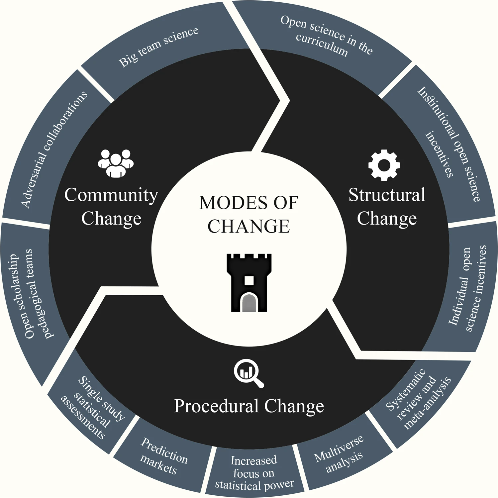

+++
# A Demo section created with the Blank widget.
# Any elements can be added in the body: https://sourcethemes.com/academic/docs/writing-markdown-latex/
# Add more sections by duplicating this file and customizing to your requirements.

widget = "blank"  # See https://sourcethemes.com/academic/docs/page-builder/
headless = true  # This file represents a page section.
active = true  # Activate this widget? true/false
weight = 10  # Order that this section will appear.

title = "Transformative Outcomes from the Replication Crisis"
subtitle = "Structural, Procedural, and Community Changes in Psychological Science"

[design]
  # Choose how many columns the section has. Valid values: 1 or 2.
  columns = "1"

[design.background]
  # Apply a background color, gradient, or image.
  #   Uncomment (by removing `#`) an option to apply it.
  #   Choose a light or dark text color by setting `text_color_light`.
  #   Any HTML color name or Hex value is valid.

  # Background color.
  # color = "#fefdf6"
  # color = "#69b3a2" # greenish
  
  # Background gradient.
  # gradient_start = "DeepSkyBlue"
  # gradient_end = "SkyBlue"
  
  # Background image.
  # image = "headers/bubbles-wide.jpg"  # Name of image in `static/img/`.
  # image_darken = 0.6  # Darken the image? Range 0-1 where 0 is transparent and 1 is opaque.
  # image_size = "cover"  #  Options are `cover` (default), `contain`, or `actual` size.
  # image_position = "center"  # Options include `left`, `center` (default), or `right`.
  # image_parallax = true  # Use a fun parallax-like fixed background effect? true/false

  # Text color (true=light or false=dark).
  text_color_light = false

[design.spacing]
  # Customize the section spacing. Order is top, right, bottom, left.
  padding = ["60px", "0", "60px", "0"]

[advanced]
 # Custom CSS. 
 css_style = ""
 
 # CSS class.
 css_class = ""
+++

 

{}

THIS IS A PAGE IN CONSTRUCTION. PLEASE COME BACK SOON!

{}

 

## Overview
---------------------

This page is dedicated to exploring and showcasing the significant and positive changes that have emerged in the field of psychological science in response to the replication crisis. Our paper, *"[The replication crisis has led to positive structural, procedural, and community changes](https://www.nature.com/articles/s44271-023-00003-2),"* serves as the foundation for this discussion.

On this page, you will find a summary of our paper, which highlights the beneficial transformations in research practices, methodologies, and community engagement that have been spurred by the replication crisis as well as educational materials our team prepared to help educators, researchers, and students better understand and implement these advancements into their practices. 

 

## Why We Wrote It
---------------------

We authored this paper to shed light on the constructive outcomes resulting from the replication crisis. The crisis served as a wake-up call, prompting researchers, institutions, journals, and stakeholders to adopt more rigorous and transparent research practices. Our goal was to document these changes and provide a comprehensive overview of how the field has evolved positively in response to past challenges. It is important to recognize and cherish these positive changes because it highlights the resilience and adaptability of the scientific community. Psychological Science, in this case, is a positive case. By understanding and appreciating these improvements, we can foster a culture that values continuous learning, transparency, and collaboration. Recognizing these positive changes not only validates the efforts of researchers and institutions who have embraced new practices but also encourages others to follow suit. This collective shift towards more rigorous and open science practices ultimately enhances the credibility and impact of psychological research, ensuring that findings are reliable, reproducible, and applicable to a broader context. Celebrating these advancements helps to build trust within the scientific community and with the public, reinforcing the importance of ethical and robust research methodologies.

 

## Educational Toolkit
---------------------

Our educational toolkit is designed to support educators, researchers, and students in understanding and educating about the replication crisis and recent advancements. The toolkit consists of five key components:

* **Summary of the Paper:** 
     * **Description:** An accessible summary that highlights the key positive changes in research practices, methodologies, and community engagement resulting from the replication crisis.
     * **Link to Summary:** [See below]().

 

* **Syllabus:** 
     * **Description:** This syllabus, designed for the course "*Understanding the Credibility Revolution and Open and Reproducible Research,*" offers a comprehensive framework for teaching the positive impacts of the replication crisis. It covers essential topics such as the replication crisis, the credibility revolution, and strategies for embedding open science into curricula. 
     * **Link to Syllabus:** [Syllabus for Course](https://docs.google.com/document/d/1npob9Bmm_MvcNcSYzLr78JJ7DtQo5EbT-BdqtkaOwoU/edit#heading=h.k4q6khy2p47y) 

 

* **Teaching Slides with Script and Pedagogical and Didactical Notes:** 
     * **Description:** These slides provide detailed information and script notes on the positive changes resulting from the replication crisis. They cover the background of the crisis, the structural, procedural, and community changes, and include notes for presenters. 
     * **Link to Slides:** [Slides with Script](https://docs.google.com/presentation/d/1zsRl22nFkRd5bkEaLgtqGmZPwb-ulzqiUivyVq_4Y8o/edit#slide=id.g277ea572683_0_1) 

 

* **Podcast about the Paper:** 
     * **Description:** This podcast episode, part of the ReproducibiliTea series, discusses our paper "From Crisis to FORRTsitive Change." It features interviews with the authors and provides an in-depth look at the positive outcomes of the replication crisis. 
     * **Link to Podcast:** [Podcast on SoundCloud](https://soundcloud.com/reproducibilitea/s3e13-from-crisis-to-forrtsitive-change)

 

* **Open-Access Paper:** 
     * **Description:** Access to the full open-access paper detailing the positive structural, procedural, and community changes. 
     * **Link to Paper:** [Open-Access Paper](https://www.nature.com/articles/s44271-023-00003-2)

 

 

### Summary of the paper & argument
------- 

**Positive Changes Detailed:** 

1. **Structural Changes:** 

* **Curriculum Changes:** There has been a notable shift in how research methods and statistics are taught, with a greater emphasis on open science practices. This includes integrating replication studies into curricula and promoting norms of open science. 
* **Incentives:** New incentives have been introduced for researchers, including badges for open practices and funding opportunities for replication studies. Journals and funders are also adopting guidelines like the Transparency and Openness Promotion (TOP) guidelines to encourage transparency. 
* **Institutional Policies:**  Development and implementation of institutional policies that support open science initiatives. This includes policies for data sharing, preregistration of studies, and requirements for replication studies in tenure and promotion evaluations. Institutions are creating environments that prioritize and reward rigorous and reproducible research, thus fostering a culture of transparency and accountability within the scientific community.

2. **Procedural Changes:** 

* **Prediction Markets:** These have been developed to assess the credibility of research findings, involving both experts and laypeople in predicting the replicability of studies. 
* **Statistical Assessment Tools:** Tools like p-curve and Z-curve are now used to detect biases in the literature. Additionally, tests like GRIM and SPRITE help identify inconsistencies in individual studies. 
* **Multiverse Analysis:** This approach involves testing hypotheses using various analytical methods to ensure the robustness of findings, reducing the influence of researchers' degrees of freedom. 
* **Cummulative Science:** Adoption of best practices for conducting systematic reviews and meta-analyses, including the use of guidelines like PRISMA (Preferred Reporting Items for Systematic Reviews and Meta-Analyses) to enhance transparency and reproducibility. This involves thorough documentation of methodological choices and comprehensive reporting of findings to minimize bias and improve the reliability of conclusions drawn from multiple studies.

3. **Community Changes:** 
* **Big Team Science:** Collaborative efforts involving large teams of researchers from multiple institutions and countries have become more common. This approach enhances the diversity and generalizability of findings. 
* **Adversarial Collaborations:** Researchers with differing viewpoints collaborate to critically evaluate each other's work, helping to identify and correct biases before publication. 
* **Open Science Communities:** Formation of communities and networks dedicated to open science, such as ReproducibiliTea journal clubs and the RIOT Science Club (and FORRT :wink:). These communities facilitate the sharing of best practices, resources, and support for implementing open science principles. They provide platforms for discussion, training, and collaboration, fostering a culture of openness and transparency within the scientific community. 
* **Public Engagement and Outreach:** Increased efforts to engage with the public and other stakeholders about the importance of replicable and transparent research. This includes public lectures, workshops, and the use of social media to disseminate knowledge about open science practices. By involving the broader community, these initiatives aim to build trust and understanding between scientists and the public, highlighting the value of robust and reliable research findings.”

 

 

4. **Expanding Structural, Procedural, and Community Changes:** 

* **Generalizability:** Addressing the generalizability crisis by ensuring research findings are applicable across diverse populations, contexts, and settings. This involves designing studies that consider a wider range of variables and conditions to enhance the applicability of results. 
* **Formal Theory Building:** Promoting formal theory building as a fundamental aspect of scientific research. This approach encourages the development of comprehensive, well-specified theories that can be rigorously tested and refined, thereby improving the overall quality and coherence of scientific knowledge. 
* **Qualitative Research:** Integrating open science principles into qualitative research to enhance transparency and rigor. This includes adopting practices such as pre-registration of study designs, open data sharing, and detailed documentation of research methodologies. 
* **Diversity, Equity, Inclusion, and Accessibility (DEIA):** Emphasizing the importance of diversity, equity, inclusion, and accessibility in research practices. This involves creating inclusive research environments, considering diverse perspectives in study designs, and ensuring that research findings benefit all segments of society. Efforts to promote DEIA contribute to more equitable and socially responsible scientific practices.

 

## Contact Us
---------- 

For more information, please contact us: info@forrt.org.

