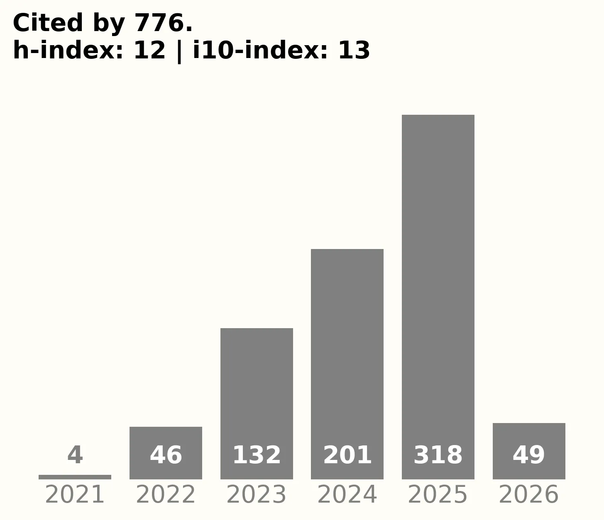

+++
# A Demo section created with the Blank widget.
# Add more sections by duplicating this file and customizing to your requirements.

widget = "blank"  #
headless = true  # This file represents a page section.
active = true  # Activate this widget? true/false
weight = 5  # Order that this section will appear.

title = "Publications, Preprints, Policy Briefs, Op-Eds, Shiny Apps, Data & R-packages"
subtitle = ""

[design]
  # Choose how many columns the section has. Valid values: 1 or 2.
  columns = "1"

[design.background]
  # Apply a background color, gradient, or image.
  #   Uncomment (by removing `#`) an option to apply it.
  #   Choose a light or dark text color by setting `text_color_light`.
  #   Any HTML color name or Hex value is valid.

  # Background color.
  # color = "Green"
  # color = "#69b3a2" # greenish
  
  # Background gradient.
  # gradient_start = "DeepSkyBlue"
  # gradient_end = "SkyBlue"
  
  # Background image.
  # image = "headers/bubbles-wide.webp"  # Name of image in `static/img/`.
  # image_darken = 0.6  # Darken the image? Range 0-1 where 0 is transparent and 1 is opaque.
  # image_size = "cover"  #  Options are `cover` (default), `contain`, or `actual` size.
  # image_position = "center"  # Options include `left`, `center` (default), or `right`.
  # image_parallax = true  # Use a fun parallax-like fixed background effect? true/false

  # Text color (true=light or false=dark).
  text_color_light = false

[design.spacing]
  # Customize the section spacing. Order is top, right, bottom, left.
  padding = ["60px", "0", "60px", "0"]

[advanced]
 # Custom CSS. 
 css_style = "font-size: 1.25rem;"
 
 # CSS class.
 css_class = ""
+++

 

---

# **Academic peer-reviewed publications**

---

<figure class="citation-container">
  
  <figcaption><a href="https://scholar.google.com/citations?user=JrBcgGMAAAAJ&hl=en&authuser=1" target="_blank">Details on Google Scholar</a></figcaption>
</figure>

This page showcases the diverse scholarly and public-facing outputs produced by FORRT and its community—including peer-reviewed publications, preprints, policy briefs, opinion pieces, interactive apps, datasets, and open-source tools. It reflects our ongoing efforts to contribute to scientific discourse, inform policy, and promote open, inclusive, and transparent research practices. Whether you're a researcher, educator, or policymaker, this hub provides access to FORRT’s evolving body of work. Dive in to discover, cite, or collaborate.

 

---

## **Mapping Open Science Communities in Psychology: A Systematic Narrative Review**

---

We have written a manuscript, entitled *International Initiatives to Enhance Awareness and Uptake of Open Research in Psychology: A Systematic Mapping Review,* which outlines the global landscape of Open Science initiatives within psychology. This postprint provides a systematic review of *187 initiatives*, categorized into procedural, structural, and community-based changes, highlighting the roles they play in advancing transparency, replicability, and collaboration in research practices. The review aims to increase awareness, adoption, and coordination of these initiatives across psychology and beyond, serving as a roadmap for disciplines experiencing similar challenges.

***Status***: Published by **Royal Society** 🎉🥳. Cite as:
> Skubera Magda, Korbmacher Max, Evans Thomas Rhys, Azevedo Flavio and Pennington Charlotte R. 2025International initiatives to enhance awareness and uptake of open research in psychology: a systematic mapping reviewR. Soc. Open Sci.12241726. https://doi.org/10.1098/rsos.241726 

 

---

## **An annotated introductory reading list for neurodiversity**

---

Since its inception, the concept of neurodiversity has been defined in a number of different ways, which can cause confusion among those hoping to educate themselves about the topic. Learning about neurodiversity can also be challenging because there is a lack of well-curated, appropriately contextualized information on the topic. To address such barriers, we present an annotated reading list that was developed collaboratively by a neurodiverse group of researchers. The nine themes covered in the reading list are: the history of neurodiversity; ways of thinking about neurodiversity; the importance of lived experience; a neurodiversity paradigm for autism science; beyond deficit views of ADHD; expanding the scope of neurodiversity; anti-ableism; the need for robust theory and methods; and integration with open and participatory work. We hope this resource can support readers in understanding some of the key ideas and topics within neurodiversity, and that it can further orient researchers towards more rigorous, destigmatizing, accessible, and inclusive scientific practices.

The **postprint** can [be found here (eLife 13:e102467)](https://doi.org/10.7554/eLife.102467). 

> Mirela Zaneva, Tao Coll-Martín, Yseult Héjja-Brichard, Tamara Kalandadze, Andrea Kis, Alicja Koperska, Marie Adrienne Robles Manalili, Adrien Mathy, Christopher J Graham, Anna Hollis, Robert M Ross, Siu Kit Yeung, Veronica Allen, Flavio Azevedo, Emily Friedel, Stephanie Fuller, Vaitsa Giannouli, Biljana Gjoneska, Helena Hartmann, Max Korbmacher, Mahmoud M Elsherif, Alyssa Hillary Zisk (2024) Point of View: An annotated introductory reading list for neurodiversity eLife 13:e102467
https://doi.org/10.7554/eLife.102467

 

---

### **The Replication Database: Documenting the Replicability of Psychological Science**

---

We have written a manuscript about documenting and tracking replication efforts. In psychological science, replicability — repeating a study with a new sample achieving consistent results — is critical for affirming the validity of scientific findings. Despite its importance, replication efforts are few and far between in psychological science with many attempts failing to corroborate past findings. This scarcity, compounded by the difficulty in accessing replication data, jeopardizes the efficient allocation of research resources and impedes scientific advancement. Addressing this crucial gap, we present the [Replication Database](https://forrt.org/replication-hub/), a novel platform hosting >1,200 original findings paired with replication findings. The infrastructure of this database allows researchers to submit, access, and engage with replication findings. The database makes replications visible, easily findable via a graphical user interface, and tracks replication rates across various factors, such as publication year or journal. This will facilitate future efforts to evaluate the robustness of psychological research. More info about the project and other FORRT replication efforts can be found on the [Replication Hub](https://forrt.org/replication-hub/#). This effort was also highlighted by the journal _Science_ in their [news at a glance](https://www.science.org/content/article/news-glance-planning-mentoring-tracking-replications-and-deracializing-lung-tests)!

 

> Röseler, L., Kaiser, L., Doetsch, C., Klett, N., Seida, C., Schütz, A., Aczel, B., Adelina, N., Agostini, V., Alarie, S., Albayrak-Aydemir, N., Aldoh, A., Al-Hoorie, A. H., Azevedo, F., Baker, B. J., Barth, C. L., Beitner, J., Brick, C., Brohmer, H., Chandrashekar, S. P., Chung, K. L., Cockcroft, J. P., Cummins, J., Diveica, V., Dumbalska, T., Efendic, E., Elsherif, M., Evans, T., Feldman, G., Fillon, A., Förster, N., Frese, J., Genschow, O., Giannouli, V., Gjoneska, B., Gnambs, T., Gourdon-Kanhukamwe, A., Graham, C. J., Hartmann, H., Haviva, C., Herderich, A., Hilbert, L. P., Holgado, D., Hussey, I., Ilchovska, Z. G., Kalandadze, T., Karhulahti, V.-M., Kasseckert, L., Klingelhöfer-Jens, M., Koppold, A., Korbmacher, M., Kulke, L., Kuper, N., LaPlume, A., Leech, G., Lohkamp, F., Lou, N. M., Lynott, D., Maier, M., Meier, M., Montefinese, M., Moreau, D., Mrkva, K., Nemcova, M., Oomen, D., Packheiser, J., Pandey, S., Papenmeier, F., Paruzel-Czachura, M., Pavlov, Y. G., Pavlović, Z., Pennington, C. R., Pittelkow, M.-M., Plomp, W., Plonski, P. E., Pronizius, E., Pua, A. A., Pypno-Blajda, K., Rausch, M., Rebholz, T. R., Richert, E., Röer, J. P., Ross, R., Schmidt, K., Skvortsova, A., Sperl, M. F. J., Tan, A. W. M., Thürmer, J. L., Tołopiło, A., Vanpaemel, W., Vaughn, L. A., Verheyen, S., Wallrich, L., Weber, L., Wolska, J. K., Zaneva, M., & Zhang, Y. (2024). The Replication Database: Documenting the Replicability of Psychological Science.
Journal of Open Psychology Data, 12: 8, pp. 1–23. DOI: https://doi.org/10.5334/jopd.101

 

The **postprint** can [be found here (osf.io/me2ub)](https://osf.io/preprints/metaarxiv/me2ub). 

---

 

## **The Impact of Open Scholarship on Students' Learning Outcomes (Scoping Review)**

---

We have written a manuscript entitled *Teaching open and reproducible scholarship: a critical review of the evidence base for current pedagogical methods and their outcomes*. This manuscript describes the available (empirical) evidence of the impact (and importance) of integrating open scholarship into higher education, its benefits and challenges on three specific areas: students’ (a) scientific literacy; (b) engagement with science; and (c) attitudes towards science. This paper was borne out of colleagues reporting a need for something tangible to take to Heads of Departments to show pedagogical rationale for open scholarship (above and beyond the moral/'good for science' case that wasn't always being heard on the ground). Cite as:

 

> Pownall, M., Azevedo, F., König, L. M., Slack, H. R., Evans, T. R., Flack, Z., ... & FORRT. (2023). Teaching open and reproducible scholarship: a critical review of the evidence base for current pedagogical methods and their outcomes. *Royal Society Open Science*, *10*(5), Article 221255. https://doi.org/10.1098/rsos.221255

 

The **postprint** can [be found here (osf.io/9e526)](https://osf.io/preprints/metaarxiv/9e526/). 

---

 

## **Improvements since the Replication Crisis: The Structural, Procedural, and Community Changes**

---

We have written a manuscript entitled *The replication crisis has led to positive structural, procedural, and community changes*. This manuscript reviews how research structures, procedures and communities have changed in response to the replication crisis, showing that the replication "crisis" has been a positive *credibility revolution*. We also outline how improvements can continue to be made by accounting for all three levels. This manuscript was born out of the fact that much of the literature on the Replication Crisis has focused on understanding the potential underlying causes of low replicability, and framing solutions as a matter of individual researcher reform, and our community wanted to provide a wider perspective on what has been learnt since the crisis by highlighting the role of structural, procedural factors, and evidencing the rapid progress made by social scientists as a response.  Cite as:

 

> Korbmacher, M., Azevedo, F., Pennington, C. R., Hartmann, H., Pownall, M., Schmidt, K., Elsherif, M., Breznau, N., Robertson, O., Kalandadze, T., Yu, S., Baker, B. J., O'Mahony, A., Olsnes, J. Ø.-S., Shaw, J. J., Gjoneska, B., Yamada, Y., Röer, J. P., Murphy, J., Alzahawi, S., Grinschgl, S., Oliveira, C. M., Wingen, T., Yeung, S. K., Liu, M., König, L. M., Albayrak-Aydemir, N., Lecuona, O., Micheli, L., & Evans, T. (2023). The replication crisis has led to positive structural, procedural, and community changes. *Communications Psychology*, *1*, 3. https://doi.org/10.1038/s44271-023-00003-2.
 

The **postprint** can [be found here (osf.io/r6cvx)](https://doi.org/10.31222/osf.io/r6cvx).

---

 

## **Participatory Research Primer**

---

We have written a manuscript entitled *Opening up understanding of neurodiversity: A call for applying participatory and open scholarship practices*. This manuscript gives a brief overview of what participatory research methods are and why they are important for promoting neurodiversity in academia. Cite as:

 

> Gourdon-Kanhukamwe, A., Kalandadze, T., Yeung, S., Azevedo, F., Iley, B. J., Phan, J. M., … Elsherif, M. M. (2023). Opening up understanding of neurodiversity: A call for applying participatory and open scholarship practices. *The Cognitive Psychology Bulletin*, *8*, 23-27. https://doi.org/10.53841/bpscog.2023.1.8.23

 

The **postprint** can [be found here (osf.io/jq23s)](https://osf.io/preprints/metaarxiv/jq23s/). 

---

 

## **FORRT's Glossary**

---

In response to the varied and plural new terminology introduced by the *open scholarship* movement, which has transformed academia's lexicon, we have produced a community and consensus-based [Glossary](/glossary) to facilitate education and effective communication between experts and newcomers. FORRT members have written a manuscript entitled *A Community-Sourced Glossary of Open Scholarship Terms* presenting the beta 0.1 version of our glossary of open scholarship terms. Cite as:

 

> Parsons, S., Azevedo, F.,  Elsherif, M. M., Guay, S., Shahim, O. N., Govaart, G. H.,  Norris, E.,  O’Mahony, A., Parker, A. J., Todorovic, A., Pennington, C. R.,  Garcia-Pelegrin, E.,  Lazić, A., Robertson, O. M., Middleton, S. L., Valentini, B., McCuaig, J., Baker, B. J., Collins, E., ... Aczel, B. (2022). A Community-Sourced Glossary of Open Scholarship Terms.  *Nature Human Behaviour, 6*(3), 312-318. [https://doi.org/10.1038/s41562-021-01269-4](https://doi.org/10.1038/s41562-021-01269-4). 

 

The **postprint** can [be found here (osf.io/kdqcw)](https://doi.org/10.31222/osf.io/kdqcw) and here is the [copy-edited version at the publisher's website](https://rdcu.be/cHsqM).

---

 

### **The Role of Pedagogical Communities**

---

We have written a manuscript entitled *Towards a culture of open scholarship: The role of pedagogical communities* describing (a) the the need to integrate open scholarship principles into research training within higher education; (b) the benefit of pedagogical communities and the role they play in fostering an inclusive culture of open scholarship; and (c)  call for greater collaboration with pedagogical communities, paving the way for a much needed integration of top-down and grassroot open scholarship initiatives. Cite as:

 

> Azevedo, F.,  Liu, M., Pennington, C. R., Pownall, M., Evans, T. R., Parsons, S.,  Elsherif, M. M., Micheli, L., Westwood, S., & FORRT. (2021). Towards a culture of open scholarship: The role of pedagogical communities. *BMC Research Notes, 15*(1), 1-5. [https://doi.org/10.1186/s13104-022-05944-1](https://doi.org/10.1186/s13104-022-05944-1)

 

---

 

## **FORRT's Lesson Plans**

---

Despite the growing awareness of the benefits of training reproducible methods within undergraduate and postgraduate curricula, there remains a lack of systematic incorporation of open scholarship practices in taught courses across Higher Education. While the potential reasons for this are diverse, one reason may be the dearth of available ready-to-use educational resources. To support instructors aiming to bridge that gap, FORRT's community built open educational resources that can be integrated into taught courses ‘out of the box’. As creating or changing course content can be onerous and time-consuming, we aimed to make evidence-based, high-quality lesson plans and activities available to teaching faculty, thus reducing the labour required to develop and implement open scholarship content. We compiled lesson plans and activities, and categorized them based on their theme, learning outcome, and method of delivery, which are made publicly available here: [FORRT's Lesson Plans](/lesson-plans). Cite as:

> Pownall, M., Azevedo, F., Aldoh, A., Elsherif, M. M., Vasilev, M. R., Pennington, C. R., … Parsons, S. (2021). Embedding open and reproducible science into teaching: A bank of lesson plans and resources. *Scholarship of Teaching and Learning in Psychology*. Advance online publication. [https://doi.org/10.1037/stl0000307](https://doi.org/10.1037/stl0000307). 

The **postprint** can [be found here (osf.io/fgv79)](https://doi.org/10.31234/osf.io/fgv79). 

---

 

## **Open Science in the Developing World: A Collection of Practical Guides for Researchers in Developing Countries**

---

Over the past decade, the open-science movement has transformed the research landscape, although its impact has largely been confined to developed countries. Recently, researchers from developing countries have called for a redesign of open science to better align with their unique contexts. However, raising awareness alone is insufficient—practical actions are required to drive meaningful and inclusive change. In this work, we analyze the opportunities offered by the open-science movement and explore the macro- and micro-level barriers researchers in developing countries face when engaging with these practices. Drawing on these insights and aiming to inspire researchers in developing regions or other resource-constrained contexts to embrace open-science practices, we offer a four-level guide for gradual engagement: (a) foundation, using open resources to build a solid foundation for rigorous research; (b) growth, adopting low-cost, easily implementable practices; (c) community, contributing to open-science communities through actionable steps; and (d) leadership, taking on leadership roles or forming local communities to foster cultural change. We further discuss potential pitfalls of the current open-science practices and call for readaptation of these practices in developing countries’ settings. We conclude by outlining concrete recommendations for future action.

 

The **preprint** can [be found here (osf.io/7ubk2)](http://osf.io/7ubk2), and final **publication**: [here](https://doi.org/10.1177/25152459251357565).

Download the supplementary material [here](https://journals.sagepub.com/doi/suppl/10.1177/25152459251357565/suppl_file/sj-docx-1-amp-10.1177_25152459251357565.docx?_gl=1*qdrt5e*_up*MQ..*_ga*MzI4ODQ0MDI1LjE3NjY0ODg2NjU.*_ga_60R758KFDG*czE3NjY0ODg2NjUkbzEkZzAkdDE3NjY0ODg2NjUkajYwJGwwJGgxOTI0NTEyNTAw).

> Hu, C.-P., Xu, Z., Lazić, A., Bhattacharya, P., Seda, L., Hossain, S., Jeftić, A., Özdoğru, A. A., Amaral, O. B., Miljković, N., Ilchovska, Z. G., Lazarevic, L. B., Wu, H., Bao, S., Ghodke, N., Moreau, D., Elsherif, M., C., C., Ghai, S., ... Azevedo, F. (2025). **Open Science in the Developing World: A Collection of Practical Guides for Researchers in Developing Countries.** *Advances in Methods and Practices in Psychological Science*, *8*(3), 25152459251357565. [https://doi.org/10.1177/25152459251357565](https://doi.org/10.1177/25152459251357565) 

---

 

  <h1> Preprints </h1>
  

## **Neurodiversity & Open Scholarship in Academia**

---

We have written a manuscript entitled *Bridging Neurodiversity and Open Scholarship: How Shared Values Can Guide Best Practices for Research Integrity, Social Justice, and Principled Education* explaining that Neurodiversity is fundamental to the understanding of human behaviour and cognition and that neurodivergent individuals are often stigmatised, devalued, and objectified. The authors describe systematic barriers, issue with disclosure, directions on prevalence and stigma, intersection of neurodiversity and open scholarship, and provide recommendations that can lead to personal and systematic changes to improve acceptance of neurodivergent individuals. We also present the perspectives of neurodivergent authors, the majority of whom have personal lived experiences of neurodivergence(s), and provide recommendations for how research and academia can and should be improved in terms of research integrity, inclusivity and diversity. We end with discussing systematic barriers, issue with disclosure, directions on prevalence and stigma, intersection of neurodiversity and open scholarship, and provide recommendations that can lead to personal and systematic changes to improve acceptance of neurodivergent individuals.

***Status***: Our paper is **preprinted** 🎉🥳 in MetaArxiv. Cite as:
> Elsherif, M. M., Middleton, S. L., Phan, J. M., Azevedo, F., Iley, B. J., Grose-Hodge, M., … Dokovova, M. (2022, June 20). Bridging Neurodiversity and Open Scholarship: How Shared Values Can Guide Best Practices for Research Integrity, Social Justice, and Principled Education. https://doi.org/10.31222/osf.io/k7a9p.

---

 

## **FORRT's Manifesto**

---

We have written a manuscript entitled *Introducing a Framework for Open and Reproducible Research Training (FORRT)* describing the importance of integrating open scholarship into higher education, its benefits and challenges, as well as about FORRT initiatives aiming to support educators in this endeavor. 

The **preprint** can [be found here (osf.io/bnh7p)](https://osf.io/bnh7p). 

***Status***: Our manuscript is currently under review. Cite as:
> Azevedo, F., Parsons, S., Micheli, L., Strand, J., Rinke, E., ... & FORRT (2019, December 13). Introducing a Framework for Open and Reproducible Research Training (FORRT). https://doi.org/10.31219/osf.io/bnh7p

---

 

## **In Pursuit of Citational Justice: A Toolkit for Equitable Scholarship**

---

Decades of empirical research across disciplines reveal the pervasiveness of citation biases along axes of gender, race, geography, and epistemology. Who we cite reflects and reinforces both the boundaries and hierarchies of academic knowledge, covertly shaping not only whose research is legitimized and valued but also whose careers are advanced.Citations, the currency of the academy with power to reinforce or dismantle hierarchies that privilege dominant knowledge systems cannot thus be a neutral, a political act. This paper unpacks the concept of  citation politics  and its role in sustaining epistemic hierarchies within scholarly communities. Rather than framing citation bias as a matter of individual oversight, we position it as a systemic issue tied to academic structures,norms, and incentive systems. We introduce a comprehensive and openly accessible Citational Justice Toolkit, developed by the FORRT community, which curates actionable resources, tools, and practices helping scholars and institutions to audit,diversify, and reflect on their citation practices across the research cycle. Our aim is to support a shift from tokenistic inclusion toward epistemically accountable, socially responsible, and structurally aware scholarship. We argue that reimagining citation as an ethical and epistemic practice is foundational to building a just and inclusive academic ecosystem, fostering pluralism, transparency, and integrity in knowledge production.

 

The **preprint** can [be found here (osf.io/qjecy_v2)](https://osf.io/preprints/metaarxiv/qjecy_v2). 

***Cite as:***
> Sauvé, S. A., Middleton, S. L., Gellersen, H., & Azevedo, F. (2025, July 31). In Pursuit of Citational Justice: A Toolkit for Equitable Scholarship. https://doi.org/10.31222/osf.io/qjecy_v2

---

 

# Op-Eds and Other Media 

---

📄 For the ***Official PLoS Blog***, on [creating a comprehensive, dynamic database cataloging scientific claims and subsequent replication attempts across various disciplines of social, cognitive, and behavioral sciences](https://theplosblog.plos.org/2024/02/unveiling-the-truth-in-science-the-quest-for-reliable-knowledge/).

 

Azevedo, F., Hartmann, H., Röseler, L., Wallrich, L., & Micheli, L. (2024, February 15). Unveiling the Truth in Science: The Quest for Reliable Knowledge. The Official PLOS Blog. https://theplosblog.plos.org/2024/02/unveiling-the-truth-in-science-the-quest-for-reliable-knowledge/



 

📜 For ***The Psychologist***, on [open scholarship pedagogical communities](https://www.bps.org.uk/psychologist/open-scholarship-pedagogical-communities).

 

Azevedo, F. (2023). Open scholarship pedagogical communities. The Psychologist, British Psychological Society.



 

📄 For the ***Observer***, of the Association for Psychological Science, on [Navigating Academia as Neurodivergent Researchers](https://www.psychologicalscience.org/observer/gs-navigating-academia-as-neurodivergent-researchers).

 

Azevedo, F., Middleton, S., Mai Phan, J., Kapp, S., Gourdon-Kanhukamwe, A., Iley, B., Elsherif, M., & Shaw, J. J. (2022). Navigating Academia as Neurodivergent Researchers: Promoting Neurodiversity Within Open Scholarship. APS Observer. https://www.psychologicalscience.org/observer/gs-navigating-academia-as-neurodivergent-researchers



 

📃 For ***In-Mind Magazine***, on [What is Open Science and Why Does It Need a Glossary](https://de.in-mind.org/blog/post/was-ist-offene-wissenschaft-und-warum-braucht-sie-ein-woerterbuch).

 

Azevedo, F., Baum, M., Hartmann, H., Micheli, L., Spitzer, L., & Wingen, T. (2022). What is "Open Science"? And why does it need a glossary? (Was ist „Offene Wissenschaft”? Und warum braucht sie ein Wörterbuch?). In-Mind Magazine. https://de.in-mind.org/blog/post/was-ist-offene-wissenschaft-und-warum-braucht-sie-ein-woerterbuch



 

📜 For the ***Center of Open Science Blog***, on [Integrating Open and Reproducible Science Principles into Higher Education](https://www.cos.io/blog/educating-in-the-open-scholarship-eara).

 

Azevedo, F. (2022). Educating in the Open Scholarship Era: Integrating Open and Reproducible Science Principles into Higher Education. Center for Open Science (COS). https://www.cos.io/blog/educating-in-the-open-scholarship-eara



 

📃 [The Letter to UNESCO’s Principles of Open Science Monitoring](./Letter_to_UNESCO’s_Principles_of_Open_Science_Monitoring.pdf).

  
PDF Preview here

  <embed src="./Letter_to_UNESCO’s_Principles_of_Open_Science_Monitoring.pdf" type="application/pdf" width="100%" height="600px" />

---

 

# Policy Briefs 
***

### **Policy** | **Open Scholarship in QAA Briefing**
---

FORRT was asked by the UK's Quality Assurance Agency for Higher Education (QAA) to produce a short briefing note in collaboration with the UK Reproducibility Network (UKRN) about the importance of embedding open scholarship into higher education. In the note, we argued that students need to understand and experience open and rigorous research processes to become effective and responsible consumers of evidence. We structured this around three themes (Thinking About Research, Doing Research, and Engaging With Research) and showed how this can be implemented across different fields. 

The **briefing note** can [be found here](2023_QAA%20_%20FORRT_UKRN.pdf).

***Status***: Our briefing note is being used for QAA's work around standards and quality in Higher Education. Cite as:
> Azevedo, F., DeBruine, L., Evans, T. R. (2023). *Open Scholarship in QAA Briefing*. Framework for Open and Reproducible Research Training & UK Reproducibility Network. https://forrt.org/publications

 

---

## **Policy** | **Building Community**

---

FORRT responded to the the call from the UK House of Commons Science and Technology Committee on for [evidence on reproducibility and research integrity, and the roles different institutions play in this](https://committees.parliament.uk/call-for-evidence/562) arguing that one important component of research integrity that is often absent from discussion: the pedagogical consequences of how we teach, mentor, and supervise students through *open scholarship*. Our argument boils down to 'If you want to go fast, go alone. If you want to go far, go together.'

The **submission** can [be found here](Azevedo_et.al._FORRT_Science_Technology_Committee_UK_Inquiry.pdf).

***Status***: Our submission is currently being considered by the UK's Parliament Science and Technology Committee. Cite as:
> Azevedo, F.,  Liu, M., Pennington, C. R., Pownall, M., Evans, T. R., Parsons, S.,  Elsherif, M. M., Micheli, L., Moreau, D., & FORRT. (2021). *Towards a culture of open scholarship: The role of pedagogical communities*. (Report No. RRE0080). Written evidence on reproducibility and research integrity. UK Parliament. [[UK Parliament](https://committees.parliament.uk/work/1433/reproducibility-and-research-integrity/publications/written-evidence/?SearchTerm=FORRT&DateFrom=&DateTo=&SessionId=), [PDF](https://committees.parliament.uk/writtenevidence/39751/pdf/), [html](https://committees.parliament.uk/writtenevidence/39751/html/)]

 

---

## **Policy** | **Briefing Note for Degree Accrediting Societies**

---

We have written to UKRN (UK's Reproducibility Network) and the British Psychological Society (BPS) a short note on our organization and goals, as well as providing 3 (three) recommendations:

1) We ask that degree accrediting societies and higher education institutions endorse FORRT as a valuable tool for educators, providing resources for successfully implemented pedagogies.
2) We ask that degree accrediting societies and higher education institutions support and promote the opening of teaching materials, to support educators to integrate principles of open and reproducible research in their own teaching and mentoring materials.
3) We ask that representatives from degree accrediting societies and higher education institutions meet with FORRT to discuss partnerships and shared educational aspirations with FORRT. 

The **briefing note** can [be found here](Parsons_Azevedo_FORRT_UKRN_Briefing_note_for_degree_accrediting_societies.pdf).

***Status***: Our briefing note was informative to UKRN & the British Psychological Society. Cite as:
> Parsons, S., Azevedo, F., & FORRT (2020). *Briefing note for degree accrediting societies*. Framework for Open and Reproducible Research Training. https://forrt.org/publications

---

 

  <h1> FORRT affiliated projects </h1>
  

## **A scoping review on metrics to quantify reproducibility: a multitude of questions leads to a multitude of metrics**

---

Reproducibility is recognized as essential to scientific progress and integrity. Replication studies and large-scale replication projects, aiming to quantify different aspects of reproducibility, have become more common. Since no standardized approach to measuring reproducibility exists, a diverse set of metrics has emerged and a comprehensive overview is needed. We conducted a scoping review to identify large-scale replication projects that used metrics and methodological papers that proposed or discussed metrics. The project list was compiled by the authors. For the methodological papers, we searched Scopus, MedLine, PsycINFO and EconLit. Records were screened in duplicate against pre-defined inclusion criteria. Demographic information on included records and information on reproducibility metrics used, suggested or discussed was extracted. We identified 49 large-scale projects and 97 methodological papers and extracted 50 metrics. The metrics were characterized based on type (formulas and/or statistical models, frameworks, graphical representations, studies and questionnaires, algorithms), input required and appropriate application scenarios. Each metric addresses a distinct question. Our review provides a comprehensive resource in the form of a ‘live’, interactive table for future replication teams and meta-researchers, offering support in how to select the most appropriate metrics that are aligned with research questions and project goals.

The **postprint** can [be found here](https://doi.org/10.1098/rsos.242076). 

***Cite as:***

> Heyard Rachel, Pawel Samuel, Frese Joris, Voelkl Bernhard, Würbel Hanno, McCann Sarah, Held Leonhard, Wever Kimberley E., Hartmann Helena, Townsin Louise and Zellers Stephanie 2025A scoping review on metrics to quantify reproducibility: a multitude of questions leads to a multitude of metricsR. Soc. Open Sci.12242076. https://doi.org/10.1098/rsos.242076

---

 

## **The Potential of Preregistration in Psychology: Assessing Preregistration Producibility and Preregistration-Study Consistency**

---

Study preregistration has become increasingly popular in psychology, but its potential to restrict researcher degrees of freedom has not yet been empirically verified. We used an extensive protocol to assess the producibility (i.e., the degree to which a study can be properly conducted based on the available information) of preregistrations and the consistency between preregistrations and their corresponding papers for 300 psychology studies. We found that preregistrations often lack methodological details and that undisclosed deviations from preregistered plans are frequent. These results highlight that biases due to researcher degrees of freedom remain possible in many preregistered studies. More comprehensive registration templates typically yielded more producible preregistrations. We did not find that the producibility and consistency of preregistrations differed over time or between original and replication studies. Furthermore, we found that operationalizations of variables were generally preregistered more producible and consistently than other study parts. Inconsistencies between preregistrations and published studies were mainly encountered for data collection procedures, statistical models, and exclusion criteria. Our results indicate that, to unlock the full potential of preregistration, researchers in psychology should aim to write more producible preregistrations, adhere to these preregistrations more faithfully, and more transparently report any deviations from their preregistrations. This could be facilitated by training and education to improve preregistration skills, as well as the development of more comprehensive templates.

The **postprint** can [be found here](https://doi.org/10.1037/met0000687). 

***Cite as:***

> van den Akker, O. R., Bakker, M., van Assen, M. A. L. M., Pennington, C. R., Verweij, L., Elsherif, M. M., Claesen, A., Gaillard, S. D. M., Yeung, S. K., Frankenberger, J.-L., Krautter, K., Cockcroft, J. P., Kreuer, K. S., Evans, T. R., Heppel, F. M., Schoch, S. F., Korbmacher, M., Yamada, Y., Albayrak-Aydemir, N., . . . Wicherts, J. M. (2024). The potential of preregistration in psychology: Assessing preregistration producibility and preregistration-study consistency.Psychological Methods. Advance online publication. https://doi.org/10.1037/met0000687

 

  <h1> Work in Progress </h1>
  

# **Open Social Psychology**

Social psychology is built on a strong set of classical research paradigms and findings, featured in many of the textbooks, syllabi, online courses and teaching guides that aspiring psychologists study with and established psychologists use as teaching resources. However, the common body of knowledge that social psychology relies on is undergoing change. Modern research methods and changing attitudes towards permissible research practices bring about social psychological research that looks different today than it used. This book is dedicated to tracing some of these changes, and to offering a version of record of the changing perceptions and interpretations of classic social psychology in the light of it’s contemporary counterpart. As such, this study book is a snapshot of how we see social psychology today.

Because it tends to be difficult to keep teaching and study materials up to date with emerging trends and debates, we see this study book as an addition to traditional educational resources in social psychology. It is published as an Open Educational Resource to aid the accessibility of this knowledge for all, and to be adapted to teachers’ and learners’ needs as they dive into what social psychology has to offer.

[ Read More here](https://forrt.org/open-social-psychology/). 

***Cite as:***

> Rahal, R.-M. (in preparation). Open Social Psychology. https://forrt.org/open-social-psychology/ 

---

# **Ongoing Projects**

We are currently preparing additional manuscripts on a range of topics. To find out more about what we're working on and how you can contribute, visit our [Get Involved page](/about/get-involved).

---
