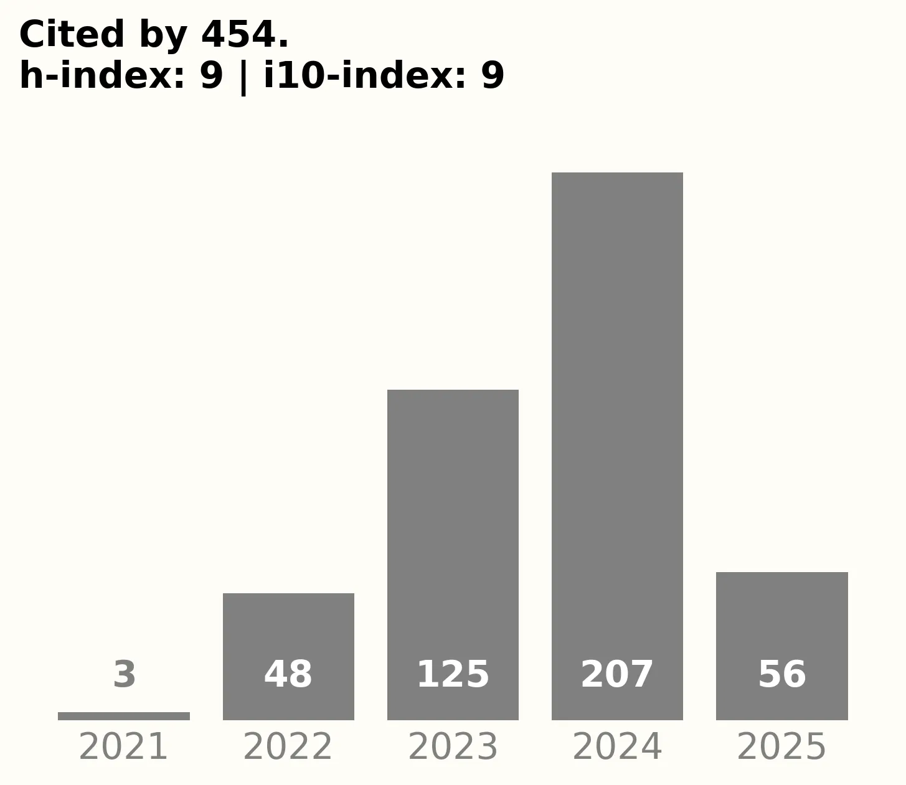

+++
# A Demo section created with the Blank widget.
# Add more sections by duplicating this file and customizing to your requirements.

widget = "blank"  #
headless = true  # This file represents a page section.
active = true  # Activate this widget? true/false
weight = 5  # Order that this section will appear.

title = "FORRT's Research, Scholarship & Resources"
subtitle = "Peer-reviewed research, tools, data, teaching materials, and policy resources advancing open and reproducible science."

[design]
  # Choose how many columns the section has. Valid values: 1 or 2.
  columns = "1"

[design.background]
  # Apply a background color, gradient, or image.
  #   Uncomment (by removing `#`) an option to apply it.
  #   Choose a light or dark text color by setting `text_color_light`.
  #   Any HTML color name or Hex value is valid.

  # Background color.
  # color = "Green"
  # color = "#69b3a2" # greenish
  
  # Background gradient.
  # gradient_start = "DeepSkyBlue"
  # gradient_end = "SkyBlue"
  
  # Background image.
  # image = "headers/bubbles-wide.webp"  # Name of image in `static/img/`.
  # image_darken = 0.6  # Darken the image? Range 0-1 where 0 is transparent and 1 is opaque.
  # image_size = "cover"  #  Options are `cover` (default), `contain`, or `actual` size.
  # image_position = "center"  # Options include `left`, `center` (default), or `right`.
  # image_parallax = true  # Use a fun parallax-like fixed background effect? true/false

  # Text color (true=light or false=dark).
  text_color_light = false

[design.spacing]
  # Customize the section spacing. Order is top, right, bottom, left.
  padding = ["60px", "0", "60px", "0"]

[advanced]
 # Custom CSS. 
 css_style = "font-size: 1.25rem;"
 
 # CSS class.
 css_class = ""
+++

---

 

<figure class="citation-container">
  
  <figcaption><a href="https://scholar.google.com/citations?user=JrBcgGMAAAAJ&hl=en&authuser=1" target="_blank">Details on Google Scholar</a></figcaption>
</figure>

This page showcases the diverse scholarly and public-facing outputs produced by FORRT and its community—including peer-reviewed publications, preprints, policy briefs, opinion pieces, interactive apps, datasets, and open-source tools. It reflects our ongoing efforts to contribute to scientific discourse, inform policy, and promote open, inclusive, and transparent research practices. Whether you're a researcher, educator, or policymaker, this hub provides access to FORRT’s evolving body of work. Dive in to discover, cite, or collaborate.





 



 



 



 



 



 

  

      <h1>Find More About Ongoing Projects</h1>
      

      

          We are currently preparing additional manuscripts on a range of topics. To find out more about what we're working on and how you can contribute, visit our <a href="/about/get-involved">Get Involved page</a>.
      

  

