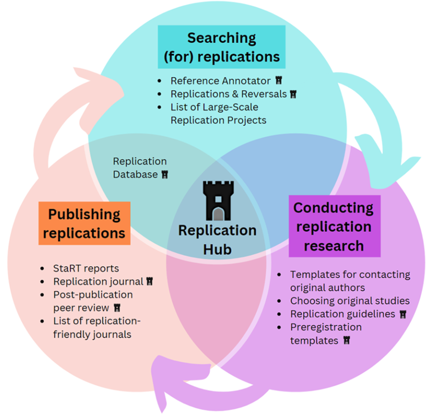
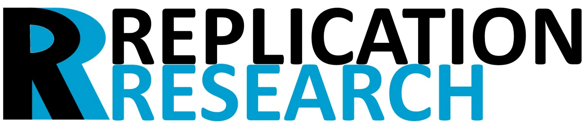

---
# Section metadata
title: "FORRT Replication Hub"
date: 2023-09-09
type: plain_page
---

 

 

### **Transforming Research: Support for Every Level of Replication and Reproduction**

The FORRT Replication Hub provides a comprehensive collection of resources and tools designed to assist researchers in the identification, evaluation, execution, and publication of replication studies.

### **Projects**

1. FORRT’s Replication Database (FReD) serves as a centralized repository where researchers can access information about past replication efforts, including methodologies and outcomes. This database is intended to facilitate easier access to replication study data, promote transparency, and encourage the conduct of further replications by providing researchers with a clear view of what has been previously attempted and achieved.  
    

   - [FReD Explorer](/apps/fred_explorer.html) is an interactive tool within the FORRT Replication Database designed to facilitate the navigation and discovery of replication studies. It allows researchers and educators to explore a wide array of replication projects easily, filtering them based on various criteria. The Explorer helps users identify trends and gaps in replication research, offering a user-friendly interface to access detailed information on past studies.

2. [FReD Annotator](/apps/fred_annotator.html) is a tool aimed at enhancing the quality and accessibility of data within the FORRT Replication Database. It allows users to check a list of references for potential replication attempts and returns a reading list that includes replication attempts and outcomes of the replication studies.

3. [Replication Research](http://replicationresearch.org) is a diamond open access journal for reproductions, replications, and conceptual articles from multiple fields. It is being developed by FORRT and the Münster Center for Open Science and will be launched in fall 2025\.  
    

4. [FORRT’s Replications and Reversals](/reversals/) is a crowdsourced list of studies that have been replicated, not replicated, or reversed (i.e., replication results were the opposite of original results) for pedagogical purposes. It stopped updating in late 2023 as we are merging it into FReD. An updated version of the list will be available shortly.

### **Partner Projects**

* The [Scaling Machine Assessments of Research Trustworthiness](https://www.cos.io/about/news/cos-expands-score-program-efforts) (SMART) competition explores innovative methods to predict the replicability of scientific findings using algorithms. FORRT has [partnered](https://www.cos.io/blog/cos-and-forrt-partner-to-increase-discoverability-and-usability-of-replication-evidence) with the COS to provide a large training dataset.  
* The [Collaborative Replication and Education Project (CREP)](https://forrt.org/glossary/vbeta/collaborative-replication-and-educa/) is an initiative designed to organize and structure replication efforts of highly-cited empirical studies in psychology to satisfy the dual needs for more high-quality direct replications and more training in empirical research techniques for psychology students. CREP aims to address the need for replications of highly cited studies, and to provide training, support and professional growth opportunities for academics completing replication projects.  
* The [Institute for Replication (I4R)](https://forrt.org/replication-hub/i4replication.org) organizes replication games to conduct replications and reproductions. It provides replication and teaching resources and helps researchers disseminate and publish replications and reproductions.  
* The Center for Open Science’s projects to [Systematizing Confidence in Open Research and Evidence (SCORE)](https://www.cos.io/score) and , the [Scaling Machine Assessments of Research Trustworthiness (SMART)](https://www.cos.io/about/news/cos-expands-score-program-efforts)  include prediction markets, machine-learning, and replication efforts.  
* The project [Improving Reproducibility in Science (iRise)](https://camarades.shinyapps.io/dev-irise-soles/) identifies, tracks, and evaluates discipline-wide open science interventions and develops tools to improve reproducibility.  
* The [Replication Wiki](https://replication.uni-goettingen.de/wiki/index.php/Main_Page) provides teaching resources for replication research and a database with reproductions and replications from the social sciences (particularly economics).  
* The [Journal of Comments and Replications in Economics](http://jcr-econ.org) is the go-to outlet for reproductions and replications from the field of economics.
* We are also very grateful to everyone who contributed to the many large-scale replication efforts in recent years that we drew on in compiling our data. A list of large replication projects can be found [here](/replication-hub/large-scale-replication-projects/).

**Publications and Pre-prints** 

Korbmacher, M., Azevedo, F., Pennington, C. R., Hartmann, H., Pownall, M., Schmidt, K., ... & Evans, T. (2023). The replication crisis has led to positive structural, procedural, and community changes. *Communications Psychology*, 1(1), 3\. [https://doi.org/10.1038/s44271-023-00003-2](https://doi.org/10.1038/s44271-023-00003-2)

Röseler, L., Kaiser, L., Doetsch, C., Klett, N., Seida, C., Schütz, A., ... & Zhang, Y. (2024). The replication database: documenting the replicability of psychological science. Journal of Open Psychology Data, 12(8), 1-23. [https://doi.org/10.5334/jopd.101](https://doi.org/10.5334/jopd.101)

Röseler, L., Gendlina, T., Krapp, J., Labusch, N., & Schütz, A. (2022). Successes and Failures of Replications: A Meta-Analysis of Independent Replication Studies Based on the OSF Registries. *MetaArXiv Preprints*. [https://doi.org/10.31222/osf.io/8psw2](https://doi.org/10.31222/osf.io/8psw2) 

### **Support Us**

[https://opencollective.com/forrt](https://opencollective.com/forrt)

