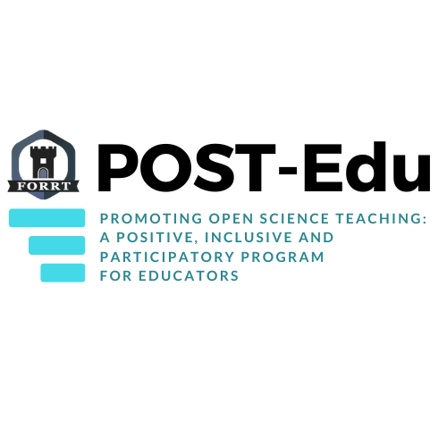

+++
# FORRT page
type = "widget_page"
headless = false  # Homepage is headless, other widget pages are not.
# url = "/feedback"
+++

Summary: The next generation of researchers and consumers of science must be equipped with knowledge of open and reproducible research to maintain and further scientific standards. Thus, educators and mentors must be able to provide a strong foundation in Open Science training. However, there is a lack of training and support available for educators in Open Science, including Continuing Professional Development (CPD) opportunities. In this project, funded by the Dutch Research Council (NWO), we aim to design and develop a pedagogically-informed, evidence-based, self-guided program for supporting the teaching of Open Science. We will produce three modules for educators interested in teaching Open Science through a 1) positive, 2) participatory, and 3) inclusive lens. The materials will be developed and evaluated in consultation with educators, and will be disseminated as an open-access course.

Project Description: This project has 3 main phases.

Phase 1 (June - October 2024): Launch Events
We employ a participatory approach to identify the challenges and opportunities educators face when incorporating different aspects of Open Science into their teaching and mentoring. To this end, we are holding launch events to explain the project and to have interesting conversations with educators about what they envision for the three modules. The next launch event will take place on October 21st from 11.30 to 13.00 (CET). You can register to attend the launch event here: 
https://docs.google.com/forms/d/1aH9yRhjehwwgZNDMJz9DEeF5cKAl2MmKsuQOcBawcSw/viewform?ts=66f5bd78&edit_requested=true 

If you could not attend one of the launch events, you can still watch the recording of a part of one of the launch events, where the project is explained in detail.

[https://youtu.be/Il-O4vFy0Vwl]

Phase 2 (October 2024 - April 2025): Module Development
Using insights from the launch events and following FORRT’s comprehensive clusters (https://forrt.org/clusters/), we will develop content for a self-guided program targeting educators interested in incorporating Open Science into their teaching/mentoring. We will develop three modules, each including active reflections on incorporating the ethos of Open Science and utilising existing open educational resources within different disciplines.

- Module 1 - “A positive lens” (Module coordinator: Dr. Thomas Rhys Evans)
The ethos of Open Science in a teaching context (importance of meta-science, transparency and reproducibility, proposed improved initiatives, and ethical consideration for improved practices). 
- Module 2 - “A participatory lens” (Module coordinator: Dr. Madeleine Pownall) 
Students and participants as active members of knowledge production (student-led research, pre-analysis plans, replications, team science, shared terminology, citizen science).
- Module 3 - “An inclusive lens” (Module coordinator: Dr. Helena Hartmann) 
Teaching Open Science incorporating concepts of diversity, inclusion, accessibility, qualitative research, reflexivity and positionality, critical feminism and neurodiversity.

Phase 3 (April & May 2025): Dissemination
Disseminate the program, elicit user feedback and engage in sustainable revision. More details to be announced. 

Interested in participating in this project?
You can express your interest to participate in the module development (Phase 2 of the project) until 27th October 2024 here: https://docs.google.com/forms/d/10fkyhgAxn94xkrdGhtMJsabHivtfNGTAEVjw48wcqQc/viewform?ts=66f6d87f&edit_requested=true

Check the possible contribution roles below:

Focus teams: Educators interested in serving as consultants for module development (~3-5 per module). Contributors will be included in the self-guided course in line with CRediT taxonomy.
Development teams: Educators interested in actively helping to develop the modules of the self-guided course (~2-3 per module). Contributors will be included in the self-guided course in line with CRediT taxonomy. 

The spots for these roles are limited and members will be selected by the core team. For more information, feel free to reach out to Team Curriculum (Leticia Micheli, Madeleine Pownall, Helena Hartmann, Thomas Rhys Evans, Karen Matvienko-Sikar & Flavio Azevedo).
