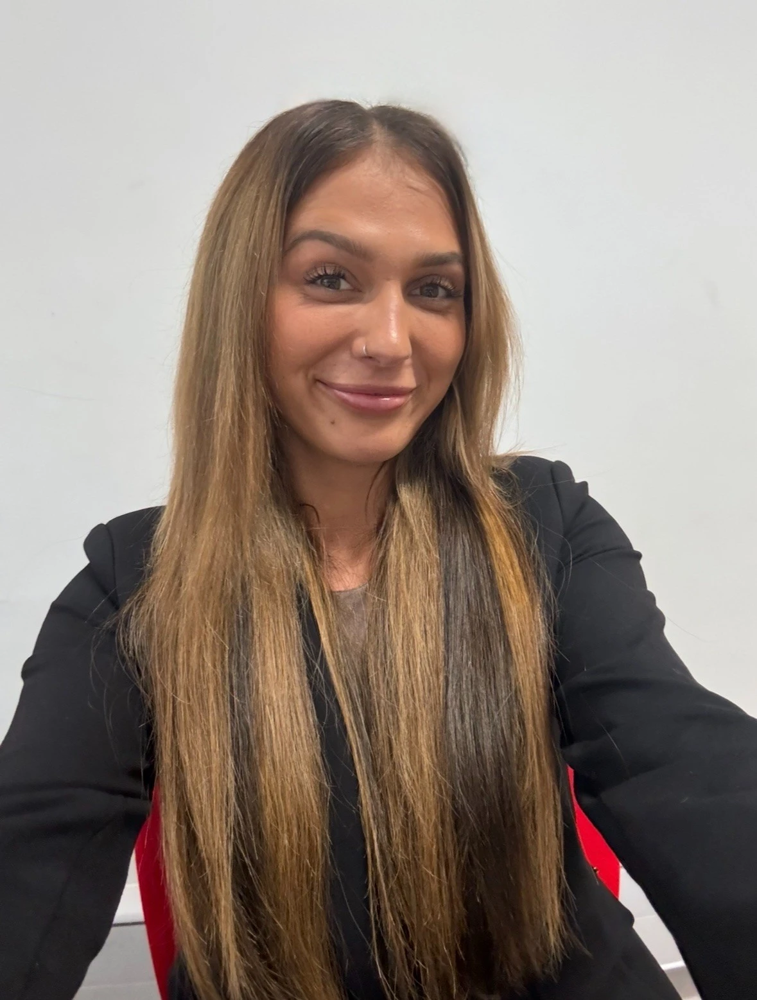

+++
widget = "blank"  # See https://sourcethemes.com/academic/docs/page-builder/
headless = true  # This file represents a page section.
active = true  # Activate this widget? true/false
weight = 10  # Order that this section will appear.

title = ""
subtitle = ""

[design]
  # Choose how many columns the section has. Valid values: 1 or 2.
  columns = "1"

[design.background]

  # Background color.
  color = "#adb6cd"
  
  # Background gradient.
  # gradient_start = "DeepSkyBlue"
  # gradient_end = "SkyBlue"
  
  # Text color (true=light or false=dark).
  text_color_light = false

[design.spacing]
  # Customize the section spacing. Order is top, right, bottom, left.
  padding = ["60px", "0", "60px", "0"]

[advanced]
 # Custom CSS. 
 css_style = "font-size: 1rem;"
 
 # CSS class.
 css_class = ""
+++

# “Finding Belonging in Open Science – Roksana”

  

    
  

  

    <a href="mailto:roksanasobolak@hotmail.com" title="Email" style="margin-right: 0.5rem;">
      <i class="fas fa-envelope fa-2x" aria-hidden="true"></i>
    </a>
    <a href="https://orcid.org/0009-0001-9534-6439" title="ORCiD">
      <i class="ai ai-orcid fa-2x" aria-hidden="true"></i>
    </a>
  

 

Joining FORRT has been one of the most transformative experiences of my academic journey so far. I was lucky enough to become part of this incredible, supportive community through my very first academic role—a project in collaboration with FORRT. Through working with FORRT, I saw what true collaboration looks like: a global network of researchers who are not only pushing the boundaries of open science but also lifting each other up along the way. The sense of community is unmatched—people are kind, generous with their time, and deeply dedicated to meaningful change.

One of the standout moments for me has been contributing to the FReD replication database, where I helped map and code effect sizes in replication studies. This experience gave me invaluable exposure to a wide range of research methods, designs, and statistical approaches. However, even more than the task itself, what stood out was the unimaginable support we received along the way. The guidance provided for tasks was clear, detailed, and thoughtful. Any queries were met with prompt, helpful, and genuinely encouraging responses. Group meetings were offered, and we were never made to feel like we were alone in the process. What truly sets FORRT apart is the care they put into everything they do. They’re not just focused on the outcome—they’re deeply invested in the process. They’re open, reflective, and constantly striving to improve how they work so that our experience as contributors is not only meaningful but also joyful. They care about the people behind the work, and that care shines through in every interaction.
I’ve already recommended FORRT to many other early career researchers because of the countless opportunities it provides to get involved in impactful projects around the world. I’m thrilled to share that I recently accepted a PhD offer at King’s College London to research ADHD and menopause. This milestone wasn’t just a career step—it was a dream come true. And I can say with full confidence that my time with FORRT played a central role in making it possible. Through FORRT, I was able to build real, tangible skills—from statistical analyses to collaborative communication to open scholarship practices. But more than that, I developed a deep sense of self-belief and belonging in academia, which is often hard to come by as an early career researcher. FORRT gave me the space to explore new challenges, take intellectual risks, and grow not only as a researcher, but as a person.

**Thank you FORRT, I am excited to see what the future holds!**
