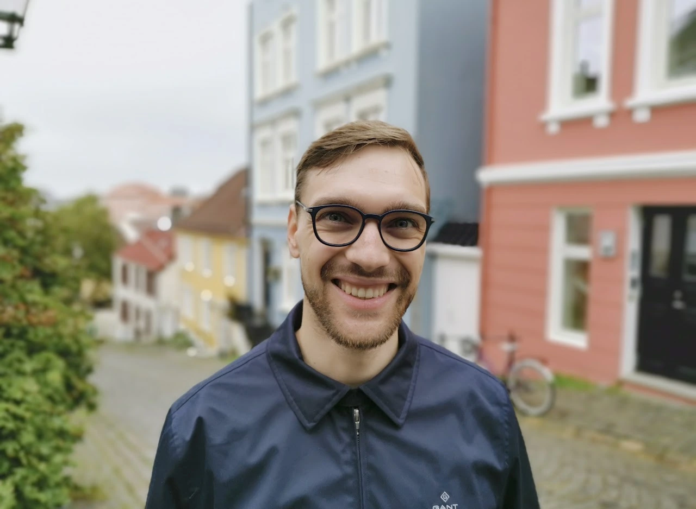

+++
widget = "blank"  # See https://sourcethemes.com/academic/docs/page-builder/
headless = true  # This file represents a page section.
active = true  # Activate this widget? true/false
weight = 10  # Order that this section will appear.

title = ""
subtitle = ""

[design]
  # Choose how many columns the section has. Valid values: 1 or 2.
  columns = "1"

[design.background]

  # Background color.
  color = "#c3cdad"
  
  # Background gradient.
  # gradient_start = "DeepSkyBlue"
  # gradient_end = "SkyBlue"
  
  # Text color (true=light or false=dark).
  text_color_light = false

[design.spacing]
  # Customize the section spacing. Order is top, right, bottom, left.
  padding = ["60px", "0", "60px", "0"]

[advanced]
 # Custom CSS. 
 css_style = "font-size: 1rem;"
 
 # CSS class.
 css_class = ""
+++

# Max Korbmacher's Experience with FORRT

  

    
  

  

    <a href="mailto:max.korbmacher@gmail.com" title="Email" style="margin-right: 0.5rem;">
      <i class="fas fa-envelope fa-2x" aria-hidden="true"></i>
    </a>
    <a href="https://orcid.org/0000-0002-8113-2560" title="ORCiD">
      <i class="ai ai-orcid fa-2x" aria-hidden="true"></i>
    </a>
    <a href="https://sites.google.com/view/maxkorbmacher/" title="Personal Website">
      <i class="fas fa-globe fa-2x" aria-hidden="true"></i>
    </a>
  

I stumbled into FORRT somewhat by accident during my master’s studies, while working on a review paper about the replication crisis. At the time, I was looking for collaborators and, without knowing much about the community or its norms, I just dropped my Google Doc into the Slack channel—completely ignoring any guidelines or structure that were probably there for good reason!
To my surprise, the response was overwhelming. I received hundreds of thoughtful comments and a flood of interest from people who wanted to collaborate. It was incredibly exciting, but also completely chaotic—and I quickly realized I was in over my head. Thankfully, several experienced FORRTers stepped in and helped me navigate the process. Instead of being frustrated by my obliviousness or the disruption I’d unintentionally caused, everyone was kind, patient, and encouraging.
That openness and generosity left a lasting impression. What began as a spontaneous post turned into multiple fruitful collaborations, real friendships, and a deep connection to the FORRT community. Eventually, I even found myself in a leadership role within the Glossary project—something I never would have imagined when I first joined.

**I’m incredibly grateful for the welcoming and collaborative spirit of FORRT, and I’m looking forward to many more exciting adventures with this wonderful community!**
