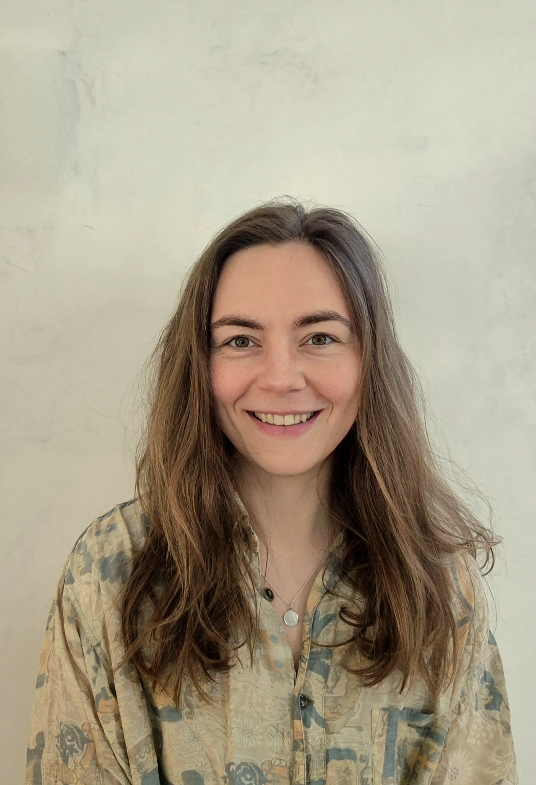

+++
widget = "blank"  # See https://sourcethemes.com/academic/docs/page-builder/
headless = true  # This file represents a page section.
active = true  # Activate this widget? true/false
weight = 10  # Order that this section will appear.

title = ""
subtitle = ""

[design]
  # Choose how many columns the section has. Valid values: 1 or 2.
  columns = "1"

[design.background]

  # Background color.
  color = "#cdadbd"
  
  # Background gradient.
  # gradient_start = "DeepSkyBlue"
  # gradient_end = "SkyBlue"
  
  # Text color (true=light or false=dark).
  text_color_light = false

[design.spacing]
  # Customize the section spacing. Order is top, right, bottom, left.
  padding = ["60px", "0", "60px", "0"]

[advanced]
 # Custom CSS. 
 css_style = "font-size: 1rem;"
 
 # CSS class.
 css_class = ""
+++

# Leonie's Experience with FORRT

  

    
  

  

    <a href="mailto:dudda@essb.eur.nl" title="Email" style="margin-right: 0.5rem;">
      <i class="fas fa-envelope fa-2x" aria-hidden="true"></i>
    </a>
    <a href="https://orcid.org/0009-0000-0759-7354" title="ORCiD">
      <i class="ai ai-orcid fa-2x" aria-hidden="true"></i>
    </a>
  

I got to know FORRT through my supervisor who encouraged me to join. We scheduled a meeting with Flavio, who gave me a warm welcome and introduced me to the different structures. We talked about my strengths and what kind of work I enjoy doing and I eventually ended up in the Glossary lead team with Flavio, Max and Mahmoud.

They made me feel very welcome from the start and I was positively surprised that there was room to find tasks that would fit my strengths and personality.
They helped me get familiar with everything, and gave me the feeling that they genuinely care about me as a person. 

**What I appreciate a lot is the warm working atmosphere. I always feel like my work is highly appreciated and that there is room for suggestions and ideas. I am very thankful for this welcoming and caring atmosphere of FORRT, and I am looking forward to all future collaborations with this community.**
