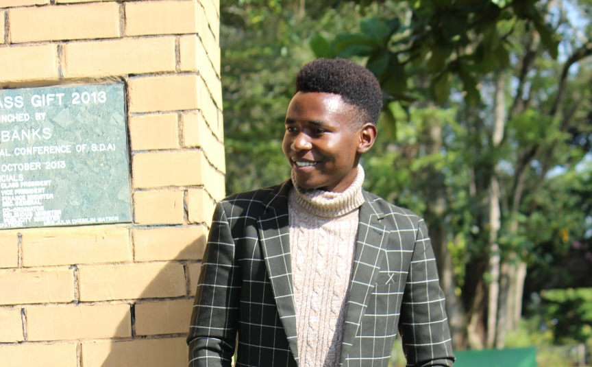

+++
widget = "blank"  # See https://sourcethemes.com/academic/docs/page-builder/
headless = true  # This file represents a page section.
active = true  # Activate this widget? true/false
weight = 10  # Order that this section will appear.

title = ""
subtitle = ""

[design]
  # Choose how many columns the section has. Valid values: 1 or 2.
  columns = "1"

[design.background]

  # Background color.
  color = "#adc9cd"
  
  # Background gradient.
  # gradient_start = "DeepSkyBlue"
  # gradient_end = "SkyBlue"
  
  # Text color (true=light or false=dark).
  text_color_light = false

[design.spacing]
  # Customize the section spacing. Order is top, right, bottom, left.
  padding = ["60px", "0", "60px", "0"]

[advanced]
 # Custom CSS. 
 css_style = "font-size: 1rem;"
 
 # CSS class.
 css_class = ""
+++

# Richard Dushime's Experience with FORRT

  

    
  

  

    <a href="mailto:mudaherarich@gmail.com" title="Email" style="margin-right: 0.5rem;">
      <i class="fas fa-envelope fa-2x" aria-hidden="true"></i>
    </a>
    <a href="https://orcid.org/0000-0002-1281-9895" title="ORCiD">
      <i class="ai ai-orcid fa-2x" aria-hidden="true"></i>
    </a>
    <a href="https://richarddushime.netlify.app/" title="Personal Website">
      <i class="fas fa-globe fa-2x" aria-hidden="true"></i>
    </a>
  

 

When I first joined FORRT, I was new to the open-source world and hungry to dive into open science. Yo Yehudi from Open Life Science (OLS) connected me with Flavio and invited me into the FORRT Slack channel and from that very first welcome (emojis and all!), I felt right at home.

As I explored the FORRT materials, I discovered the incredible work that FORRT is doing to advance transparency and ethics in research. With my technical background, I began contributing to the website adding content and implementing some improvements and quickly found myself immersed in a vibrant, supportive community.

But FORRT has offered me so much more than just web-development experience. Through hands-on contributions, I’ve learned about reproducibility in research, open access, and best practices  in academia. Collaborating with researchers  has broadened my perspective and sharpened my skills in ways I never expected.

FORRT’s commitment to pedagogical reform and inclusive open scholarship is truly inspiring. I’m grateful for the amazing people behind this initiative and for every opportunity to grow alongside them.

**To anyone considering joining FORRT: jump in! You’ll learn more, contribute more, and have far more fun than you ever imagined. Cheers!”**
