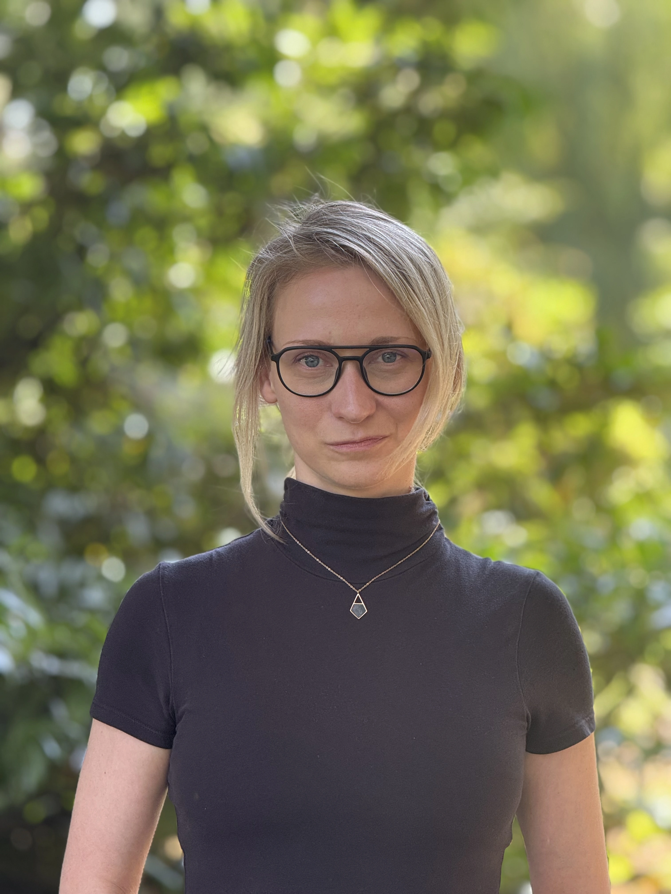

+++
widget = "blank"
headless = true  # This file represents a page section.
active = true  # Activate this widget? true/false
weight = 10  # Order that this section will appear.

title = ""
subtitle = ""

[design]
  # Choose how many columns the section has. Valid values: 1 or 2.
  columns = "1"

[design.background]

  # Background color.
  color = "#adb6cd"
  
  # Background gradient.
  # gradient_start = "DeepSkyBlue"
  # gradient_end = "SkyBlue"
  
  # Text color (true=light or false=dark).
  text_color_light = false

[design.spacing]
  # Customize the section spacing. Order is top, right, bottom, left.
  padding = ["60px", "0", "60px", "0"]

[advanced]
 # Custom CSS. 
 css_style = "font-size: 1rem;"
 
 # CSS class.
 css_class = ""
+++

# Choosing Humanity: Why FORRT Feels Like Home

  

    
  

  

    <a href="mailto:andreakispsy@gmail.com" target="_blank" title="Email" style="margin-right: 0.5rem;">
      <i class="fas fa-envelope fa-2x" aria-hidden="true"></i>
    </a>
    <a href="https://orcid.org/0000-0002-4345-3814" target="_blank" title="ORCiD">
      <i class="ai ai-orcid fa-2x" aria-hidden="true"></i>
    </a>
    <a href="https://www.andreakis.com/" target="_blank" title="Personal Website">
      <i class="fas fa-globe fa-2x" aria-hidden="true"></i>
    </a>
  

 

Joining FORRT has not only been one of the most influential academic experiences during my PhD - it has also been a deeply human one. In a space often overwhelmed by metrics, prestige, and policy debates, FORRT reminds me that behind every argument about openness, integrity, or reform are people. People who care, who stumble, who grow and who try their best to create something better together.

My encounters with fellow academics - human beings - within this space have deeply shaped both my personal as well as professional identity. As a psychologist, I think a lot about people. My research on the psychology of researchers and social dynamics in academic environments has further deepened this reflection. What makes FORRT stand out in this regard is how it not only advocates for values like transparency, inclusivity, and equity. Members and especially leaders try their very best to embody these values.

As a decentralized, democratic network, FORRT models what a safe, just, and sustainable academia could look like. From community decisions to everyday communication, there's a quiet consistency in how this organization acts with integrity. And what I feel is truly remarkable: this care continues in the background, even when things get hard - within the decision processes that many never see. Difficult situations involving uncertainty, competing needs, or inevitable frictions are handled with thoughtfulness and empathy. Not perfectly, not painlessly, but with respect for everyone's dignity and a sincere commitment to shared values.

In those moments, I learned a lot about leadership, mentorship, trust, and ethical action - a learning experience I deeply cherish and draw from in my current ventures.

Being part of FORRT has allowed me to contribute to meaningful projects, grow as a leader and community manager, and help shape a vision of academia that puts people - not systems - at the center. Beyond all of that: while in metascience and science policy we often debate openness, justice, or accountability as abstract virtues or policy terms, FORRT helped me remember that these are deeply human practices. Defending them means practicing them, especially when it's inconvenient.

**FORRT - at least for me - is more than a community. It's a promise that a different - free, kind, safe, sustainable - academia is possible. I'm proud to play my part in advocating for it through FORRT.**

### **---Dr. Andrea Kis**
