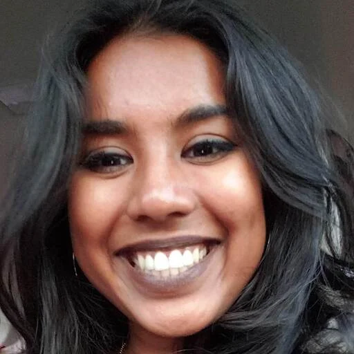

+++
widget = "blank"
headless = true  # This file represents a page section.
active = true  # Activate this widget? true/false
weight = 10  # Order that this section will appear.

title = ""
subtitle = ""

[design]
  # Choose how many columns the section has. Valid values: 1 or 2.
  columns = "1"

[design.background]

  # Background color.
  color = "#b0cdad"
  
  # Background gradient.
  # gradient_start = "DeepSkyBlue"
  # gradient_end = "SkyBlue"
  
  # Text color (true=light or false=dark).
  text_color_light = false

[design.spacing]
  # Customize the section spacing. Order is top, right, bottom, left.
  padding = ["60px", "0", "60px", "0"]

[advanced]
 # Custom CSS. 
 css_style = "font-size: 1rem;"
 
 # CSS class.
 css_class = ""
+++

# Doing Good Research, Together: Growing with FORRT 

  

    
  

  

    <a href="mailto:adanie48@uwo.ca" target="_blank" title="Email" style="margin-right: 0.5rem;">
      <i class="fas fa-envelope fa-2x" aria-hidden="true"></i>
    </a>
    <a href="https://orcid.org/0009-0004-6830-2141" target="_blank" title="ORCiD">
      <i class="ai ai-orcid fa-2x" aria-hidden="true"></i>
    </a>
    <a href="https://www.linkedin.com/in/adiradaniel/" target="_blank" title="LinkedIn">
      <i class="fa-brands fa-linkedin fa-2x" aria-dden="true"></i>
    </a>
  

 

I joined FORRT at the very beginning of my PhD, during a period shaped by COVID-19 lockdowns, when I was deeply motivated to do research well but still learning what that could look like in practice. I was searching for ways to meaningfully engage with metascience and to move beyond abstract commitments to open science toward concrete, values-driven research practices.
Participating in FORRT gave me exactly that. Through hands-on collaboration, mentorship, and shared reflection, I learned how to actively engage with open and reproducible research principles as an integrated part of my doctoral training. What began as volunteer involvement quickly became a formative space for growth — intellectually, professionally, and personally — grounded in learning with others.

Now, as a FORRT Steward, I am especially grateful for the community that has supported me at every stage of my journey. FORRT continues to shape how I think about rigor, care, and responsibility in research, and it remains a community I am excited to keep building with — not just throughout my PhD, but well beyond it.

### **---Adira Daniel Ph.D. Candidate**
